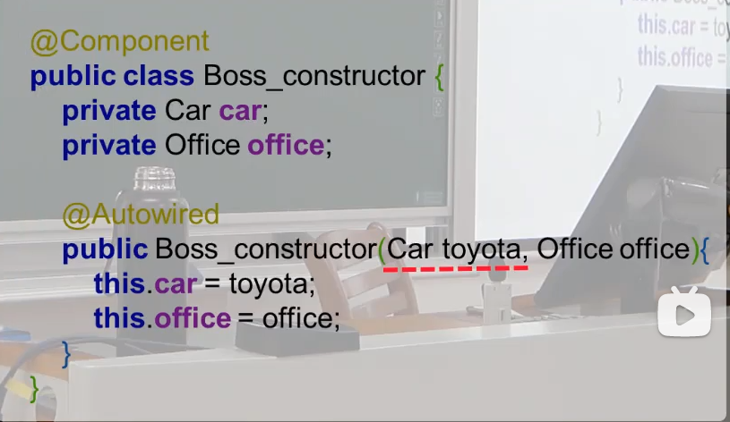
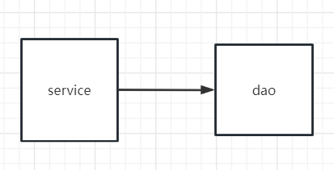
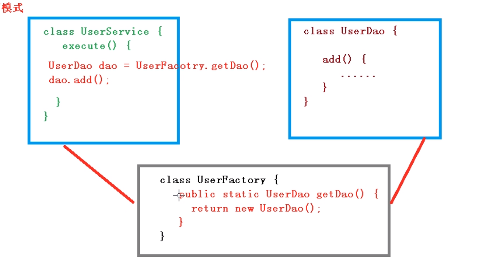
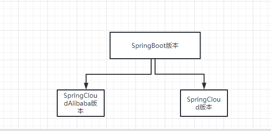

# Spring
## DI
spring进行依赖注入的两种方式
1、构造器注入
```xml
<!-- 这样写是通过pojo中的构造器方法进行属性注入 -->
<bean id="exampleBean" class="examples.ExampleBean">
    <constructor-arg type="int" value="1"/>
</bean>
```
2、set方法注入
```xml
<!-- 这样写是通过person类中的set方法进行属性注入 -->
<bean id="person" class="com.example.pojo.Person">
    <property name="age" value="23"></property>
    <property name="name" value="cbc"></property>
</bean>
```
## Spring的注解开发
* 代替`beans.xml` <a id="Configuration"></a>
```java
@Configuration
public class MyConfig {

    //作用在方法上，将该方法的返回值放到ioc容器里面
    //相当于xml中的bean标签，如果只写@Bean，id默认为方法名，class为返回值类型
    @Bean("person1") //修改id名字为person1
    public Person person(){
        return new Person();
    }
}

@Test
public void annoTest(){
    ApplicationContext ioc = new AnnotationConfigApplicationContext(MyConfig.class);
}
```
> 注：
1、通过配置类注册的组件，在ioc容器中是单例的，可通过下面的代码验证
2、MyConfig也在ioc容器中
```java
@Test
public void annoTest(){
    ApplicationContext ioc = new AnnotationConfigApplicationContext(MyConfig.class);
    Person person = (Person) ioc.getBean("person");
    Person person2 = (Person) ioc.getBean("person");
    System.out.println(person == person2); //true
}
```
* `@ComponentScan(value = "com.example.pojo")`
代替xml里面的`<context:component-scan base-package="com.example.aop"></context:component-scan>`
使得在指定包下有注解的类全部塞进ioc容器
* `@Component`
如果不写里面的value，bean-id默认为类名的小写
> Q:如果我在不同包下有两个Person类，其中pojo.Person定义在bean.xml中，aop.Person直接使用@Component，最后ioc容器中会有几个person？
只有1个，是pojo.Person
## IOC容器
* 查看IOC容器里面的所有组件：`ioc.getBeanDefinitionNames();`
----
* FactoryBean
    ```java
    public class UserFactory implements FactoryBean<User> {
    @Override
    public User getObject() throws Exception {
        return new User();
    }
    @Override
    public Class<?> getObjectType() {
        return User.class;
        }
    }
    //当我在beans.xml中配置：
    <bean class="com.example.pojo.UserFactory"></bean>
    //我就直接可以在ioc中
    User user1 = ioc.getBean(User.class);

    /*
    总结：FactoryBean的作用是：当ioc创建时，创建UserFactoryBean的时候，
    同时会把getObject方法中的返回值创建出来，并且注入ioc容器里面
    */
    ```
* 标签
    * `<bean>`标签中的`<property>`是干什么？ 通过set方法进行属性注入
    * `<bean>`标签中的id和class的作用？ id是getbean("id")来得到这个类，class就是绑定的类
* Spring用`@Controller`装配bean，怎么从ioc中取出来？
* Spring整合Mybatis的思维流程：
```xml
<!--这里是思维第二步：因为sqlsessionfactory需要数据源，所以有了如下配置-->
<!--数据源-->
<bean id="dataSource" class="org.springframework.jdbc.datasource.DriverManagerDataSource">
    <property name="driverClassName" value="com.mysql.jdbc.Driver"/>
    <property name="url" value="jdbc:mysql://localhost:3306/testdb?useSSL=true&amp;useUnicode=true&amp;characterEncoding=utf8"/>
    <property name="username" value="root"/>
    <property name="password" value="root"/>
</bean>

<!--这里是思维第一步：mybatis在使用的时候，需要创建`sqlSessionFactory`,Spring接管了，就不需要去new了，直接配置bean，所以就有了如下配置-->>
<!--配置SqlSessionFactory-->
<bean id="sqlSessionFactory" class="org.mybatis.spring.SqlSessionFactoryBean">
    <property name="dataSource" ref="dataSource"/>
    <!--关联Mybatis-->
    <property name="configLocation" value="classpath:Mybatis-config.xml"/>
    <property name="mapperLocations" value="classpath:com/example/dao/UserMapper.xml"/>
</bean>

<!--这里是思维第三步：mybatis在使用的时候，有了sqlsessionfactory，我们仍然要new一个sqlsession，在整合的时候，sqlsessionTemplate来代替sqlsession，只需要注册bean，所以有了如下配置-->
<!--注册sqlSessionTemplate , 关联sqlSessionFactory-->
<bean id="sqlSession" class="org.mybatis.spring.SqlSessionTemplate">
    <constructor-arg index="0" ref="sqlSessionFactory"/>
</bean>

<bean id="userMapper" class="com.example.dao.UserMapperImpl">
    <property name="sqlSession" ref="sqlSession"/>
</bean>

```

* Spring使用的整体流程？ xml配bean，在main函数读取xml，用什么直接getbean
* Spring有什么用？ 【狂神p5】
* 通过maven导入Spring导入哪个包？
* 注解
    * `@Component`什么意思，等价于在xml中写的什么？但bean没有名字怎么办？
        * `@Reposity`什么意思？
        * `@Service`什么意思？
        * `@Controller`什么意思？
    * `@Value()`什么意思，等价于在xml中写的什么？可以写在什么的上面？（2个）
* Bean的存在方式
    * Singleton
    该bean在内存中只存在一个实例。这种bean不能存在可以修改的field，否则多线程访问的时候，多个线程都对field进行修改，造成线程相关的问题
    类似的还有Servlet，Servlet在系统中也只存在一个实例，每一个request到来的时候就会分配一个线程来执行service方法，所以Servlet中根本没有属性。
    * Prototype（很少用）
    每次使用都会创建一个新的对象 
    ------------
    web环境：
    * request
    * session
    * Application
    ```java
    @Component //默认id=person
    @Scope("prototype") //如果不写，默认singleton
    public class Person {
    }
    ```

* `@Autowired`
如果容器中的类型只有一个，那很简单，就注入对应类型的对象
```java
public class AutoWiredTest {
    @Autowired
    Car car;//ioc容器中只有唯一的一个car对象
}
```
如果容器中相同类型的对象有多个
1、多个相同接口的实现类
```java
public class AutoWiredTest {
    @Autowired
    Car car;//Car是个接口，ioc容器中有Toyota和Halva，它们都继承Car接口
    //这样的写法就直接报错：Could not autowire. There is more than one bean of 'Car' type
    //需要加@Qualifier("toyota")

    @Test
    public void test1(){
        car.show();
    }
}
```
2、有同一个类的多个对象
```java
@SpringJUnitConfig(locations = "classpath:beans.xml")
public class AutoWiredTest {
//    @Qualifier("toyota2")
    @Autowired
    Toyota toyota; //注入名字最佳匹配的
    //如果像注入其他对象，需要加上@Qualifer
    @Test
    public void test1(){
        System.out.println(toyota.getI());
    }
}
```
3、父子类之间的关系
先按类型去匹配，如果ioc容器里有同类型的多个组件，再按名称去匹配
如下图：ioc容器里面已经有了Toyota&Halva两个bean实例，都是Car的子类，那通过自动注入的方式会去找与变量名相同的bean对象

* 为什么`Field injection is not recommended`
https://juejin.cn/post/6965673679342551048
* IOC(inversion of control)
    * IOC的目的：减少Class之间的耦合
    * IOC的好处/为什么解耦那么重要：
    ```java
    //=================ioc之前==============================
    /*
    User1Dao&User2Dao都继承于BaseDao
    这个时候需求变了，我不想用User1Dao了，我想改为User2Dao，怎么办？
    需要改Service里面的代码，可是如果这样的Service有10000个呢？要改10000次！
    */
    public class baseService{
        BaseDao dao;
        public void method(){
            dao = new User1Dao();
        }
    }
    ```
    
    <a id = "factory"></a>

    ```java
    //===============改进之工厂模式=====================
    /*
    还是上面的需求，我不想用User1Dao了，改为User2Dao
    通过工厂模式，我就不用修改10000个service类里面的代码了，只修改UserFactory里面的一行代码就行了.
    老土点说，工程模式就是中间加了一层...
    */
    ```
    

    * 什么是IOC
    ```txt
    IOC是一种思想,我们写得类/组件没有控制权
    
    落地：Spring中的IOC思想的落地实现是DI
    
    什么是DI(Dependency Injection)？DI就是如果我们写的类/组件中的某个属性是另一个组件，这个时候我们不能在组件中去new，而是要声明出来。Spring会维护一个ioc容器，里面有所有组件，在需要时会把这个属性传给你。
    我们发现在这个过程中，自己写的组件连new的权利都没有

    IOC思想的其他实现：模板方法
    如果我们写的类继承了模板方法的基类，我们发现这些方法如何运行我们仍然不能没有控制权，是执行method1()还是先执行method2()完全由基类中的模板方法来决定
    
    在JavaSE，我们写的程序都是我们的main方法作为主程序，去调用别人写好的库(Libary,which is reusable),来完成一系列功能。可是到了JavaWeb阶段，主程序是Tomcat，我们写的servlet成为了组件&库？我们的代码等待着主程序的调用。从“调用别人”转变为“被别人调用传值”
    上面是从整个Application的架构上去说
    下面对单独的一个类来说：如果这个Person类中有个属性是另一个类Car，那在构造器中就要new一下Car，不然Person对象不能用。但是我们改变写法，构造器中传个参数，将这个参数赋值给属性Car。即“你这个类不要调别人，等着别人调你并给你传值”。这也是IOC的一种体现。这种做法就被称作DI(Dependency Injection)
    所以DI只是IOC思想的一种实现方式
    ```
## AOP
* 什么是切面？
就是切进来的方法
* AOP用来解决什么问题？
* AOP的使用
    * 添加依赖
    ```xml
    <dependency>
        <groupId>org.springframework</groupId>
        <artifactId>spring-aspects</artifactId>
        <version>4.3.7.RELEASE</version>
    </dependency>
    ```
    * 配置文件
    ```xml
    <?xml version="1.0" encoding="UTF-8"?>
    <beans xmlns="http://www.springframework.org/schema/beans"
    xmlns:xsi="http://www.w3.org/2001/XMLSchema-instance"
    (new) xmlns:context="http://www.springframework.org/schema/context"
    (new )xmlns:aop="http://www.springframework.org/schema/aop"
    xsi:schemaLocation="http://www.springframework.org/schema/beans http://www.springframework.org/schema/beans/spring-beans.xsd
                    (new)http://www.springframework.org/schema/context http://www.springframework.org/schema/context/spring-context.xsd
                    (new)http://www.springframework.org/schema/aop http://www.springframework.org/schema/aop/spring-aop.xsd">
    <!-- 开启注解扫描 -->
    <context:component-scan base-package="com.example.aop"></context:component-scan>
    <!-- 开启Aspect生成代理对象-->
    <aop:aspectj-autoproxy></aop:aspectj-autoproxy>
    ```
    ```java
    //初尝试
    @Component
    public class Person {
        public void method(){
            System.out.println("这是裸的method方法");
        }
    }
    //Proxy
    @Component //将这个类交给Spring管理
    @Aspect //将这个类标志位切面类
    public class PersonProxy {

        @Before("execution(* com.example.aop.Person.method(..))")
        public void before(){
            System.out.println("before");
        }

    }
    ```
    * 切入点表达式
    ```java
    executioin(public void com.example.aop.Person.method())
    
    public void 是要修饰方法的权限和返回值类型；也可以写个*，表示任意权限，任意返回值类型
    com.example.aop.Person 是要修饰方法所在类的全类名；也可以写com.example.aop.*表示aop包下的所有类
    method 要修饰方法的方法名；也可以用*表示，表示该类public void 的全部方法
    (int,int) 被修饰方法的参数类型；也可以用(..)表示任意类型参数

    executioin(public void com.example.aop.Person.method())
    ```
    * 重用切入点表达式：`@PointCut()`
        * 使用背景
        每个方法的上面都得写：`executioin(public void com.example.aop.Person.method())`，能不能把这个表达式提取出来？
        * 使用
        ```java
        //==========================before======================
        @Before("execution(public void com.example.aop.Person.method(int,int))")
        public void before(JoinPoint joinPoint){
            System.out.println("before");
            String methodName = joinPoint.getSignature().getName();
            Object[] args = joinPoint.getArgs();
            System.out.println("parameters are "+ Arrays.toString(args));
        }
        @Around("execution(public void com.example.aop.Person.method(int,int))")
        public Object around(ProceedingJoinPoint joinPoint){
            System.out.println("before around");
            Object result = null;
            try{
                System.out.println("主方法即将执行");//之前相当于前置通知
                result = joinPoint.proceed();//主方法的执行
                System.out.println(result); //相当于返回通知
            }catch (Throwable throwable){
                System.out.println("enter catch"); //相当于异常通知
            }finally {
                System.out.println("enter finally"); //相当于后置通知
            }
            return result;
        }
        //====================after=====================================
        @Pointcut("execution(public void com.example.aop.Person.method(int,int))")
        public void pointcut(){}

        @Before("pointcut()")
        public void before(JoinPoint joinPoint){
            System.out.println("before");
            String methodName = joinPoint.getSignature().getName();
            Object[] args = joinPoint.getArgs();
            System.out.println("parameters are "+ Arrays.toString(args));
        }
        @Around("pointcut()")
        public Object around(ProceedingJoinPoint joinPoint){
            System.out.println("before around");
            Object result = null;
            try{
                System.out.println("主方法即将执行");//之前相当于前置通知
                result = joinPoint.proceed();//主方法的执行
                System.out.println(result); //相当于返回通知
            }catch (Throwable throwable){
                System.out.println("enter catch"); //相当于异常通知
            }finally {
                System.out.println("enter finally"); //相当于后置通知
            }
            return result;
        }
        ```
    * JoinPoint
    ```java
    @Before("execution(public void com.example.aop.Person.method(int,int))")
    public void before(JoinPoint joinPoint){
        System.out.println("before");
        //通过joinpoint得到方法的名字
        String methodName = joinPoint.getSignature().getName();
        //通过joinPoint得到传给方法的参数
        Object[] args = joinPoint.getArgs();
        System.out.println("parameters are "+ Arrays.toString(args));
    }
    ```
    * 五种通知类型
    1、前置通知：@Before
    2、执行主方法，如果顺利执行结束，执行返回通知：@AfterReturning。否则执行异常通知@AfterThrowing
    3、后置通知：@After
    * 环绕通知@Around
    @Around集所有通知于一身
    ```java
    @Around("execution(public void com.example.aop.Person.method(int,int))")
    public Object around(ProceedingJoinPoint joinPoint){
        System.out.println("before around");
        Object result = null;
        try{
            System.out.println("主方法即将执行");//之前相当于前置通知
            result = joinPoint.proceed();//主方法的执行
            System.out.println(result); //相当于返回通知
        }catch (Throwable throwable){
            System.out.println("enter catch"); //相当于异常通知
        }finally {
            System.out.println("enter finally"); //相当于后置通知
        }
        return result;
    }
    ```
    > Q:如果同时切入around，before和after，执行顺序是什么？
    around把before和after包裹起来
    * 切面优先级：@Order()
        * 使用背景：
        如果有两个@before方法同时切入一个函数，这两个@Before方法的执行顺序？
        * 通过@Order()来控制,括号里面的整数越小，先被执行
## 单元测试
```java
//引入spring-test和junit
<dependency>
    <groupId>org.springframework</groupId>
    <artifactId>spring-test</artifactId>
    <version>5.3.23</version>
    <scope>test</scope>
</dependency>
<!-- https://mvnrepository.com/artifact/org.junit.jupiter/junit-jupiter-api -->
<dependency>
    <groupId>org.junit.jupiter</groupId>
    <artifactId>junit-jupiter-api</artifactId>
    <version>5.9.2</version>
    <scope>test</scope>
</dependency>

@SpringJUnitConfig(locations = "classpath:beans.xml")
public class AutoWiredTest {
    @Autowired
    Car car;

    @Test
    public void test1(){
        car.show();
    }
}
```
## 事务
* beans.xml
```xml
<bean id="transactionManager" class="org.springframework.jdbc.datasource.DataSourceTransactionManager">
    <property name="dataSource" ref="dataSource"></property>
</bean>

<tx:annotation-driven transaction-manager="transactionManager"></tx:annotation-driven>
```
* 裸的`@Transactional`
配置好beans.xml之后，在service中的方法/类上加上`@Transactional`,就自动的开启了事务：如果在service方法运行的过程中出现了异常，自动调用rollback；如果正常运行，自动调用commit
* `@Transactional`其他属性
    * 设置超时时间
    * 只读事务
    * 设置事务的隔离级别
    * 在调用两个带有事务的service方法时，到底使用几个事务
# Spring MVC
* DispatcherServlet
    * doDispatch()的顺序
    判断请求是不是multipart上传请求
    通过handlerMapping找到处理当前请求的handler（里面包装了自己写的controller）
    为找到的handler找到对应的handlerAdaptor（SpringMvc要通过反射来调用我们的controller，并且还要处理参数，这件麻烦的事情就交给了handlerAdaptor
    执行interceptor中的prehandle
    执行controlle方法
    执行interceptor中的posthandle
    处理异常，渲染页面，执行interceptor中的aftercompletion
* Controller如何接收前端数据
    * 通过Servlet API（request，response，session）：controller括号中只要写request，response，那当dispatcherServlet调用该controller时，就会传给我们request和response
    > 为什么会这样？ 我们写得controller是被dispatcherServlet调用的，这种`写什么类型就给我传什么类型`应该是由反射实现的；但我不太懂..
    * 通过前端组件的name与controller方法中形参一致
    > 如果名字不一致还想要接收怎么办？加上注解`public String controller(@RequestParam("username) String name){}`
    上面代码的意思是：接收请求中参数为username中的值，并把这个值赋给name
    关于@RequestParam注意点：@RequestParam中有个属性required默认为true，也就是说如果用了@RequestParam而前端不传数，就会报错
    * 通过pojo来获取；SpringMCV会在类中去找与前端id一样属性的进行赋值，找不到的属性赋值为null
* Controller如何共享数据（往域对象里存东西）？
    * 往request里面setAttribute: 可以通过ModelAndView、Model、ModelMap、map
    > 注：ModelAndView需要自己创建并且函数返回值为ModelAndView，其余的都在参数列表中接收，和request&response一样
    ```java
    
    ```
    * 往session和application里面setAttribute:
* `@ResponseBody`的使用
    * 加上`@ResponseBody`，函数返回值就不走视图解析器了，将函数返回值传给前端
    > 如果想要将数据以json的形式返回给前端，需要加上以下两步
    1、导入jackson-databind jar包
    2、在spring的配置文件中加上`<mvc:annotation-driven />`
* 关于Controller返回值的问题：1.没有加`@ResponseBody`,返回String：正常返回页面 2.加上`@ResponseBody`：一般用于与前端交互，springmvc都认为这是一个数据，不走视图解析器。这时后端返回的仍然是String，不过得是json字符串；但有下面这种情况
```java
    @ResponseBody
    @RequestMapping("login.do")
    public Map<String, String> login(){...return map;}
    //之所以能返回map，是因为在SpringMVC的配置文件中配置了一些东西，使得返回的值会自动成为一个json；无论是返回一个类User还是类似这种，都是这个道理
```
* 注解
    * `@RequestMapping()`
        * `@RequestMapping(/**/test)`?
        ```java
        /**表示一层或者多层路径。即：
        /a/test
        /a/b/test
        /a/b/c/test
        都会访问该controller
        ```
    * `@ResponseBody`是干什么的？ 
    如果方法加上这个注解，会将这个方法的返回值直接塞进responsebody里
    * `@RestController`是干嘛的？ 查看代码可发现，@RestController就是@Controller和@ResponseBody的合体
    * `@RequestBody`
    ```java
    /*
        作用：
        将前端传过来的json数据，转化为一个对象，并赋值给person
        (会自动进行属性转化：如果匹配的上就赋值，否则为默认值)
    */
    public string test(@RequestBody Person person){

    }
    ```
* springmvc中的转发和重定向
    * 转发：`return "forward:/test"`
    * 重定向：`return "redirect:/"`
    > 注意：代码中写的`/`，出了web服务器就会变成`/Spring/`,这一步是web服务器自己做的
    同理：在web.xml中servletmapping中写的`/index.do`，它匹配的url其实是`/Spring/index.do`
## 拦截器(interceptor)
* 为什么要使用拦截器？
* 拦截器的使用
1、
```java
public class MyInterceptor implements HandlerInterceptor {
    @Override
    public boolean preHandle(HttpServletRequest request, HttpServletResponse response, Object handler) throws Exception {
        return false; //返回false表示拦截，true通过。具体原因可看源码
    }

    @Override
    public void postHandle(HttpServletRequest request, HttpServletResponse response, Object handler, ModelAndView modelAndView) throws Exception {
        HandlerInterceptor.super.postHandle(request, response, handler, modelAndView);
    }

    @Override
    public void afterCompletion(HttpServletRequest request, HttpServletResponse response, Object handler, Exception ex) throws Exception {
        HandlerInterceptor.super.afterCompletion(request, response, handler, ex);
    }
}
```
2、
```xml
<!-- 在xml中注册 -->
<mvc:interceptors>
    <bean class="com.example.interceptors.MyInterceptor"></bean>
</mvc:interceptors>
```
* 拦截器是拦截所有请求吗？
```xml
<!-- 拦截器可以配置拦截哪些请求 -->
    <mvc:interceptors>
        <mvc:interceptor>
            <mvc:mapping path="/admin/"/>
            <bean class="com.example.interceptor.MyInterceptor"></bean>
        </mvc:interceptor>
    </mvc:interceptors>
```
* 拦截器中的抽象方法
preHandle：控制器方法执行之前执行preHandle()，其boolean类型的返回值表示是否拦截或放行，返回true为放行，即调用控制器方法；返回false表示拦截，即不调用控制器方法
postHandle：控制器方法执行之后执行postHandle()
afterComplation：处理完视图和模型数据，渲染视图完毕之后执行afterComplation
## RESTful(Representational state transfer)
* 为什么要使用Rest风格？
* 为什么RestfulAPI要带版本？
```java
如果不带版本
/users 只能同时访问一个版本上的api
带上版本
v1/users 访问v1版本上的user功能
v2/users 访问v2版本上的user功能
这样就可以是开发&调试更加方便，都在同一个项目中
```
* 使用RestFul API时的一些原则
```java
1、使用名词，而不是动词：表示对哪个资源进行crud操作，而具体执行什么动作（查询还是删除），则根据请求方式来确定
/users      √
/createuser     ×
2、使用Get请求时，不能修改任何数据；只能查询
3、名词要复数
/users      √
/user       ×
4、返回userid为1用户下的文章编号为5的文章
/users/1/articles/5

```
* 如何在controller中得到`/article/4`中的`4`？
```java
@GetMapping("{id}")
public String getArticle(@PathVariable("id") Integer id){
    return "success";
}
```
## 异常处理器
* 基于配置文件配置异常处理器
* 基于注解配置异常处理器：`@ControllerAdvice`
```java
@ControllerAdvice
public class ExceptionHandler {
    @org.springframework.web.bind.annotation.ExceptionHandler(value = {RuntimeException.class})
    public String testException(){
        return "error";
    }
}
```
* （*原理理解）Spring MVC的工作流程？ 用户请求通过web.xml的引导进入DispatcherServlet
```java
    //localhost:3306/MyWork/hello
    public class DispatcherServlet{
        ModelAndView DispatcherMv = null;

        /*1. 调用HanderMapping & HanderExecution：通过xml文件去找/hello对应的controller，并返回这个controller信息
        【之所以要在beans.xml中配置适配器、映射器、解析器，是因为DispaterServlet要用到这些类，所以通过Spring进行管理要注册bean】
        */
        //2. 调用HanderAdapter，HanderAdapter执行controller里面的方法并返回mv（方法是我们自己写得，相当于原来的servlet，通过调用service&dao处理业务）
        DispacherMv = HanderAdapter();
        /*4.调用ViewResolver(mv)，返回视图路径（给"hello",返回"/WEB-INF/hello.jsp"） 
        */
        //最终像普通的servlet一样，返回或重定向用户页面
    }
```
```xml
    <!--DispatcherServlet绑定beans.xml-->
    <servlet>
        <servlet-name>SpringMVC</servlet-name>
        <servlet-class>org.springframework.web.servlet.DispatcherServlet</servlet-class>
        <init-param>
            <param-name>contextConfigLocation</param-name>
            <param-value>classpath:beans.xml</param-value>
        </init-param>
        <load-on-startup>1</load-on-startup>
    </servlet>
----------------------------------------------
    <!--Mappering-->
    <bean class="org.springframework.web.servlet.handler.BeanNameUrlHandlerMapping"/>
    <!--Adapter-->
    <bean class="org.springframework.web.servlet.mvc.SimpleControllerHandlerAdapter"/>
    <!--视图解析器:DispatcherServlet给他的ModelAndView-->
    <bean class="org.springframework.web.servlet.view.InternalResourceViewResolver" id="InternalResourceViewResolver">
        <!--前缀-->
        <property name="prefix" value="/WEB-INF/jsp/"/>
        <!--后缀-->
        <property name="suffix" value=".jsp"/>
    </bean>

    <!--Mappering需要通过这个来解析/hello对应的controller-->
    <bean id="/hello" class="com.kuang.controller.HelloController"/>
```

---
* 真实开发
```xml
<!--pom.xml-->
<dependencies>
        <dependency>
            <groupId>org.springframework</groupId>
            <artifactId>spring-webmvc</artifactId>
            <version>5.3.23</version>
        </dependency>
        <dependency>
            <groupId>javax.servlet</groupId>
            <artifactId>servlet-api</artifactId>
            <version>2.5</version>
        </dependency>
        <dependency>
            <groupId>javax.servlet.jsp</groupId>
            <artifactId>jsp-api</artifactId>
            <version>2.2</version>
        </dependency>

        <dependency>
            <groupId>javax.servlet</groupId>
            <artifactId>jstl</artifactId>
            <version>1.2</version>
        </dependency>
        <!--导Spring的包还能理解，为什么还要导入servlet、jsp、jstl这些包？-->
        <!--可以去掉跑一下，结果500，这是因为spring内部要用到这些包-->


<!--springmvc.xml-->
    <?xml version="1.0" encoding="UTF-8"?>
    <beans xmlns="http://www.springframework.org/schema/beans"
      xmlns:xsi="http://www.w3.org/2001/XMLSchema-instance"
      xmlns:context="http://www.springframework.org/schema/context"
      xmlns:mvc="http://www.springframework.org/schema/mvc"
      xsi:schemaLocation="http://www.springframework.org/schema/beans
   http://www.springframework.org/schema/beans/spring-beans.xsd
   http://www.springframework.org/schema/context
   http://www.springframework.org/schema/context/spring-context.xsd
   http://www.springframework.org/schema/mvc
   https://www.springframework.org/schema/mvc/spring-mvc.xsd">

   <!-- 配置SpringMVC -->
   <!-- 1.开启SpringMVC注解驱动 -->
   <mvc:annotation-driven />
   <!-- 2.静态资源默认servlet配置-->
   <mvc:default-servlet-handler/>

   <!-- 3.配置jsp 显示ViewResolver视图解析器 -->
   <bean class="org.springframework.web.servlet.view.InternalResourceViewResolver">
       <property name="viewClass" value="org.springframework.web.servlet.view.JstlView" />
       <property name="prefix" value="/WEB-INF/jsp/" />
       <property name="suffix" value=".jsp" />
   </bean>

   <!-- 4.扫描web相关的bean -->
   <context:component-scan base-package="com.kuang.controller" />

</beans>
```
* 有一个User类，那uservo是干什么的？ 【狂神p2】
* web.xml配Servlet时，url`/`与`/*`的区别是什么?
* 注解
    * `@RequestMapping("")`?  


# SpringBoot
* 为什么SpringBoot项目刚启动就结束？
添加web依赖
* SpringBoot的好处
1、在原先我们要在服务器上装tomcat，再把web项目打成war包部署到tomocat里。
但通常情况下一个tomcat我们只部署一个项目，因为太吃资源
于是就想，能不能把tomcat和web程序直接打成一个整体
SpringBoot最后生成的就是一个jar包，它里面内嵌了tomcat，所以我们在服务器上只需要一个java -jar就可以直接把web项目跑起来了

2、SpringBoot把配置文件全部砍掉了
## 文件的上传&下载
* 文件的上传
```java
    @RequestMapping("/upload")
    public String upload(@RequestPart("file") MultipartFile file) throws FileNotFoundException {
        //文件存储位置
        String path = "D:\\code\\springBoot_learn\\springBoot_learn\\src\\main\\resources\\static\\files";
        //按照上传日期进行分类
        String dataDir = new SimpleDateFormat("yyyy-MM-dd").format(new Date());
        String dirPath = path+"\\"+dataDir;
        File dir = new File(dirPath);
        if (!dir.exists()) dir.mkdir();
        //进行文件传输
        try {
            file.transferTo(new File(dirPath+"\\"+file.getOriginalFilename()));
        } catch (IOException e) {
            throw new RuntimeException(e);
        }
        return "success";
    }
```
```xml
spring:
  servlet:
    multipart:
      max-file-size: 10MB //调整单个文件大小限制
      max-request-size: 100MB //调整所有文件一起的大小限制
```
* 文件下载
```java
    @GetMapping("download")
    public String download(HttpServletResponse response) throws IOException {
        String path = "D:\\code\\springBoot_learn\\springBoot_learn\\src\\main\\resources\\static\\files\\2023-06-13";

        response.setHeader("Content-Disposition","attachment;fileName=abc");
        FileInputStream is = new FileInputStream("D:\\code\\springBoot_learn\\springBoot_learn\\src\\main\\resources\\static\\files\\2023-06-13\\.npmrc");
        ServletOutputStream os = response.getOutputStream();

        IOUtils.copy(is,os);
        IOUtils.closeQuietly(is);
        IOUtils.closeQuietly(os);

        return "success";
    }
```
## Lombok
简化JavaBean的开发
    * 使用
    1、`@Data`注解自动帮我们写好set、get、toString、hashcode方法
    2、`@NoArgsConstructor`和`@AllArgsConstructor`注解，自动添加无参&有参构造器
    注意：`@AllArgsConstructor`默认是全参构造器，如果想要定制，就需要自己手写

* yaml
* slf4j
```java
引入lombok后，直接在使用的类上加上`@Slf4j`
log.info("开始启动");//在运行的时候显示
log.debug("xxx") //只有在debug的模式下才显示

log.error("这是{}","{}占位符");//通过{}进行占位
```

## 注解
* `@Value`
```java
@Value("${server.port}") //将配置文件中对应的值注入到URL字符串里面
String URL;
```
* `@Configuration`
    * 出现的背景
    因为在SpringBoot中，没有了以前的`beans.xml`配置文件，那该如何向Spring中添加组件？
    如果支持注解开发，我们可以使用`@Component`注解使某个类成为组件，可是如果我们引入的是第三方jar包里的类，我们该如何是第三方类成为组件？我们又不可能去修改jar里面的代码。这时候就需要用到配置类
    * 使用：[click](#Configuration)
* `@ConfigurationProperties`
    * 
* `@Conditional`
    * `@ConditionalOnBean`
    ```java
    public class MyConfig {
        //这个时候，user01也不会被塞进ioc容器里面
        @ConditionalOnBean(name="tom")
        @Bean
        public User user01(){
            User zhangsan = new User("zhangsan", 18);
            zhangsan.setPet(tomcatPet());
            return zhangsan;
        }
        //普通方法，ioc容器里面没有name为tom的组件
        public Pet tom(){
            return new Pet("tomcat");
        }
    }
    ```
* `@RequestParam`,`@RequestBody`,`@RequestPart`的区别
看你需求
get请求：想要提取url后面的参数，通常使用`@RequestParam`
post请求：想要将body中的json自动转化为一个java对象，使用`@RequestBody`;
如果只想得到表单中的某一项的值，也可以使用`@RequestParam`
如果想把body中的文件自动转化为一个multipart对象，使用`@RequestPart`
> 注意：当使用`@RequestBody`时，发送给服务器的必须是一个json，即如果直接通过form表单进行提交，就不符合。在postman中就会报Unsupported Media Type错误。
幸运的是，像axios发起post请求，它都会帮我们自动转化为json格式
* `@SpringBootApplication`
会自动扫描启动类所在的包下，的所有子包
* `@ComponentScan`
```java
    package com.cd826dong.clouddemo.XXX.XX.application;
    import …
    @SpringBootApplication
    // 这里我们通过@ComponentScan注解，将配置自动扫描的起始位置设置为com.cd826dong
    @ComponentScan("com.cd826dong.＊＊")
    @EntityScan(basePackageClasses=User.class)
    public class Application {
        public static void main(String[] args) throws Exception {
            SpringApplication.run(Application.class, args);
        }
    }
```
## web开发
* 静态资源访问
`localhost:8080/a.jpg`，对于`/a.jpg`的访问，springboot会先去匹配所有的controller，如果没有，就去一些目录下匹配静态资源。
这些目录是：类路径下的`/static`,`/public`,`/resources`,`/META-INF/resources`
这些目录也可以自定义：
```xml
spring:
    resources:
        static-locations: [classpath:/haha/]
    <!-- 上面的4个静态资源路径失效，系统会去/haha下找静态资源  -->
    mvc:
    static-path-pattern: /res/**
    <!-- 加上之后想要访问静态资源的url是：localhost:8080/res/a.jpg -->
```
* welcome页面和favicon
只要在静态目录下有index.html，访问`localhost:8080`就会访问到index页面
只要在静态目录下有favicon，系统就会有小图标
* thymeleaf
springboot是不支持jsp的，所以换一个技术
    * springboot中使用thymeleaf：
    1、pom.xml中引入thymeleaf
    2、在classpath/template下开发html页面
    * html中引入thymeleaf

## CORS
corss origin resource sharing
* cors出现的背景
form表单中的action可以随便跳转，但是ajax中的url是不能跨服务器的（确切的说，同一台服务器跨端口都不行，同一端口跨协议也不行）。但是在前后端分离的项目中，肯定要涉及到使用ajax/axios访问后端数据（部署在另一台服务器上）
* 同源限制的理解
同源限制的执行者是浏览器；
也并不是浏览器中的所有操作都是同源限制的，如form中的action，script中的src，iframe，img等都不受同源限制。
但ajax是受得
* SpringBoot如何解决跨域问题？
    * `@CrossOrigin`：放在controller的类上，表示该controller随便被访问
    * 全局解决：自己写配置类
# SpringCloud
## config
* config有什么用？
想要改一下数据库；原来的100个微服务在配置文件中写的数据库配置都要改，怎么办？
* bootstrap.properties不生效
`pom.xml`中添加
```xml
<dependency>
    <groupId>org.springframework.cloud</groupId>
    <artifactId>spring-cloud-starter-bootstrap</artifactId>
  </dependency>
```
# SpringCloud Alibaba
## Nacos
* `error creating bean with name ‘configurationPropertiesBeans‘ defined in class path resource`
SpringBoot版本与SpringCloudAlibaba版本不匹配
对应关系:[link](https://github.com/alibaba/spring-cloud-alibaba/wiki/%E7%89%88%E6%9C%AC%E8%AF%B4%E6%98%8E)

1. 如果在SpringBoot项目中集成Nacos,或者其他SpringCloudAlibaba组件,就要根据SpringBoot的版本选择相应的SpringCloudAlibaba版本.否则就会出现莫名其妙的错误
2. 如果在SpringBoot项目中集成LoadBalancer,或者其他SpringCloud组件,就要根据SpringBoot的版本选择相应的SpringCloud版本,否则也会出现一些莫名其面的错误
* Springcloud与SpringBoot版本对应关系:[link](https://spring.io/projects/spring-cloud)
* SpringcloudAlibaba与SpringBoot版本对应关系:[link](https://github.com/alibaba/spring-cloud-alibaba/wiki/%E7%89%88%E6%9C%AC%E8%AF%B4%E6%98%8E)
```xml
  <!--SpringBoot版本与cloud和Alibaba版本对应关系  -->
  <parent>
    <groupId>org.springframework.boot</groupId>
    <artifactId>spring-boot-starter-parent</artifactId>
    <version>2.7.12</version>
    <relativePath/> 
  </parent>

  <properties>
    <java.version>1.8</java.version>
    <spring-cloud.version>2021.0.5</spring-cloud.version>
    <spring-cloud-alibaba.version>2021.0.4.0</spring-cloud-alibaba.version>
  </properties>
  
  <dependencyManagement >
    <dependencies>
      <dependency>
        <groupId>com.alibaba.cloud</groupId>
        <artifactId>spring-cloud-alibaba-dependencies</artifactId>
        <version>${spring-cloud-alibaba.version}</version>
        <type>pom</type>
        <scope>import</scope>
      </dependency>
      <dependency>
        <groupId>org.springframework.cloud</groupId>
        <artifactId>spring-cloud-dependencies</artifactId>
        <version>${spring-cloud.version}</version>
        <type>pom</type>
        <scope>import</scope>
      </dependency>
    </dependencies>
  </dependencyManagement>
```
* Nacos集成负载均衡
在新版本中的Nacos,已经把Ribbon给去除了;所以通过RestTemplate访问`http://服务名/person/1`时会报错:`"I/O error on GET request for \"http://service-9001/department/8\": service-9001; nested exception is java.net.UnknownHostException: service-9001`
解决方法:自己引入下面的springcloud新版负责负载均衡的loadbalancer
```xml
    <dependency>
        <groupId>org.springframework.cloud</groupId>
        <artifactId>spring-cloud-loadbalancer</artifactId>
    </dependency>
```
> Warning!
微服务名称是不能有下划线`_`的,不然访问微服务时也会报错:`Request URI does not contain a valid hostname: http://service_9001/department/8`
## seata
* 在已有的nacos项目中使用seata
`pom.xml`中只加一个`seata-spring-boot-starter`就行了！！