# 计算机基础
* 编码 [link](https://www.bilibili.com/video/BV1xD4y1y7yc/?p=3&share_source=copy_web&vd_source=06916e4965d23cba05dd9e3692d8ca39)
编码方式就是一张表：假如我想在计算机里面存`a`，那该如何用二进制表示`a`呢？
    * ASCII（America standard code for information interchange）(美国规定)
    ascii表：如果想存a，就在底层存`0110 0001`(编码);相反，如果从内存中取出来`0110 0001`，就在屏幕上显示a(解码)
    * GBK（国标扩（展））（中国规定）
    1、GBK兼容ASCII，所以GBK的表0~127的位置都要让给ASCII，从后面用
    2、一个汉字对应两个字节
    > Q: 在GBK中如何区分汉字和英文字母？
    GBK中汉字的二进制一定以1开头，且必须占两个字节

    * Unicode（国际统一规定）
        * UTF-32
        一个字符用4个Byte存储；太浪费内存
        * UTF-8
        1、英文和数字：占一个字节
        2、汉字：占三个字节
* 什么是ANSI编码？
操作系统默认编码
* 什么是BOM？
    * 全称Byte On Mark
    如果不使用BOM，那一个空文件里就是空的
    如果使用BOM，即使文件内容是空的，但是文件最开始会存在若干个字节，用来标明文件的编码格式
    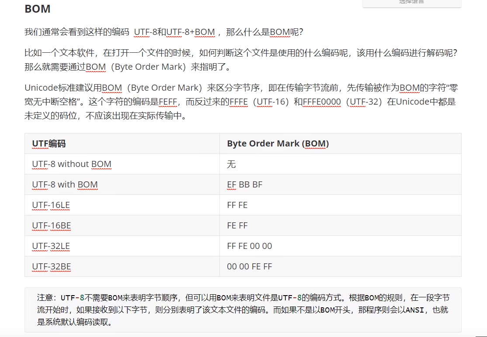
* Java中char中文字符串在内存中的存在方式？
一个char以utf-16的编码方式占两个字节而存在
如何验证？debug就行
* 如何将字符串以GBK的方式写入文件？
```java
    public static void main(String[] args) throws IOException {
        String str = "大家好！";
        OutputStreamWriter writer = new OutputStreamWriter(new FileOutputStream("a.txt"), "GBK");
        writer.write(str);
        writer.flush();
    }
```
# JDK
## switch
> 如果 case 语句块中没有 break 语句时，匹配成功后，从当前 case 开始，后续所有 case 的值都会输出。
```java
switch (i){
                case 0:
                    cell.setCellValue("所在部门");
                    break;
                case 1:
                    cell.setCellValue("员工姓名");
                    break;
                case 2:
                    cell.setCellValue("食堂选择");
                    break;
                case 3:
                    cell.setCellValue("就餐人数");
                    break;
                case 4:
                    cell.setCellValue("就餐金额");
                    break;
                case 5:
                    cell.setCellValue("就餐人员");
                    break;
                case 6:
                    cell.setCellValue("填报日期");
                    break;
                case 7:
                    cell.setCellValue("附件");
                    break;
            }
```

## enhanced for statement
* 语法
```java
for (V : Ex){
    //some statement
}
```
`:`右边有两种可能：
1、Ex是一个对象，该对象implements Iterable 
2、Ex是一个数组
如果Ex是一个对象，那么增强for循环会被翻译为如下形式的普通for循环
```java
for (I #i = Expression.iterator(); #i.hasNext(); ) {
    {VariableModifier} TargetType Identifier =
        (TargetType) #i.next();
    Statement
}
```
如果Ex是一个数组，那么增强for循环会被翻译为如下形式的普通for循环
```java
for (int #i = 0; #i < #a.length; #i++) {
    {VariableModifier} TargetType Identifier = #a[#i];
    Statement
}
```
### 参考资料
* [jdk文档](https://docs.oracle.com/javase/specs/jls/se8/html/jls-14.html#jls-14.14.2)
* [StackOverflow](https://stackoverflow.com/questions/85190/how-does-the-java-for-each-loop-work)
# Java基础
* 什么是devops？[link](https://www.ruanyifeng.com/blog/2023/03/platform-engineering.html)
*  与内存相关
    * 当写`Person p1`，就会在内存（栈）里有一块区域表示p1，在`new Person()`的时候，才会在内存（heap）里开辟一块区域表示对象，并把这个对象的地址赋给p1
    * 关于构造器：`通过调用构造器，才在内存里创建对象`
* 我们知道JVM就是一个程序，那什么是JDK？什么又是JRE？：JDK（Java Development Kit）=JRE+一些程序（javac,jar.exe）；JRE（Java Runtime Environment）= JVM+一些库；为什么打开项目的时候我们需要配置JDK呢？我觉得一方面idea的自动编译功能应该依靠JDK中的javac，运行的时候需要JRE
* 类中的东西
    * 匿名对象
    * 代码块
        * 形式：`{}`
        * 分类
            * 可以用static修饰的静态代码块：`static{}`；1.我们知道，static修饰的东西会随着类的加载而加载（代码中出现这个类的时候）`Person.desc`，而静态代码块会随着类的加载而**执行**
            * 裸的代码块/非静态代码块：`{}`；1.我们知道，不用static修饰的会随着对象的创建而创建，非静态代码块会随着对象的创建`new Person()`而自动执行
* `\t`:表示一个tab（8个空格）
```java
public static void main(String[] args) {
        System.out.println("Hello\tWorld!"); //Hello	World!
    }
```
* 语法
    * 继承的一个应用：代码复用 尚硅谷p228
    * 注解（Annotation）
## ClassLoader
### getSystemResource() method
#### 参考资料
1. [herongyang](https://www.herongyang.com/JVM/ClassLoader-getSystemResource-Method-Find-File.html)
2. [What's the default classpath when not specifying classpath?](https://stackoverflow.com/questions/8227682/whats-the-default-classpath-when-not-specifying-classpath)
#### 分析
如果代码中调用了`ClassLoader.getSystemResource('a.txt')`：
那么代码会将加载资源的任务交给当前类的加载器,让该类的加载器去加载资源getResources
```java
    public static URL getSystemResource(String name) {
        ClassLoader system = getSystemClassLoader(); //appClassLoader
        if (system == null) {
            return getBootstrapResource(name);
        }
        return system.getResource(name);
    }
```
类-加载器(app-classloader)也不想干这个活，他会把这个任务往上抛，扔给自己的父-加载器(ext-classloader)
```java
    public URL getResource(String name) {
        URL url;
        if (parent != null) {
            url = parent.getResource(name);
        } else {
            url = getBootstrapResource(name);
        }
        if (url == null) {
            url = findResource(name);
        }
        return url;
    }
```
所以最终，调用的是下面的方法
```java
    //Find resources from the VM's built-in classloader
    private static URL getBootstrapResource(String name) {
        URLClassPath ucp = getBootstrapClassPath();
        Resource res = ucp.getResource(name);
        return res != null ? res.getURL() : null;
    }
```
VM's built-in classloader(bootstrap-classloader)会去**一些**目录下去找这个资源，这些目录其中之一就是default classpath
根据参考资料2，default classpath就是classes目录下,**不包含子目录！**
因为无论是自己启动jvm还是idea帮你启动，启动目录都是classes，而`The default value of the class path is "."`

如果想从其他目录中加载资源，就如参考资料1中所说:
> If I want the JVM to load the logo.jpg file and the Hello.class from MyZIP.zip file, I need to use "-classpath" option to tell the JVM to search in MyZIP.zip first:
## Jar
* 编译时将源文件与classes分开(当前在src目录，要去新建classess目录):`javac -d ../classes Hello.java`
* 打jar包
    1、在classes文件夹下创建manifest.txt
    ```txt
    Main-Class:<空格>Hello<回车>//格式非常严格
    ```
    2、`jar -cvmf manifest.txt app1.jar *.class`
    3、`java -jar app1.jar`这样就可以运行jar包了
* package
    * 为什么要引入包？
    Java要写出可以重用的组件：比如我写了一个非常好用的类叫做util，我把我的类分享给你用，可恰好你需要用我的uilt提供的功能写一个自己的util类，这时候两个class的名字就冲突了。改名是不可能的，因为要见名知意；
    Java引入package来解决命名冲突。
    引入包以后，我的util类的名字是com.cbc.util,你的util类的名字是com.somebody.util,就不会命名冲突
    * 使用package
    1、需要在src下去建立com/headfirstjava,然后在com/headfirstjava下写的java文件的第一行加上`package com.headfirstjava;`
    2、在src下编译：`E:\code\Java_learn\src>javac -d ../classes com/headfirstjava/*.java`这时候classes文件夹下可以没有任何东西，编译完成后就会自动生成com/headfirstjava文件夹以及下面的*.class文件
    3、在classes目录下：`E:\code\Java_learn\classes>java com.headfirstjava.Hello`；java会自动在当前文件夹下去找com&headfirstjava文件夹，然后去运行Hello.class文件。如果把Hello.class文件移动到其他地方，都不能运行
    * 将package打成jar包
    1、在classes目录下创建manifest文件
    2、classes目录下：`jar -cvmf manifest.txt package.jar com`只需要指定com
    3、classes目录下：`java -jar .\package.jar`
    > 通过上面就可以解释：为什么一个类中有package，把它编译后的class文件复制出来，然后直接cmd命令行去java运行会显示“错误: 找不到或无法加载主类 Hello”
    想要运行就要创建好包，把class文件放到包里，然后在包外面去cmd命令行java运行
## 基本语法
* 8种基本数据类型
    * 哪八种？
    char;boolen;byte、short、int、long;float、double
    * 整型：四种整型之间的区别是什么？
    * char
        * 在Java中占几个字节？
        两个字节
        * 本质
        char的底层存的是一个无符号整数，对应的是该字符的unicode编码；
        因为char是一个无符号整数，所以`char >> 1`是无符号右移，第一位永远补0
    * 我们说，long变量赋值一定要在后面加上L，但`long l = 1234`编译通过，为什么？float变量后面一定要加上F，`float f = 12.3`会出现什么编译错误信息？
    1、1234被看成int，然后将int赋给long，属性自动类型提升；如果写成`long l = 123456789`就会编译报错
    2、12.3被看作double，double往float转，编译报错
    > 在java中，123类似的整数默认为int型，12.13等小数默认为double型;
    所以在代码中这样写：`byte b = a+1`(a是byte)就会报错
* 自动类型转换&强制类型转换 
    * 什么是自动类型转换？关于short,byte,char特殊情形？
    * 什么是强制类型转换？
    ```java
    //强转的前提是先使用多态，在进行强转
    Object obj = new String();
    String str = (String) obj
    //正常编译，但运行时会报错
    Object obj = new Object();
    String str = (String) obj
    ```
    * Java中的类型转换
    ```java
    //1、向上转换
    Person p = new Person();
    Object obj = (Object) p;
    //2、向下转换
    Object obj = new Object();
    Person p = (Person) obj;

    //这两种都能通过编译，但是第二种在运行时会报错；
    //从内存中很好理解：向上转换，其实内存中的对象所含的数据是“够的”
    //                向下转换，内存中对象所含的数据是“不够的”
    ```
* 关于注释：
    * 单行注释：//
    * 多行注释：/*   */
    * 文档注释：/**   */ :文档注释可以使用Javadoc命令解析成doc文件 尚硅谷宋p37


* 类和类中的内容
    * 方法
        * 什么是方法的重载？怎么判断哪些情况是不是重载?重载与返回值类型和权限修饰符没有关系
        * 什么是可变个数形参的方法？它与参数为数组之间的关系？（不能共存&调用方式不同）；如果方法参数为数组，我们可以遍历得到所有的传入变量，那用可变个数形参该怎么得到？【p209】
    * 匿名对象是什么？ `method(new Person()); //不规范的写法`
    * 匿名子类的写法？
    ```java
    Person p = new Person(){
        //重写方法or do something
    };
    ```
* 位运算
    * `>>`:有符号右移，最高位补0还是1按照补码的最高位
    * `>>>`:无符号右移，最高位永远补0
* Java查看int底层的二进制表示：`Integer.toBinaryString(c)`
* 小数查看底层的二进制表示：`Float.floatToIntBits(12.1f);`/`Double.doubleToLongBits(12.3)`
## 面向对象
* 三大特性的内容？
* Object
    * `equals`与`==`之间的区别？:`==`如果是基本数据类型，比较的是值，如果是对象，比较的是内存地址；`equals`是超类Object里面的方法，只有类才能调用，比较的是内存地址（原始的意思就是比较地址，但如果重写就不一定了）；
    * 为什么Object中的`equals`比较的是地址？【请看源码】
    * 那为什么`String.equals`比较的是内容？
* 封装
    * 为什么要有private和set方法？【p221】；因为private，从而有了get方法怎么理解？
    * 封装性的体现：1.属性私有化，同时提供get、set方法(把类看做成一个盒子，我不允许你直接操作我里面的元素，而是要通过我提供的口子来操作)。2.方法私有化...【p222】
    * *对封装性的理解（面试）*:从使用的层面理解：正是因为有封装性，我们才可以直接调用某个方法来做功能，而不需要关注具体的方法实现；从操作的层面上说：有了封装性，才能限制使用者对当前类中的元素的修改，你的操作需要满足一定的条件才会生效
    * 四种权限修饰符是什么？他们的区别？【p223】
    * this关键字
        ```java
        //使用场景一：这时的this是给编译器javac看的
        public Point(int x, int y) {
            this.x = x;
            this.y = y;
        }
        //使用场景二（死记）：如果想在构造器中调用重载的另一个构造器，需要使用this
        public Rectangle() {
            this(0, 0, 1, 1); //这里如果写Rectangle(0,0,1,1)报错
        }
        public Rectangle(int width, int height) {
            this(0, 0, width, height);
        }
        ```
        * 为什么要用this？[link](https://blog.csdn.net/benxiangsj/article/details/124282800)
        * this怎么理解? this关键字一定是在一个类中使用，可以理解为“当前正在创建的对象”。所以`this.val = val`表示把val赋值给当前正在创建对象的属性val
        * `this();`什么意思？【p234】
* 接口
```java
//1、接口允许**多继承！**
public interface MyInterface extends interfaceParent1,interfaceParent2 {
    //2、接口中可以有变量，修饰符写不写都行，默认且只能是public static final
    //通过MyInterface.a来调用
    int a = 0;
    //3、接口中的方法加不加修饰符都行，默认且只能是public abstract
    Integer method1();
}
```
* 继承
    * 继承与接口的关系：`继承只能是一个,而接口的实现可以是多个.继承的原意是希望得到父类的特性.而实现接口是对自身一个插入式的扩展` [link](https://www.zhihu.com/question/49674278/answer/133404995)
    > 接口的好处：
    1、主机与CPU之间的关系：只要主机留好接口，CPU遵守接口，那么整个系统就能工作。
    不需要了解CPU的复杂结构
    2、声明好接口，上一层就可以直接使用编写，编译不会报错。不管有没有实现类
    * 为什么一个子类可以调用父类的方法和属性？【p278】（通过构造器将所有父类加载到方法区，子类的构造器一定调用父类的构造器）
    * 关于继承：
    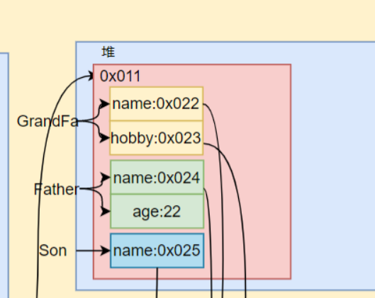
        * 继承，会继承父类的所有的属性和方法，包括private类型
        * 内存：属性冲突，两个都存在
        * super关键字的使用：用super.属性，会从父类开始找，如果父类没有该属性，继续往上找，直到找到**第一个**具有该属性的类，就不再往上找了
        > Q:如果GrandFa有个方法method，Father重写method，Son直接调用super.method,调用的是谁的method？ Father
    * super关键字：
        * 小理解：无论是this，还是super，都是在出现重名的情况下，用来指明的
        * 
    * 问题看代码 | 答案：1、如果显示的写出有参构造函数，那就不会默认提供无参构造器了。2、Child类会提供默认的无参构造函数，但根据**子类对象实例化的全过程**,子类需要调用父类的无参构造器，但Father没有无参构造器，只写了个有参构造器，自然报错
    > 子类对象实例化的全过程：
    1、为什么子类能够拥有父类的所有属性和方法？ 那是因为在创建子类对象的时候会调用父类的构造器，将父类的属性和方法加载到堆中，一直向上递归，直到Object类
    2、子类对象在堆中的状态：既然调用了所有父类的构造方法，那初始化对象时，在堆中是存在好多个方框还是一个方框（每个方框代表一个对象）？只有一个方框，虽然调用所有父类的构造方法，但堆中只存在一个对象，那就是我们自己new的
    ```java
    public class Father {

    private String name = "张三";//私有属性
    private String sex = "男";

    public Father(String name, String sex) {
        this.name = name;
        this.sex = sex;
        }
    }
    public class Child extends Father { //报错，为什么？
    }
    ```
* 多态
    * 什么是多态？父类的引用指向子类的对象，能不能调看父类，怎么调，看子类
    * 为什么要有多态？提高方法的通用性、减少方法的重载【p281】| 通过多态，将规范和实现直接分开 `void doData(Connection conn)`
    * 多态的属性值取决于父类还是子类？ 父类【p282】
    * 什么是虚拟方法？
    * 父子类对象之间的类型转换
    强转是和多态搭配使用的；
    多态是我new了一个Student，把它赋给Person；
    然后Person可以强转为Student
    ```java
    Person p = new Student();//多态
    p1 = (Student) p//强转

    //==========================================
    Person p = new Person();
    s1 = (Student)p //报错
    ```
* 关键字

    * native:表示这个方法具体实现调用的是底层的C或C++，不再用Java了。
    * super：`super是为了兼容代码而设计的？`
    * final
        * 修饰对象
            * 类：表示这个类不能被继承了，像String、System。（为什么要把String类声明为final？因为这个类的功能已经很完整了，不需要在继承来扩充功能了
            * 方法：这个方法不能被重写
            * 属性：表明对象出生时，它的属性已经是final的了/确定下来了（不能修改）（在哪赋？1.直接写2.代码块3.构造器|为什么可以用1、2、3来赋值，不能在自己写的set方法里赋值？）
        * final与static的区别
    * abstract
        * 抽象类：表示这个类不能被实例化
        > 抽象类与接口之间的区别？
        抽象类可以有自己的成员变量，接口只能有方法。所以继承抽象类可以比实现接口复用更多的代码
        * 抽象方法：没有方法体；子类可以选择实现抽象方法 或者 成为抽象类
    * static （来源：在尚硅谷JavaWebp259 12min20s中，为什么findCookie方法要用public static：）【当前：基础p317】
        * 为什么要使用static？
        怎么通过多线程实现卖票？假设票数共`tickets=100`张，如果`tickets`不用static修饰，会发现每个线程各卖100张，与实际不符
        * static的使用
            * static修饰属性：当我们new多个对象的时候，每个对象里都有一份非静态属性（称为实例变量）；但这些对象共享一份静态属性（static修饰的）
            > static变量在方法区中的静态域里
            所以当new一个对象的时候，它的普通成员变量在堆中，而static变量在方法区中
            * static修饰方法：随着类的加载而加载，可以通过类.方法来调用
        * static在内存里的状态：static修饰的方法、变量在内存中就只有一个，不像对象每次new一个就会在内存里有一个对象；会随着类的加载而加载
        > class文件被加载到方法区后，之于变量：只有静态成员变量被分配内存，其他的变量还都是死的。之于方法：只有静态方法被分配内存成为一个栈帧，其他的方法还都是死的；
        当new出来一个对象的时候，会在堆中为非静态成员变量分配内存，并初始化；
        当对象调用某个非静态方法的时候，jvm的执行引擎才会把该方法封装为栈帧
        以上，回答下列问题：
        为什么静态方法不能调用非静态变量：非静态变量在内存中还不存在
        * 怎么理解静态方法不能调用非静态方法：从类的加载过程分析
    * package
        * 为什么要有包这个概念：package应该和import结合着看。我觉得就是为了方便管理，方便使用
* 自动装箱&自动拆箱
什么是自动装箱？
自动装箱是指可以把一个int直接赋值给Integer。在编译的过程中实际上会调用Integer.valueOf方法
自动拆箱是指可以把一个Integer直接赋值给int。在编译的过程中实际上会调用Integer.intValue方法
```java
//int->Integer
Object tese(){
    int i = 0;
    return i;
}
```
* 基本数据类型对应的包装类怎么改变里面的value值？
> Furthermore, Integer is immutable, meaning you can't change its value. 
* 内部类
    * 静态内部类
    * 成员内部类
    * 方法内部类
    * 匿名内部类
    ```java
    new 父类(参数列表){
        //匿名内部类的实现
    }
    new 父接口(参数列表){
        //匿名内部类的实现
    }
    Comparator<String> con = new Comparator<String>() {
        @Override
        public int compare(String o1, String o2) {
            return 0;
        }
    };
    ```
    作为类中的属性
    什么时候使用内部类？
    一个类只被当前类使用，而不被其他类使用
    成员内部类的例子：看jdk源码中LinkedList中的Node
    * 局部内部类
    在方法、代码块、构造器中
## 异常处理
* 为什么要有异常处理？
可能用户忘记了输入字符串，而后台又会对字符串进行一些操作。结果是当用户一点击登录按钮，出现nullexception以及一连串代码，这对用户来说体验感极差。如果用下面的代码来处理异常,当用户不小心误操作引发异常时，可以有一个很友好的提示信息
```java
    try {
        str.length();
    } catch (Exception e) {
        System.out.println("xxxx，请重试");
    }
```
> RuntimeException可以不处理
* 常见的异常以及复现？【p373】
* 如果不处理异常，接下来的代码还会走吗？如果处理后，接下来的代码还会走吗？
* 处理异常的两种方式：try-catch & throws
    * try-catch
        * 在try-catch中，如果在try中某一条语句出现异常，那try中该条语句的下面语句还会执行吗？不会
        * 如果catch中多有个catch项匹配该异常，进入哪个catch？还会进入其他的catch语句吗？ 逐个匹配，一旦匹配成功，就进行异常处理，处理完成后直接跳出try-catch
        ```java
        String str = null;
        try {
            str.length();
        } catch (NullPointerException e){
            System.out.println("nullpointerexc");
        } catch (Exception e) {
            System.out.println("exc");
        }
        //输出：nullpointerexc
        ```
        * 如下面代码:如果第一个fw.close发生异常，还会执行第二个try-catch吗？当然，try-catch就是对异常进行处理，处理完就没事了，继续执行下面的代码
        ```java
        finally{
            try {
                if(fw != null)
                    fw.close();
            } catch (IOException e) {
                e.printStackTrace();
            }

            try {
                if(fr != null)
                    fr.close();
            } catch (IOException e) {
                e.printStackTrace();
            }
        }
        ```
    * throws
        * 该方法可能出现异常，通过throws将异常扔给调用者，由调用者进行异常处理
        ```java
        public static void main(String[] args){
            try {
                method2();
            } catch (IOException e) {
                e.printStackTrace();
            }
	    }
        public static void method2() throws IOException{
            //do something
	    }
        ```
        * 如果method()通过throws处理异常，那当异常出现的时候，method()方法中的下面的代码还会执行吗？ 不会
        * 关于子类重写父类的方法时，抛出的异常要小于父类抛出的异常
        ```java
        class SuperClass{
            public void method() throws IOException {

            }
        }
        class SubClass extends SuperClass{
            @Override
            public void method() throws Exception {//编译报错
                super.method();
            }
        }
        ```
        > 为什么？由于多态
    * throw：自己创建异常
    * catch中常用的方法？【p375】
    * finally：如果有返回值，那这个try-catch的执行流程？
> try-catch与throws两种处理异常的区别？
throws处理异常：一个方法逐行执行，当某一行出现异常时，就会在堆中创建一个exception对象，并且直接结束（方法中剩余的行不执行了）
如果代码中涉及到流操作，try-catch要比throws好。原因是最后一步通常要把流关掉，如果throws了，在出现异常时就直接退出了，没有关闭流，导致内存泄漏

* 注：涉及到流时的异常处理
只需要注意两点：1、要用try-catch，不能用throws 2、finally中要判断是否为空
```java
    FileReader reader = null;
    try {
        reader = new FileReader("a.txt");
        int data = reader.read();
        System.out.println(data);
    } catch (IOException e) {
        e.printStackTrace();
    } finally {
        try {
            if (reader != null) //important！
            //可能上面创建流的时候报异常了，流没创建出来，但无论怎么样都要执行finally操作，所以要判空
            reader.close();
        } catch (IOException e) {
            e.printStackTrace();
        }
    }
```

* `try-finally`
    * 为什么要使用`try-finally`?
    看下面的代码:发现这个`lock.unlock()`有点问题，如果当tickets减为0，那就直接break了，即直接跳出while循环，这个🔒永远也释放不掉；
    这时就要把这个`lock.unlock()`放进finally里面，**这样即使break了，也会先执行finally里的代码后，在跳出while循环**。
    ```java
    public void run() {
        while(true){
            lock.lock();
            if (tickets > 0) {
                System.out.println(Thread.currentThread().getName() + ":" + tickets);
                tickets--;
            } else break;
            lock.unlock();
        }
    }
    ```

## 注解
* 元注解：修饰注解的注解
1、Target：表示该注解可以放在哪
2、Rentention：该注解何时生效
3、
4、
* 注解的用法？ 注解并不上加上注解就会有什么作用，声明注解是给反射用的
* 注解的写法
```java
public @interface Target {
    ElementType[] value(); //注解的属性，可以给value属性赋值，因为前面声明的是数组，所以可以赋值多个
    //调用时：@Target(value={ElementType.TYPE,ElementType.FIELD})
    String value1();//可以给value1属性赋值，因为前面声明的是单个变量，所以可以赋值多个
    //调用时：@Target(value1="Hello")
}
//如果写得时候什么都不加，默认给value属性赋值
@Target(ElementType.TYPE) //默认给value属性赋值
public class annotationTest{

}
```
--------

* 继承
    * 类与类之间的继承
        * 子类可以对父类中的方法进行**重写**或者功能**扩充**，怎么理解？

    * 反射
        * 看看`Test.class`文件里有什么东西：`javap -v Test`(.class是二进制文件，通过javap反汇编)
        * 反射给我的感觉就是操作class类，这个类是class文件的对象化，那反射为什么叫反射？
        * 什么时候用反射：需要根据字符串来调用对应的类或者方法时（字符串是可以变得）
        * 我在BaseServlet中doGet中写反射代码，然后我用另一个Servlet继承BaseServlet，为什么我这个Servlet中不需要写doget方法，直接写login方法，就可以正常运行？因为继承 尚硅谷p259在CookieServlet中没有doget方法的疑问
* 泛型程序设计
    * 为什么`Deque<Integer>`尖括号里只能是Integer不能是int？ Java核心卷1p320
## 集合 
* Collection接口
    * 往Collection中存自定义对象的时候，自定义类要重写哪些方法？
    equals方法
    对于List而言，尽管add操作不需要对象重写方法，但remove/contains操作会调用equals方法。
    对于set而言，在添加的时候就会用到equals方法和hashCode方法
    * `Person[] res = Collection.toArray(new Person[0])`
    将集合转化为数组,括号里面需要一个数组的首地址，为了节省空间，就写成了`Person[0]`
    * List
        * List的常用方法
        增、删、改、查、插、长度、遍历
        add、remove、set、get、add、size、iterator
        * ArrayList
            * `RandomAccess`接口
            1、需要背景
            `RandomAccess`是给算法看的，如Collections中的binarySearch，如果某个List实现类RandomAccess接口，那么就会选择更高效的二分实现（直接通过下标访问的indexBinarySearch）。如ArrayList
            否则只能通过iterator去一个个的移动（iteratorBinarySearch）。如LinkedList
            * 扩容机制
            在add第一个元素的时候会上来new的Object数组为10，不断往里面加元素，如果不够了就会扩为原来的1.5倍（`oldC = oldC + (oldC>>1)`）
        * ArrayList与Vector
        ArrayList作为List的主要实现类；Vector作为List的古老实现类
        ArrayList与vector之间的关系像stringbuffer和stringbuilder
        因为arraylist是线程不安全的，所以执行效率比较高；
        而vector是线程安全的。所以通常使用arraylist而不用vector
        > ArrayList的补充：
        jdk7使用ArrayList空参构造器，会创建一个16的数组
        jdk8使用空参构造器，不会创建数组，直到添加第一个数据的时候才会new数组
        * ArrayList与LinkedList
        ArrayList底层使用数组；频繁查询使用ArrayList
        LinkedList底层使用双向链表；频繁删除、插入使用LinkedList
        * iterator
        对两个指针的封装体
        在ArrayList中，iterator是一个内部类，对外提供功能
    * set
    无序性&不可重复性；如何理解无序性和不可重复性？
    无序性：无序性是指添加的元素的位置在==逻辑上==是无序的。
    比如List接口中的实现类是有序的，无论是ArrayList还是LinkedList，在逻辑上肯定第二个插入的元素在第一个插入的元素的后面；
    而HashSet/HashMap却不是，插入元素的位置由hashCode配合上一个函数求得。所以很有可能后插入的元素在先插入元素的前面
    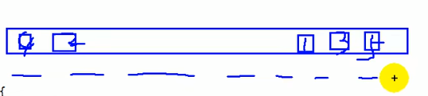
    使用Set要重写添加类中equals()和hashCode()
        * HashSet
        * LinkedHashSet
        hashset的子类；遍历时会按照当初添加的顺序遍历
        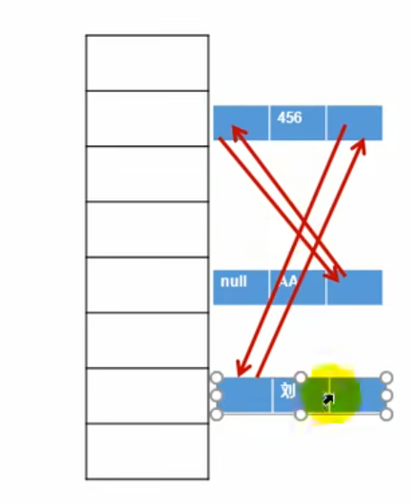
        * TreeSet
        1、底层使用红黑树实现，对象能够排序
        2、使用TreeSet时，里面只能存相同类的对象
        3、注意：TreeSet判断对象想不想同使用的时候CompareTo方法的返回值：如果返回值为0就认为两个对象是相同的。不像HashSet先根据hashCode再根据equasl()
* Map接口
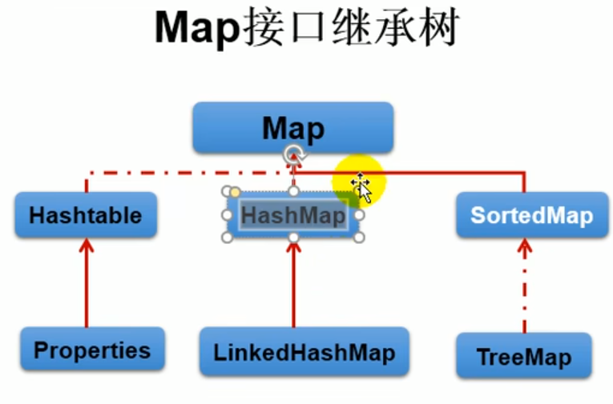
HashMap作为Map的主要实现类；Hashtable作为Map的古老实现类;
HashMap线程不安全，效率高；Hashtable线程安全，效率低
HashMap可以存null的key或者value；而Hashtable不能
LinkedHashMap继承HashMap，可以在遍历的时候按照添加的顺序去遍历
TreeMap可以保证按照key进行排序，实现排序遍历
    * HashMap
        * HashMap的扩容机制
        在put第一个元素的时候会new一个长度为16的Node数组(table);
        如果往里面放的元素超过了threshold，就会去扩容：
        新数组的size是原来的2倍`newCap = oldCap << 1`;新的threshold是原来的2倍`newThr = oldThr << 1`
        往新的Node数组里面移动的策略：会计算在新的Node数组里面的位置；
        HashMap中链，算上table中元素，最多能放8个；开始放第九个的时候
        * HashMap中的factor的作用
        factor用来指示当map中的元素个数达到Node数组百分之多少时，对Node数组进行扩容
        有两个目的:1、使得在Map中的链表比较少2、Node数组利用率高
        * HashMap put元素的过程
        通过对hash进行运算(`i = (n-1)&hash`)算出该元素在Node数组中的位置i
        如果该位置为null，直接插入
        否则进行比较：1、如果hash值一样 并且（地址一样||equals返回true），直接修改 2、否则紧接着与链表中的下一个比较
        * HashMap中的Node数组的长度为什么是2的幂次方？
        源代码中的`(n - 1) & hash `等价于`hash%n`。前提是n必须为2的倍数
    ```java
    final V putVal(int hash, K key, V value, boolean onlyIfAbsent,
                   boolean evict) {
        Node<K,V>[] tab; Node<K,V> p; int n, i;
        if ((tab = table) == null || (n = tab.length) == 0)
            //如果table数组没有初始化，就去new一个长度为16的Node数组
            n = (tab = resize()).length;
        if ((p = tab[i = (n - 1) & hash]) == null)//确定添加进来的元素在table数组中的位置
            tab[i] = newNode(hash, key, value, null);
        else {
            Node<K,V> e; K k;
            if (p.hash == hash &&
                ((k = p.key) == key || (key != null && key.equals(k))))
                e = p;
            else if (p instanceof TreeNode)
                e = ((TreeNode<K,V>)p).putTreeVal(this, tab, hash, key, value);
            else {
                for (int binCount = 0; ; ++binCount) {
                    if ((e = p.next) == null) {
                        p.next = newNode(hash, key, value, null);
                        if (binCount >= TREEIFY_THRESHOLD - 1) // -1 for 1st
                            treeifyBin(tab, hash);
                        break;
                    }
                    if (e.hash == hash &&
                        ((k = e.key) == key || (key != null && key.equals(k))))
                        break;
                    p = e;
                }
            }
            if (e != null) { // existing mapping for key
                V oldValue = e.value;
                if (!onlyIfAbsent || oldValue == null)
                    e.value = value;
                afterNodeAccess(e);
                return oldValue;
            }
        }
        ++modCount;//被修改的次数+1
        if (++size > threshold)//map中的总数量+1
            resize();
        afterNodeInsertion(evict);
        return null;
    }
    ```
    会去new一个长度为16的Node数组
    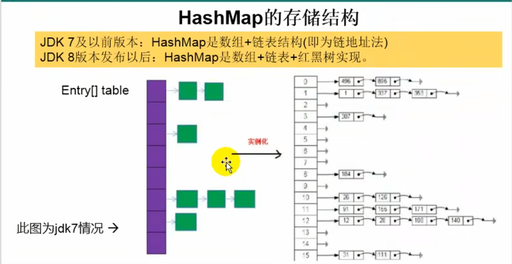
    
    * Properties:
    1、常用来处理配置文件
    2、作为HashMap的子类，它的特别之处就是key和value都是String类型
    ```java
    //==========a.cbc=============
    //其实文件名只是一个标志，只要程序能找到就行，不管后缀是.txt还是.cbc
    name=Tom
    password=123456
    //===========使用================
    public static void main(String[] args) throws IOException {
        Properties prop = new Properties();
        prop.load(new FileReader("a.cbc"));//new FileReader还是new FileInputStream都可以
        String name = prop.getProperty("name");
        System.out.println(name);
    }
    ```
    > Warning！
    配置文件下面两种写法是不一样的!
    driver=com.mysql.jdbc.Driver
    当pros.getproperty()的时候，driver="com.mysql.jdbc.Driver";
    driver="com.mysql.jdbc.Driver"
    当pros.getproperty()的时候，driver=" "com.mysql.jdbc.Driver" ";
    多个引号!
## 泛型（jdk5引入）
* 为什么要使用泛型？（使用泛型与Object的区别）
1、可以消除cast的代码
2、使用泛型可以保证集合里面存的数据都是相同类型的。Object什么东西都可以往里面放，很容易引发runtimexception。排除运行时异常要比编译异常花费更长的时间
> 注：泛型的类型不能是基本数据类型
* 自定义泛型类
> 注：
1、自定义泛型类中的构造器就是正常的构造器，不用带泛型
* 泛型类
```java
public class A <T>{
    public T method(){ //和普通方法一样，只不过void/int被换成了T
        //
    }
}
```
* 泛型方法
```java
如果在一个普通的类中使用泛型，写成如下方式：
public class A{
    public int indexof(T[] arr,T target){
        for (int i = 0; i < arr.length; i++){
            if (arr.equals(target)) return i;
        }
        return -1;
    }
}
会编译报错。解决方法有两种：
1、将类变成泛型类
2、将方法变为泛型方法
public class A{
    public <T> int indexof(T[] arr,T target){
        for (int i = 0; i < arr.length; i++){
            if (arr.equals(target)) return i;
        }
        return -1;
    }
}
```
* `T`的限定
    * 背景：使用`T`，就可以看成Object。如果我想对这个`T`加上一些限制：比如T必须为Number的子类。而不是Object的子类
    * 上限为某个类
    ```java
    public class NumberPair<U extends Number,V extends Number>{

    }
    ```
    * 上限为某个接口
    ```java
    public <T extends Comparable> T max(T[] arr){ //要求传进来的类型T要实现Comparable

    }
    ```
    * 上限为E
    ```java
    public <T extends E> void addAll(T[] arr){

    }
    ```
* 通配符：`?`
    * `<? extends E>`
    ```java
    public void addAll(DynamicArray<? extends E> arr){

    }
    等价于
    public <T extends E> void addAll(DynamicArray<T> arr){

    }
    ```
    * `<? super E>`:不知道类型是什么，但是类型T是E的父类
## 常用类
* String
    * 常用方法
        * 将String转化为char数组：String.toCharArry();
        * 将char数组转化为String：调用String的构造器
        > 为什么将char数组传给String的构造器，还需要在new一个新的char数组，然后在在调用copyof方法复制？不能直接将传进来的char数组直接赋给String里面的value吗？
        API中写的很清楚，这样做就算对原来的char数组做修改，也不会影响String
        * 忽略大小写进行字符串比较：equalsIgnoreCase
        > 注：`"C".equalsIgnoreCase(str)`这样写的目的是为了避免空指针异常
        * 字符串转化为大写：toUpperCase
    * 什么是String的不可变性？
    无论对原有的String做任何修改操作，都会重新造一个新的String，而不改变原来的
    体现：1、`str += "World"`2、`str.replace(a,m)`
    > **important**
    `String str = new String("hello");`底层过程：
    0、当类进行加载的时候，就会在方法区中开辟内存，创建一个`"hello"`字符串
    1、在执行new的时候，就会在堆中开辟内存，并且将堆中String里面的value赋个地址，指向方法区中`"hello"`字符串中的value
    图如下：
    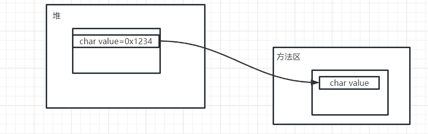
    ```java
    //Notice 2:

    /*
        1、字面量或者字面量的组合都在常量池
        2、只要涉及到变量，都在堆空间
        String str1 = "JavaEE"
        String str = str1 + "Hadoop"
        str1和Hadoop都在常量池中，但str在堆中
    */


    //这种形式编译器会直接把"JavaEEHadoop"放进常量池，所以运行时常量池中只会存在一个String实例JavaEEHadoop，而不会分别存在Java和Hadoop两个String
    String str2 = "JavaEE"+"Hadoop";

    //这种形式：只要涉及一个变量+，都会重新创建一个String
    String str1 = "JavaEE";
    String str3 = str1+"Hadoop";
    ```
    * `intern()`方法
    ```java
    String s1 = "java";
    String s3 = "javaHadoop";
    String s5 = s1+"Hadoop";
    String s8 = s5.intern();
    s8 == s3 //true
    /*
    s5.intern()运行流程解析：
    因为s5是"javaHadoop",所以首先去运行时常量池里面去找，存不存在字符串str.equals(s5)==true，如果存在，直接将该字符串地址返回给s8
    如果不存在，在运行时常量池中创建对象，并将地址返回给s8
    */
    ```
    * 
    ```java
    Person p1 = new Person("Hello",1);
    Person p2 = new Person("Hello",2);
    p1.name == p2.name //true,为什么？
    ```
    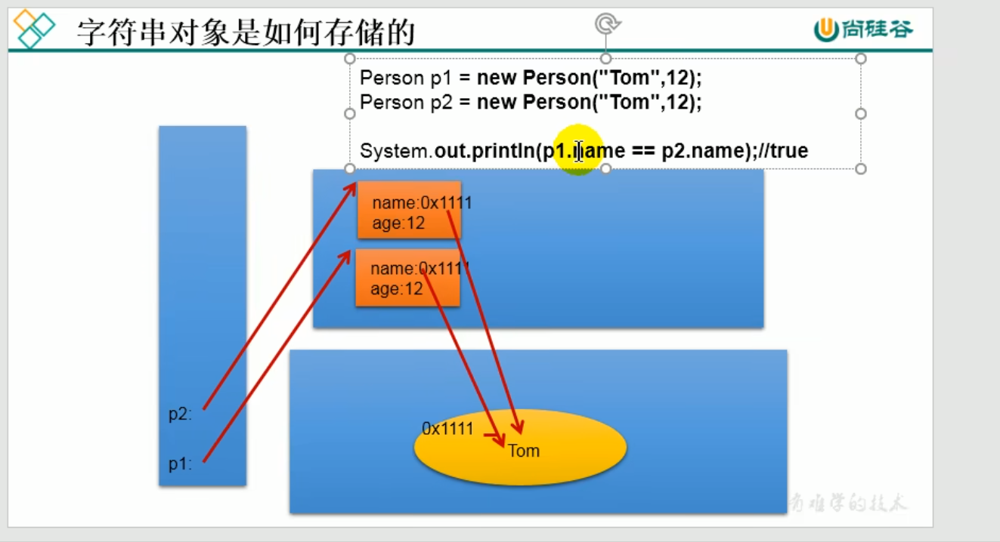

    * StringBuffer & StringBuilder
    1、String和StringBuffer是JDK1.0一块推出的
    2、StringBuilder是JDK1.5推出的，目的是对StringBuffer在线程方面进行改良
    > StringBuffer效率比较低，因为是线程安全的类，方法都是synchronized的
* Random
    * 构造器Random(seed):如果seed一样，随机出来的数也一样，所以一般这样用`new Random(System.currentTimeMillis());`
    * random.nextInt(4):从0~3中随机取一值
### Java字符串占位符
* 参考：[CSDN](https://blog.csdn.net/weixin_41919486/article/details/122521836)
### Arrays
* `Arrays.sort()`
    * 基本数据类型，默认从小到大
    * `sort(T[] a, Comparator<? super T> c)`
        * 使用背景：
        1、对String数组需要从大到小排序：自己写个Comparator
        2、对String数组，想要忽略大小写进行从小到大排序：`Arrays.sort(arr,String.CaseInsensitiveComparator)`
* `Arrays.toString()`：
    * 需要背景：输出数组。如果直接输出str，输出的是一个地址
    * Arrays里有九个重载的toString方法，分别为八个基本数据类型+一个对象类型
### Collections
* `reverse`
```java
//反转list
Collections.reverse(list);
```
* `reverseOrder`
reverseOrder底层仍然是调用类里面的compareTo方法。
所以只有像String这样已经重写了compareTo方法的类，才能使用reverseOrder方法
* `binarySearch`：针对List
默认传入的List需要从小到大排序，如果是从大到小排序想要使用binarySearch，需要传入一个逆序的Comparator`Collection.binarySearch(list,7,Collections.reverseOrder())`;
* `sort`：针对List


### 时间相关
* `System.currentTimeMillis()`
* Date类
    * util.Date的使用
    ```java
    public class DateTest {
        public static void main(String[] args) {
            Date date = new Date();
            System.out.println(date);
            //2023-4-11 星期二
            //getYear得到的是距离1900年之间的，所以res+1900才是现在的年份
            System.out.println(date.getYear());//123
            //如果1月，返回0；所以现在的月份是res+1
            System.out.println(date.getMonth());//3
            //周日为0
            System.out.println(date.getDay());//2
        }
    }
    ```
    * util.Date与sql.Date之间的区别
    1、sql.Date涉及数据库：数据库中的int对应Java中的int；数据库中的varchar对应Java中的String；数据库中的Date就对应Java中的sql.Date
    2、sql.Date继承于util.Date
    3、如何将util.Date转化为sql.Date？
    ```java
    public class SimpleDateFormatTest {
        public static void main(String[] args) throws ParseException {
            Date date = new Date();
            java.sql.Date date1 = new java.sql.Date(date.getTime());
        }
    }   
    ```
* SimpleDataFormat
    * 如何通过simpledataformat将`2000-11-03`转化为Data中的数值？
    ```java
    public class SimpleDateFormatTest {
        public static void main(String[] args) throws ParseException {
            String str = "2023-04-11";
            SimpleDateFormat sdf = new SimpleDateFormat("yyyy-MM-dd");
            Date date = sdf.parse(str);
            System.out.println(date);
        }
    }
    ```
    * 将Date转化为`2023-04-11 15:51:16 星期二`的形式
    ```java
    public class SimpleDateFormatTest {
        public static void main(String[] args) {
            SimpleDateFormat sdf = new SimpleDateFormat("yyyy-MM-dd HH:mm:ss E");
            String res = sdf.format(new Date());
            System.out.println(res);
        }
    }
    ```
* 比较器
    * comparable接口
        * compareTo的写法：
        this(A) compateTo(B)
        如果A比B大，返回正；A比B小，返回负。这样写排序的时候默认从小到大
        * 使用：
        1、类继承接口，重写compareTo方法
        2、将实例塞到数组里面，使用Arrays.sort()进行排序
    如何对对象数组进行排序？
    * comparator接口
        * 为什么引入comparator接口？
        一个类已经实现类comparable接口，但想按照其他规则排序，而且不想改类中的源代码：例如想要String从大到小去排序；或者相对JDK里面的类实现排序功能（JDK里没有实现comparable接口的类，但我们又不能改jdk的源码
        * comparator的使用
        实现compare方法，A compare B：如果A大于B返回正，小于返回负。默认从到大
        ```java
        Arrays.sort(str, new Comparator<String>() {
            @Override
            public int compare(String o1, String o2) { //接口的匿名实现类
                return -o1.compareTo(o2);
            }
        });
        ```
* number类
    * BigDecimal
        * 为什么要使用Big Decimal？
        BigDecimal在商业中代替double类型，实现更好的精度管理
        ```java
            public static void main(String[] args) {
            double a = 0.1;
            double b = 0.00000000000001;
            double c = a+b;
            System.out.println(c); //系统输出0.10000000000001001
        }
        ```
## IO
* File类
    > 为什么要使用File类进行IO？
    1、Java中万事万物皆对象，用file来表示一个文件
    2、file.getAbsolutePath()有时真的挺有用的
* `OutPutStream`为什么要在close之前执行flush操作？
与操作系统的实现有关，有可能在write之后，数据并不是直接写入文件，而是在内存中缓存着，如果直接close掉了，可能会造成数据丢失；
通过flush操作，指示os将write的所有数据写入磁盘
```java
    //运行后会发现a.txt里面什么都没有
    public static void main(String[] args) throws IOException {
        String str = "大家好！";
        FileWriter fw = new FileWriter("a.txt");
        fw.write(str);
    }
```
* 节点流（文件流）
    * FileReader&FileWriter
        * read():返回读入字符的编码数字，如果到了文件末尾，返回-1
            ```java
            char[] cbuf = new char[5];
            int len;
            fr.read(cbuf); //文件的内容：helloWorld123
            while((len = fr.read(cbuf)) != -1){
                for(int i = 0;i < cbuf.length;i++){
                    System.out.print(cbuf[i]); //第三次输出123ld？
                }
            }
            ```
        * FileInputStream&FileOutputStream

* 处理流  
    > 注：如果把流想象成一根管子，节点流就是裸的管子，而对象流包裹在节点流上
    从代码层面：处理流在创建时，传给构造器的参数都是流对象，而不像节点流一样参数为file/String

    * 缓冲流
        * 为什么要使用缓冲流？缓冲流是对节点流的进一步封装，目的就是为了提高传输效率
        * BufferedInputStream&BufferedOutpurStream
        > 注意：Buffered流在构造的时候需要传入一个节点流。（体现缓冲流包在节点流的外面）
        在关闭流的时候，需要先关Buffered流，在关节点流。但由于关闭缓冲流的时候，系统会自动的把节点流关闭，所以节点流的关闭不写也行

        >Q:为什么BufferedStream会比FileStream效率高?
        BufferedStream与底层交互的次数比较少，与底层交互一次，它会一下取很多数据并保存在自己类中的buffer中。
        用BufferedStream进行read操作，实际上是将buffer中数据的一部分给你，而不需要在向底层去要
        * BufferedReader&BufferedWriter
            * readline()
    * 转换流
        * InputStreamReader&OutputStreamWriter
    * 其他处理流
        * 打印流：PrintStream&PrintWriter
        > 注：因为System.out就是一个PrintStream，所以PrintStream通常与System.setOut()搭配使用，这样再用System.out的时候就不会输出到控制台了
        * System.in&System.out
        > 为什么用System.out时，如果pojo重写to_string和不重写to_string输出的内容不一样？
        请看System.out.print方法的源代码
        * 数据流：dataInputStream&dataOutputStream
            * 用法：将基本数据类型or String输出至本地文件
        * 对象流：ObjectInputStream&ObjectOutputStream
            * 用法：将一个对象写入本地文件（序列化）
            * 如何将自己手写的Person类序列化&反序列化
            ```java
            public class Person implements Serializable {//必须要implements Serializable接口
                int age;
                String name;

                public Person(int age, String name) {
                    this.age = age;
                    this.name = name;
                }

                @Override
                public String toString() {
                    return "Person{" +
                            "age=" + age +
                            ", name='" + name + '\'' +
                            '}';
                }
            }
            //=========================================================
            public static void main(String[] args) throws Exception {
                ObjectOutputStream oos = new ObjectOutputStream(new FileOutputStream("oos.txt"));
                oos.writeObject(new Person(1,"cbc"));

                ObjectInputStream ois = new ObjectInputStream(new FileInputStream("oos.txt"));
                Object o = ois.readObject();
                System.out.println(o);
            }            
            ```
        > 序列化&反序列化
        1、序列化就是将对象数据保存到本地；反序列化就是将对象从文件中读入内存
        2、一个类想要序列化的条件：①实现serializable接口②给一个serialVersionUID③类中的所有属性也要可序列化（基本数据类型默认可序列化）
        3、如果一个类中的属性被static或者transient修饰，则不能序列化
        (
            firstly:从内存层面来了解：序列化是将堆中对象的数据进行保存，但static修饰的变量值存在方法区，自然保存不了
            secondly:transient关键字应该是给序列化的操作者看的
        )
        关于serialVersionUID的一些说明：
        1、这个UID可以不写，如果不写，系统会自动生成一个，但存在问题
        2、假如我使用Person类的对象person进行序列化为person.dat，系统会生成一个UID。
        但如果我对Person类进行一些修改，那这时Person类的UID就会更新。这时将person.dat反序列化时就找不到对应的类了
        所以一般UID一定要写
        * RandomAccessFile类
## 网络编程
* ByteArrayOutputStream
    * 为什么用它？
    情景：有一个网络输入流，传输的是文本文件，我想在内存层面（程序中）输出一下传过来的内容，该怎么写？
    因为传输内容有中文、有英文，所以不能直接输出Byte数组转String，可能乱码
    * 优点：该类中有个buffer，如果不够了还可以自己增加，所以将Byte数组写进ByteArrayOutputStream中，最后通过类的to_String方法打印到console
* Socket
    
    * socket.shoutdownOutput
## 反射
new对象的第二种方式
* 为什么需要反射？
动态性
需求：给你不同类的名称，给我返回不同类的实例(对象)
```java
   public void test2(){
        for(int i = 0;i < 100;i++){
            int num = new Random().nextInt(3);//0,1,2
            String classPath = "";
            switch(num){
                case 0:
                    classPath = "java.util.Date";
                    break;
                case 1:
                    classPath = "java.lang.Object";
                    break;
                case 2:
                    classPath = "www.java.Person";
                    break;
            }
            try {
                Object obj = getInstance(classPath);
                System.out.println(obj);
            } catch (Exception e) {
                e.printStackTrace();
            }
        }
    }
    public Object getInstance(String classPath) throws Exception {
        Class clazz =  Class.forName(classPath);
        return clazz.newInstance();
    }
```
> 反射与封装性矛盾吗？
* 获取class对象的四种方式
```java
        //方式一：
        Class c1 = Person.class;
        System.out.println(c1);

        //方式二：通过运行时类的对象,调用getClass()
        Person p1 = new Person();
        Class c2 = p1.getClass();
        System.out.println(c2);

        //*常用：方式三：调用Class的静态方法：forName(String classPath)
        Class c3 = Class.forName("com.example.pojo.Person");
        System.out.println(c3);

        System.out.println(c1 == c2);
        System.out.println(c1 == c3);

        //方式四：使用类的加载器：ClassLoader  (了解)
        ClassLoader classLoader = ReflectionTest.class.getClassLoader();
        Class c4 = classLoader.loadClass("www.gh110.com");
        System.out.println(c4);
```
Some Questions
1、Class实例和方法区的数据结构是一个东西吗？
不是
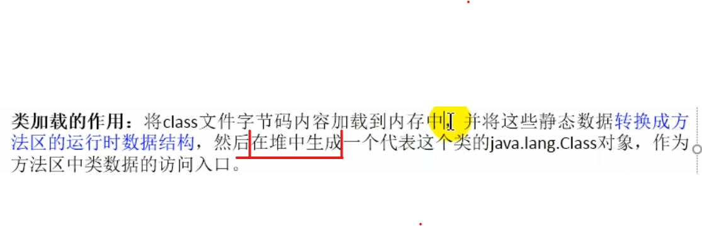
2、一个Person类加载进来会生成一个Class对象，那Class类呢？
根据下面的代码，Class类加载进来也会有一个Class对象
```java
Class classClass = Class.class;
System.out.println(classClass);
```
* 使用ClassLoader加载配置文件
```java
        Properties pros = new Properties();
        //此时的文件默认在当前的module下。
        //读取配置文件的方式一：
//        FileInputStream fis = new FileInputStream("jdbc.properties");
//        pros.load(fis);

        //读取配置文件的方式二：使用ClassLoader
        //配置文件默认识别为：当前module的src下
        ClassLoader classLoader = ClassLoaderTest.class.getClassLoader();
        InputStream is = classLoader.getResourceAsStream("jdbc1.properties");
        pros.load(is);
```
## 日志
* 为什么需要日志？
比如说一个供用户进行增删改查的项目，如果我想知道用户的每一步操作的信息（几月几号几时几分，进行了什么操作，操作的数据是什么），该怎么做？
当然可以把这些记录存到数据库里，但不建议；
也不能直接在代码中sout，因为代码是部署在服务器上的，1、首先服务器上可能不止一个项目在运行，就算你使用一个屏幕盯着服务器的输出看，信息也是很乱的2、就算只有一个项目在运行，你也可以盯着屏幕看，那如果我想知道几个月前的记录，你难道要一直往上翻？

日志的功能简而言之就是将程序的输出转写到一个文件里（使用sout是将信息输出到控制台，使用日志可以将信息输出到文件中）。每个项目引入自己的日志，最后的结果就是多出来几个文件，每个项目将自己想要输出的信息输出到文件中。
这样就算我找几个月之前的数据，也很容易找到
## 类的扩展
### 枚举类（enum）
* 枚举类的前身
```java
    class Size {
        public static final int SMALL = 0;
        public static final int MEDIUM = 1;
        public static final int LARGE = 2;
    }
``` 
* 为什么使用枚举类？

```java
enum Size{
    SMALL,
    MEDIUM,
    LARGE;
}
等价于
public final class Size extends Enum<Size> {
        public static final Size SMALL = new Size("SMALL",0);
        public static final Size MEDIUM = new Size("MEDIUM",1);
        public static final Size LARGE = new Size("LARGE",2);
        private static Size[] VALUES = new Size[]{SMALL, MEDIUM, LARGE};
        private Size(String name, int ordinal){
            super(name, ordinal);
        }
        public static Size[] values(){ //编译器自己加的
            Size[] values = new Size[VALUES.length];
            System.arraycopy(VALUES, 0, values, 0, VALUES.length);
            return values;
        }
        public static Size valueOf(String name){ //编译器自己加的
            return Enum.valueOf(Size.class, name);
        }
    }
```

## jdk新特性
* Lambda表达式（一种语法）
    * Lambad出现的背景
    官话：更简洁balabala
    白话：其他编程语言里有，Java一看还挺好，直接'借鉴'过来
    * Lambda表达式的本质
    `Comparable cmp = (o1,o2) -> Integer.compare(o1,o2)`:Lambda表达式整体作为一个对象；这个对象实现了xx（Comparable）接口
    ```java
    Runnable runnable = ()->{
    //some code here  
    };
   
    Runnable runnable = new Runnable() {
        @Override
        public void run() {
            //some code here      
        }
    };    
    ```
    * 使用Lambda表达式的要求：该接口为函数式接口
    即只有一个抽象方法
* 函数式接口
    * `@FunctionalInterface`
    验证该接口是否符合函数式接口的要求
* Lambda表达式的日常使用
一个函数，可以接收一个变量
也可以接收一个方法（方法提供一套执行逻辑，数据由对象自己提供：如list.foreach()）
如果一个方法需要接收方法作为参数，一般通过接口实现
当传递参数的时候，有以下写法
```java
//1
list.forEach(new Consumer<String>() {
            @Override
            public void accept(String s) {

            }
        });
//2 Lambda表达式
list.forEach(curString->{
    System.out.println(curString);
});
//3 Lambda表达式进阶：方法引用
list.forEach(System.out::println);
```
* 理解方法引用
使用方法引用的时候，说明该参数需要一个函数
而函数我只关心参数和函数体
# Stream
## reference
* [Introduction to Java 8 Streams -by daeldung](https://www.baeldung.com/java-8-streams-introduction)
# 并发/异步编程
## 为什么需要多线程？
在一个service中，可能需要查询多次数据库(可能不是同一张表，甚至可能不是同一个数据库)，将多次的查询结果封装成Vo
> a、读取文件1 （10ms）
b、处理1的数据（1ms）
c、读取文件2 （10ms）
d、处理2的数据（1ms）
e、读取文件3 （10ms）
f、处理3的数据（1ms）
g、整合1、2、3的数据结果 （1ms）

**单线程总共就需要34ms。**
那如果你在这个请求内，把ab、cd、ef分别分给3个线程去做，就只需要12ms了。
## 使用多线程的几种方式
* 线程的创建和使用
    * 有几种方式创建线程? (2+2JDK5.0)
        1. 继承thread类，重写run方法
        > 为什么调start()方法会执行run()？ 
        the Java Virtual Machine calls the run method of this thread.-JavaAPI
        2. 实现Runnable接口，实现run方法，`new Thread(p).start();`
        > Q:为什么通过实现runnable接口这种方式，tickets就可以把static去掉？
        因为mythread对象呢在内存中只有一份，tickets变量存在这个对象中。通过线程调用run方法的时候，修改的是同一个对象中的同一个tickets
        3. FutureTask+Callable接口
        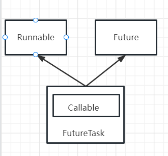
        调用futuretask里面的run方法
        run方法实际调用callable中的call方法，并将结果储存起来
        ```java
        public class CallableTest {
            static int a;
            static class MyCallable implements Callable<Integer>{
                @Override
                public Integer call() throws Exception {
                    System.out.println("enter thread!");
                    for (int i = 0; i < 2000; i++) a++;
                    return a;
                }
            }
            public static void main(String[] args) throws ExecutionException, InterruptedException {
                FutureTask<Integer> task1 = new FutureTask<>(new MyCallable());
                Thread t1 = new Thread(task1);
                t1.start();
                //如果t1还没有执行结束，那么get()方法会一直阻塞
                Integer res = task1.get();
            }
        }        
        ```
        4. 使用线程池
        使用线程池的好处
        不使用线程池，人为的创建线程销毁线程有以下问题：
        1、不节制：来一个请求我就会分配一个线程，CPU&内存空间急剧下降
        2、做了一些没必要的重复动作：创建-处理-销毁，又创建-处理-又销毁：多次的创建&销毁动作，没必要；不能很好的复用
        ```java
        public class ThreadPoolTest {
            static class MyRunnable implements Runnable{
                @Override
                public void run() {
                    String name = Thread.currentThread().getName();
                    System.out.println(name);
                }
            }
            public static void main(String[] args) {
                ExecutorService executorService = Executors.newFixedThreadPool(4);
                for (int i = 0; i < 10; i++) executorService.submit(new MyRunnable());
                executorService.shutdown();
            }
        }        
        ```
## 线程池详解
### 为什么需要线程池？
如果在项目中需要执行异步任务，如果使用原生的线程创建方式(使用线程的前三种)，就会频繁的涉及线程的创建以及线程的销毁；

不使用线程池，人为的创建线程销毁线程有以下问题：
1、不节制：来一个请求我就会分配一个线程，CPU&内存空间急剧下降
2、做了一些没必要的重复动作：创建-处理-销毁，又创建-处理-又销毁：多次的创建&销毁动作，没必要；不能很好的复用
> ps: 在以后的业务代码中，使用多线程只通过线程池，其他三种方法都不用
### 创建线程池的方式
```java
//1、使用JUC中的Executors工具类
ExecutorService executorService = Executors.newFixedThreadPool(4);
//2、使用原生的ThreadPoolExecutor
/*  ThreadPoolExecutor构造器的七大参数：
        1）int corePoolSize：线程池创建好以后，存在的线程数量；这些线程会一直存在
        2）int maximumPoolSize：规定线程数的上限(包括core)
        3）int keepAliveTime：除了核心线程之外的线程，如果空闲了keepAliveTime，那么就销毁
        4）unit：和keepAliveTime配合使用：如果unit=SECOND，keepAliveTime=10，那就代表10s
        5）BlockingQueue<Runnable> workQueue:通过service.submit()提交的线程任务，如果没有线程有空，就会先被放进workQueue里，等待被线程执行
        6）ThreadFactory threadFactory：线程池创建线程的时候，所使用的线程工厂
        有什么用？可以模仿Executors工具类中的defaultThreadFactory，来自定义线程的名称
        7）handler：如果阻塞队列满了，由handler处理拒接执行任务
        有什么用？可以模仿ThreadPoolExecutor中的AbortPolicy来自定义当阻塞队列满了执行什么操作(AbortPolicy执行的操作是抛异常)
*/
```
### 线程池运行流程
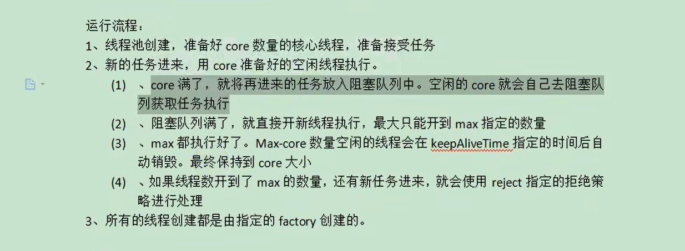


## synchronized
* 背景
在使用多线程的时候，如果多线程之间共享变量，那就要加上一些措施。否则会导致运行结果出错
如下买票的例子：
```java
public class SellTickets {
    public static class Runnable01 implements Runnable{
        private Integer tickets = 100;
        @Override
        public void run() {
            while (tickets > 0){
                try {
                    Thread.sleep(100);
                } catch (InterruptedException e) {
                    e.printStackTrace();
                }
                String name = Thread.currentThread().getName();
                System.out.println(name+" ： "+"第"+tickets+"张票已卖出");
                tickets--;
            }
        }
    }

    public static void main(String[] args) {
        Runnable01 r1 = new Runnable01();
        new Thread(r1).start();
        new Thread(r1).start();
    }
}
```

* 同步方法中的锁对象是谁？
锁对象是方法的调用者
如果不加static，调用者就是this
如果加上static，调用者就是.class对象
* 对象在内存中的样子
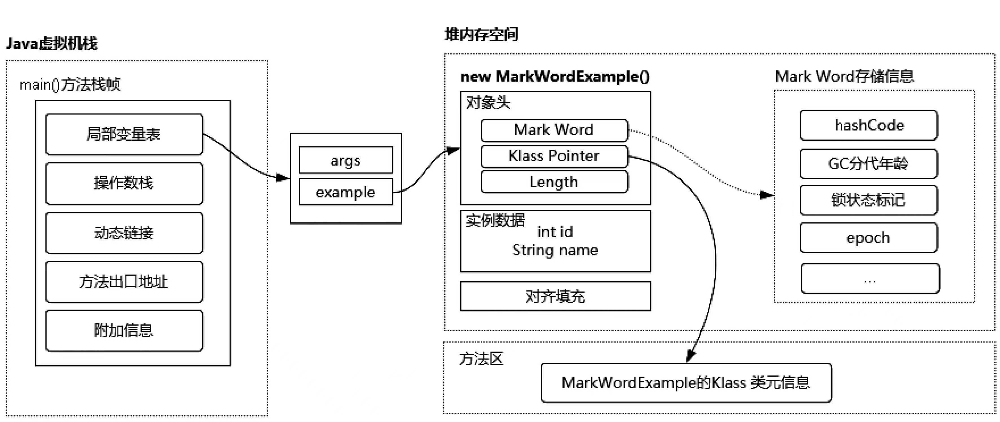


## volatile
* 使用volatile的结果是：
当某个线程对共享变量进行修改后，其他线程就立刻能得到修改后的结果
* 作用：
1、被volatile修饰的变量a，只要有线程修改a,那么其他线程就立刻可以看到这个a被修改了
2、禁止指令重排
> volatile可以保证在字节码执行getstatic,getfiled，放进操作数栈里面的数据一定是正确的。但是这并不是说明使用volatile就一定是线程安全的，因为在执行字节码的时候仍然存在原子性问题
即volatile保证一致性，但不保证原子性
* 什么时候使用？(使用场景)
一个线程写，多个线程读
1、标志flag
2、单一赋值
3、读多写少的场景：写操作加上synchronized，读操作不加锁，变量声明为volatile
```java
//=================before:子线程一直循环
public class VolatileTest {
    static boolean flag = true;
    static class MyThread extends Thread{
        @Override
        public void run() {
            while(flag){

            }
            System.out.println("子线程结束");
        }
    }
    public static void main(String[] args) throws InterruptedException {
        MyThread t1 = new MyThread();
        t1.start();
        Thread.sleep(10);
        flag = false;
    }
}
//=================after:正常结束=========================
public class VolatileTest {
    static volatile boolean flag = true;
    static class MyThread extends Thread{
        @Override
        public void run() {
            while(flag){

            }
            System.out.println("子线程结束");
        }
    }
    public static void main(String[] args) throws InterruptedException {
        MyThread t1 = new MyThread();
        t1.start();
        Thread.sleep(10);
        flag = false;
    }
}
```
## 并发编程的原子性、可见性、有序性
* 原子性
两个线程同时取值，同时加1，相继写回，会发现+1执行了两次，可结果只多了1
* 可加性
main线程，子线程，子线程不断地while，当flag为false的时候退出while，main线程去修改flag的值
* 有序性
例子同可加性
* synchronized解决了所有问题
> Q：synchronized是如何解决可见性问题的？
进入synchronized块的内存语义是把在synchronized块内使用到的变量从线程的工作内存中清除，这样在synchronized块内使用到该变量时就不会从线程的工作内存中获取，而是直接从主内存中获取。退出synchronized块的内存语义是把在synchronized块内对共享变量的修改刷新到主内存。-《Java并发编程之美》
* 什么是原子性、可见性、有序性？
是指在对共享变量进行操作时，操作一定通过某种机制满足原子性、可见性和有序性。否则多线程程序的运行结果是错误的
1、原子性
通过锁synchronzed来保证原子性
（ps：保证原子性自然就保证可见性，如果保证了原子性，两个线程根本不可能同时对共享变量进行操作，自然不存在可见性的问题）
2、可见性
两个线程同时在操作数栈中对共享变量进行操作
## 线程的操作
### `join()`
如果main方法里调用`thread.join()`方法，那么只有在thread运行结束后才能继续运行后面的语句
```java
public class VolatileTest {
static int a = 0;
static class MyThread extends Thread{
    @Override
    public void run() {
        a = 20;
    }
}
public static void main(String[] args) throws InterruptedException {
    MyThread myThread = new MyThread();
    myThread.start();
    myThread.join();
    System.out.println(a); //a必为20
    }
}   
```
### `wait()&nofity()`
> very important!
wait()&notify()必须在`synchronized()`同步代码块中调用
* 多线程出现的背景
CPU越来越快，进程之间进行切换发挥不了cpu的全部性能，而且代价很高（保存的内容很多），所以将进程的执行进一步细化为线程。
* 支持多线程后出现的问题
1、原子性
因为线程共享一些内存，所以在多个线程想要修改同一个内存时，就会发生原子性问题（内存的访问不能互斥）。得到的结果一般都是错的
2、线程的同步（线程2的执行需要线程1算出的结果）
* 如何解决这些问题？
1、原子性（锁思想）
* 操作系统如何支持多线程/并发？
锁的实现需要硬件和os的共同帮助
硬件提供一些原子指令（test-and-set,compare-and-swap）,通过这些原子指令，可以实现锁的基本功能（互斥），但效率不高
os可以通过一些数据结构or思想对基本锁进行改进，使得其效率更高
> 什么是CAS？
CAS(compare-and-swap)是硬件中的一个原子指令，比较当前值与所期待的值是否相同...
这一系列操作都是原子的，即不能被打断的
* 概念
    * 什么是线程？ 一个进程中的一条执行路径
    * 什么叫一个程序支持多线程？
    * 多线程就一定快吗？什么情况下多线程反而更慢？
    * 什么情况下需要多线程？ 如果系统的某个功能需要等待时间，那就需要把它放在线程里，这样的目的是获得更好的用户体验（外卖例子）
    * 使用线程的好处
    以外卖软件为例子，如果不使用多线程，那么在加载图片这个任务是在主程序完成的。在图片加载完成之前，下面的代码都要等待，不能执行。
    使用多线程后，可以把加载图片这个任务分给一个线程（后备处理器），主程序继续执行（效率高）
## JUC下的类
* 阻塞队列
和队列类似，只不过如果队列中满了在往里面添加元素，会阻塞添加元素的线程
同理，在往外拿的时候，如果队列为空，会阻塞拿元素的线程

* 线程的安全问题
    * 为什么线程会有安全问题？
    多线程的好处就是通过充分压榨CPU，来获得更高的效率；但缺点是如果多线程操作共享数据时，往往会出现错误
    举个栗子：卖票环节，多个线程同时进入if语句；
    > 如何理解：只要线程中操作了共享数据，就一定存在线程安全问题？
    不仅是if语句，就算简单的加减在多线程中都会出现问题
    两个线程同时对`i`进行+1000操作，但`i=i+1000`会被分为多个字节码指令，如果第一个线程先把i放进操作数栈，然后切换第二个线程。最终结果就是两个线程都执行了+1000操作，但i只多了1000
    * 解决线程安全的问题(通过🔒)
        1. 同步代码块
        ```java
            synchronized (obj) { //ojb是任意对象，充当锁；唯一要求就是多线程中，obj实例唯一
            //如果Runnable接口，obj通常用this,如果继承，obj通常MyClass.class
                if (tickets > 0) {
                    try {
                        Thread.sleep(100);
                    } catch (InterruptedException e) {
                        e.printStackTrace();
                    }
                    System.out.println(Thread.currentThread().getName() + ":" + tickets);
                    tickets--;
                } else break;
            }
        ```
        2. 同步方法：在方法上加上synchronized
        注意点：在方法上加上synchronized默认使用this作为obj，这种用法对extends来说无效，所以在extends时要将此同步方法声明为static的，它就会使用class作为obj
        3. 使用Lock
        ```java
        Lock lock = new ReentrantLock();
        public void run() {
            while(true){
                try{
                    lock.lock();
                    if (tickets > 0) {
                        System.out.println(Thread.currentThread().getName() + ":" + tickets);
                        tickets--;
                    } else break;
                }finally {
                    lock.unlock();
                }
            }
        }
        ```
* 使用🔒的弊处：死锁问题
* 线程的通信问题
    * 问题引入
    如何让两个线程**交替**打印1~100之间的数？
    ```java
    //extends方法
    public void run() {
        while (true){
            synchronized (WaitTest.class){
                WaitTest.class.notify();
                if (i < 100){
                    i++;
                    System.out.println(Thread.currentThread().getName()+":"+i);
                    try {
                        WaitTest.class.wait();
                    } catch (InterruptedException e) {
                        e.printStackTrace();
                    }
                }else break;
            }
        }
    }
    ```
    通过wait(),notify();
    > 注：
    1、wait()调用后，当前线程进入阻塞态，只有其他线程调用notify，该线程才能继续执行；
    2、wait()调用后，当前线程会进入阻塞态并释放掉同步锁
    3、wait()和notify()是由锁来调用的！
> 面试题：sleep()和wait()的异同
相同点：调用后，都进入阻塞态
不同点：
    1、wait调用后会释放掉锁，而sleep不会
    2、所属的类不同
    3、调用条件不同
## JMM
* 【工作内存，主内存】与【JVM中方法区，栈..】有什么区别/关系？
都是对JVM内存的的划分，只不过站得角度不同
从功能上划分：根据内存区域功能的不同可以划分为方法区，堆，栈等
从线程的角度上划分：只有工作内存和主内存
如果硬要一一对应，我觉得工作内存有点像虚拟机栈（线程私有），而方法区和堆对应主内存（线程共享）  
* JMM是一组规范/龟腚
* JMM规定，Java中的所有变量都存在主存里；当线程使用某个变量时，会先把这个变量赋值到自己的工作内存
> 工作内存=寄存器+缓存

```java
public class JMM {
    static int counter = 0;

    public static void main(String[] args) throws InterruptedException {
        for (int i = 0; i < 10; i++){
            new Thread(()->{
                for (int j = 0; j < 10000; j++){
                    counter++;
                }
            }).start();
        }
        Thread.sleep(500);
        System.out.println("counter: "+counter);
    }
}
```
如上代码，我们知道多线程操作共享变量，如果不加任何限制，结果肯定会出错。
如何解释出错原因？
出错原因就是JMM；
因为JMM规定，在操作变量之前，要把变量从主内存(该情况是指：堆)复制到工作内存(线程私有的虚拟机栈中栈帧的操作数栈中)
我来模拟一下出错原因：
counter复制到线程1的操作数栈中，此时CPU切换线程
counter复制到线程2的操作数栈中，此时CPU切换线程
counter复制到线程3的操作数栈中，此时CPU切换线程
线程1执行+1操作
线程2执行+1操作
线程3执行+1操作
线程1写回counter
线程2写回counter
线程3写回counter
此时线程共执行了3次+1操作，但是counter的值是1
> PS：其实JMM这个规定，从字节码中也可以看出来。如下图

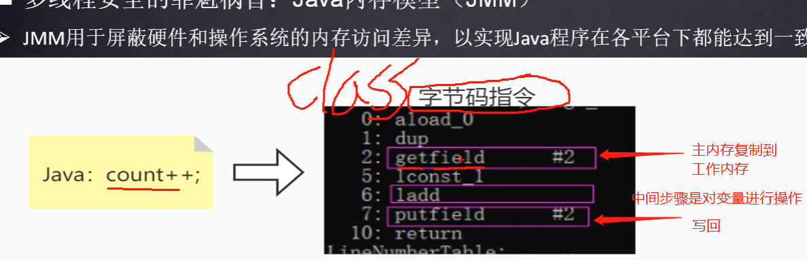
如何解决上述问题，请看原子类

## 原子类
如上述所示，普通的`int counter`在多线程执行`++`操作的时候，因为不能保证原子性导致结果出错；如何解决这一问题？
可以通过原子类，如下面代码所示
```java
    static AtomicInteger counter = new AtomicInteger(0);

    public static void main(String[] args) throws InterruptedException {
        for (int i = 0; i < 10; i++){
            new Thread(()->{
                for (int j = 0; j < 10000; j++){
                    counter.incrementAndGet();
                }
            }).start();
        }
        Thread.sleep(500);
        System.out.println("counter: "+counter.toString());
    }
    
}
```
为什么通过原子类，就可以保证操作的原子性，从而得到正确的结果？
换句话说，原子类中的++，它之所以安全的原理是什么？
请看下节：CAS
## CAS
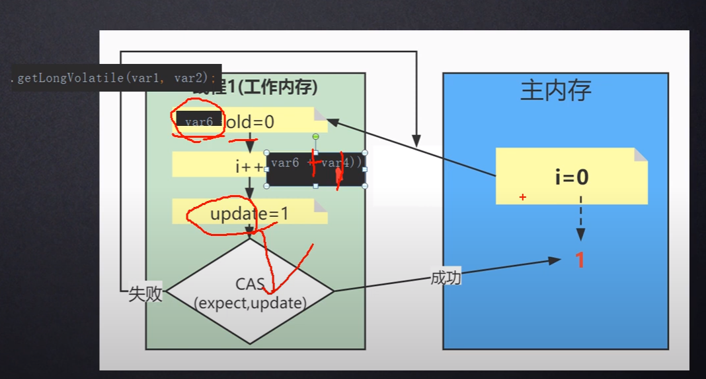

* 原子类中的CAS比直接`counter++`好在什么地方？
主要是好在最后一步：CAS并不会直接把值写回，而是进行CAS(compare and swap)
1.如果主内存中的值与工作内存中的old value相同，就直接写回。因为相同代表没有线程动过主内存中的值
2.如果不相同，就把主内存中的值取过来，重新执行`++`操作(自旋)
> ps:CAS(compare and swap)操作是原子操作：意味着同一时刻，只会有一个cas方法在运行

* 什么是CAS
在Java层面是一个原子方法，在执行这个方法的过程中，可以保证其他线程进不来；
这个方法的内容是：拿着自己的期待值expect和内存中的值比较一下，如果相等就更新内存。不相等就自旋
* 为什么需要cas？
cas是一种无锁算法，使用synchronized保证数据一致性效率不高；使用cas是对synchronized的一种代替，目的是提高效率
> cas为什么比锁高效？
从jvm内存布局上想象：
锁：如果一旦加锁，取值-运算-放回值，完全串行化
cas：取值：你取你的，我取我的；运算：你算你的，我算我的；最后一步放回值：需要进行比较一下
* cas的使用
在并发场景下对基本数据类型进行操作时，通常不使用synchronized，而使用基于cas的原子类
* cas的缺点
1、如果并发冲突比较多，我认为cas效率比较低。因为每次在写回值得时候发现共享变量已经被改了，那就需要抛弃前面辛苦算来得结果从新来过
2、aba问题
* ABA问题
线程1在写回之前要看一下共享变量有没有被改过，即通过单个值是否改变来判断这个变量有没有被动过，其实这是有问题的。即使值还是那个值，但可能在此之前线程二已经把这个值给改了，只不过后面又改回来了。
使用automicStampledReference和正确的编码方式来解决aba问题
> todo:ABA问题有什么坏处？

## 锁
如上所述，多线程访问共享变量，如果不加任何措施，是会出现运算错误的；
为了解决这种问题，除了使用基于CAS的原子类外，也可以使用锁
### synchronized锁
其实synchronized锁原理很简单，当某个线程在访问主内存前，需要去‘抢锁’，如果能抢到：就执行1、复制到工作内存2、数据处理3、写回内存4、释放锁
可以看出锁的作用就是限制**有且只有一个线程**在进行数据操作

#### synchronized锁升级
在JDK1.6之前，synchronized锁是重量级锁
如上所述，如果线程抢到了锁，就会继续执行接下来的操作；那对于那些没有抢到锁的线程，它们应该做些什么？
重量级的意思时：如果线程没有抢到锁，则线程直接挂起（park），将CPU移开到其他线程（可以在头脑中直接将代表该线程的方框 置为灰色）
这意味着涉及到上下文切换（由操作系统完成，各种寄存器值的保存...)
意味着效率很低

在JDK1.6之后，synchronized锁会经历一个被称为锁升级的过程
偏向锁：当系统中只有一个线程的时候，线程看一下锁对象中的某个属性，如果是自己，直接执行代码
轻量级锁：如果第二个线程来了，发现锁的拥有者不是自己，则立刻执行CAS操作进行抢占锁
重量级锁：如果第一次CAS操作抢占失败，则锁升级为重量级锁：在重量级锁中，该线程会自旋几次执行CAS操作，如果都抢不到锁，则park掉加入队列
当释放锁的时候，会唤醒park掉的线程，让它重新竞争锁；但是不保证这个线程一定能抢到锁，如果抢不到，继续park
> 所以synchronized锁是非公平锁

#### 悲观锁 vs 乐观锁
悲观锁or乐观锁是锁这一个概念的实现方式
悲观锁：在访问共享变量之前尝试加锁，防止其他线程访问
乐观锁：通过CAS的方式来判读当前线程能否访问共享变量

### Lock接口

Lock接口实现的锁与synchronized之间的区别
1、使用Lock锁时，unlock方法一定要写在finally里面
这是因为当发生异常的时候，synchronized锁默认会释放锁，而Lock锁却不会，如果Lock锁的unlock方法不写在finally里，可能会死锁
#### ReentrantLock

##### 公平锁 vs 非公平锁
ReentrantLock在创建的时候可以声明为公平锁或者非公平锁
通过下图阅读源码：
公平锁：线程在抢锁的时候首先会看一看以前有没有线程抢锁（队列中有没有线程）
非公平锁：线程不管三七二十一直接抢锁

非公平锁会导致线程饥饿问题：即可能会发生某个线程一直抢到锁的情况


#### ReentrantLock为什么是可重入锁
可重入锁是指：锁中套锁。如下图：

ReentrantLock之所以是可重入的原因：


> ps:Synchronized锁也是可重入锁：如下图


### ReentrantReadWriteLock
可重入读写锁：一个资源能够被多个读线程同时访问，或者被一个写线程访问；但是不能同时存在读写线程

> PS：ReentrantReadWriteLock非常适用于读多写少的场景：会比其他的锁更快
#### 互斥锁 vs 共享锁
像synchronized，ReentrantLock：在访问共享资源的时候首先要上锁。同一个资源永远只有一个线程访问；而ReentrantReadWriteLock在读操作上进行了优化，允许多个线程同时读。所以ReentrantReadWriteLock是一种共享锁
#### 写线程饥饿问题
ReentrantReadWriteLock是读读共享，读写互斥
即在读线程完成之前，是不允许写线程执行的


* `Thread.sleep()`与`TimeUnit.SECONDS.sleep()`的区别？
功能完全一样，只不过`TimeUnit.SECONDS.sleep()`可读性更好
```java
Thread.sleep(4*60*1000);//能看出来4分钟吗？
TimeUnit.MINUTES.sleep(4);//是不是更好读？
```
* CompletableFuture
    * 使用背景
    FutureTask中的Future接口有一些缺点：CPU资源被浪费
    如果有两个任务，其中任务二需要任务一的结果才能执行。把任务一交给一个线程，任务二如果在主线程，就要原地等待了。
    ```java
    //1、get()方法：如果线程没有执行结束，main线程直接阻塞（Waiting状态）
    public static void main(String[] args) throws ExecutionException, InterruptedException {
        FutureTask<String> task1 = new FutureTask<>(new MyCallable());
        Thread t1 = new Thread(task1);
        t1.start();
        String res = task1.get(); 
    } 
    //2.轮转，浪费CPU
    FutureTask<String> task1 = new FutureTask<>(new MyCallable());
    Thread t1 = new Thread(task1,"t1");
    t1.start();
    String res;
    while(true){
        if (task1.isDone()){
            res = task1.get();
            break;
        }
    }
    ```
    * CompletableFuture thenaccept 与thenacceptasync区别？
    thread1运行CompletableFuture中的run方法，如果使用thenaccept传递一个函数，那么等run方法运行结束后，仍然由thread1来执行该函数；
    如果使用thenacceptasync，那么由thread1调用线程池，在开一个新的线程thread2来运行该函数
    * 使用
    ```java
    //直接新建一个线程并启动，没有返回值
    public static void main(String[] args) {
        ExecutorService executorService = Executors.newFixedThreadPool(3);

        CompletableFuture.runAsync(()->{
            String name = Thread.currentThread().getName();
            System.out.println(name);
        }，executorService);

        executorService.shutdown();
    }
    //有返回值的线程，启动
    public static void main(String[] args) throws InterruptedException {
        CompletableFuture.supplyAsync(()->{
            String name = Thread.currentThread().getName();
            System.out.println(name);
            return "task over";
        });
        TimeUnit.SECONDS.sleep(1);//注意：如果主线程提前结束了，那CompletableFuture使用的默认线程池将会被关闭，即线程任务不会被执行完
    }
    //回调函数，用以往的线程池是实现不了的
    static int a = 0;
    public static void main(String[] args) {
        CompletableFuture<Void> completableFuture = CompletableFuture.runAsync(() -> {
            System.out.println("thread begin");
            for (int i = 0; i < 10000; i++) a++;
            System.out.println("thread end");
        });
        completableFuture.whenComplete((v,e)->{
            System.out.println("callback begin");
            System.out.println(a);
            System.out.println("callback end");
        });
    }
    Q：callback函数由谁执行?
    如果设置callback的时候线程任务已经执行结束，则由main线程执行；
    如果线程任务还没结束，则由线程执行
    ```
    * 线程串行化
    ```
    任务A-任务B
    //如果任务B不需要任务A的结果，用thenRun
    //如果任务B需要任务A的结果，用thenAccpet
    //如果任务B需要任务A的结果，并且还需要将结果传给下一个，用thenApply 

    ```
    * 两任务组合：都要完成
    ```
    //thenCombine
    //thenAcceptBoth
    //runAfterBoth
    ```
    * 两任务组合：完成一个即可
    ```
    //applyToEither
    //acceptEither
    //runAfterEither
    ```
    * 多任务组合
    ```
    //static allOf ：只有传入的completableFuture全部完成后
    //static anyof： 只要有一个completableFuture完成即可
    ```
    2、isDone()方法：
    * CompletableFuture中间过程的方法
        * thenApply(Function)
        参数是一个function，输入并返回
        * thenAccept(Consumer)
        参数是一个Consumer，只能输入，不能返回值
## 守护线程
* [《Java并发编程深度解析与实战》-1.10 守护线程]()
## ThreadLocal
* 使用
```java
//每个线程往threadLocal里set值时，只有自己可见
static ThreadLocal<String> tl = new ThreadLocal<>();
public static void main(String[] args) {
    tl.set("main thread");
    new Thread(()->{
        String s = tl.get(); //null
        System.out.println(s);
        tl.set("t1");
    },"t1").start();
    String s = tl.get();//自己set得"main thread"
    System.out.println(s);
}
```
* 原理
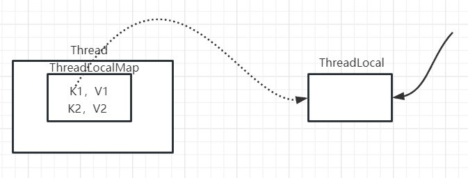
* 为什么ThreadLocalMap中的key要设计为一个弱引用？
如下图，当右边的强引用消失后（可能是方法退出，或者手动设置null），ThreadLocal所占内存就可以被回收了，紧接着ThreadLocalMap里面的replaceStaleEntry方法也可以回收内存。
如果使用强引用，这些内存就永远不会被回收，造成内存泄漏

* 为什么ThreadLocal使用完后要remove？
尽管ThreadLocal提供replaceStaleEntry方法来回收map内存，但这只在set方法执行时执行。如果只是用一次set方法，ThreadLocal又被回收了，那在**第二次set方法执行前**，value所引用的很大一块内存是不能被回收的。
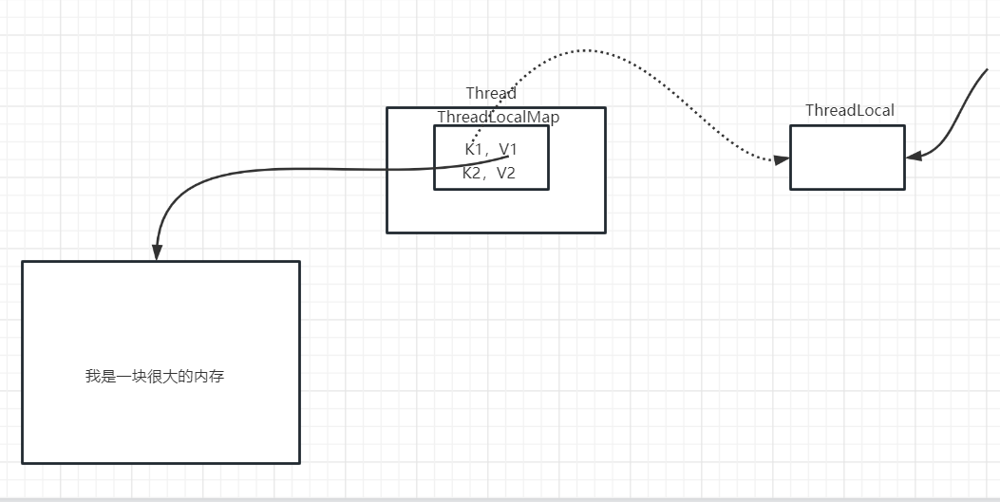
* 使用背景
业务需求：
```java
/*
    1正常完成，
    但由于下面的代码发生异常，导致2没有执行就直接推出了
    这时候数据库里就只有一个订单号，没有这个订单到底买了什么东西
    这时怎么办？
*/
public void LoginService(){
    1、插入订单
    封装一些数据对象
    数据库操作

    某些代码，会抛异常

    2、插入订单详情
    封装一些数据对象
    数据库操作
}
```
# 设计模式
* 开闭原则（open-closeed principle）
    * 背景
    软件的设计不可能一开始就设计好了，肯定会不断迭代增加新功能。那该如何设计才能在迭代的时候不把整个软件设计推导重来呢？
    * 理解
    开：可以扩展；闭：但不能修改
    more specific：在写类的时候，尽可能让类足够好，写好就不需要修改了。如果新需求来了，我们增加一些类就完事了，而不是去修改原来的类。
    i.e.面对需求，我们是增加代码，而不是修改类。这就是开闭原则
* 依赖倒转原则
面向接口编程
## 单例模式
* 为什么要使用单例设计模式？
如果我只想让整个系统中只存在一个类的实例（这个类的实例化很浪费资源），不能说通过人的自觉性在整个程序中只new一次...这样是不靠谱的；
通过写单例，可以将类的实例的创建方式写死
* 在单例的代码中为什么要将`instance`设成private? 封装性，防止外部随便改这个属性
饿汉式:
```java
//饿汉式
class Order{
    private Order(){

    }

    private static Order instance = new Order();

    public static Order getInstance(){
        return instance;
    }

}
```
懒汉式：
```java
//懒汉式
class User{
    private User(){

    }
    private static User instance = null;
    public static User getInstance(){
        if (instance == null) instance = new User();
        return instance;
    }

}
```
> 懒汉式比饿汉式节省内存，但存在一个问题：线程不安全
我认为只要存在if语句，都是线程不安全的；原因是如果刚判断完if语句，CPU挪走了，执行另一个线程的if语句，结果导致两个线程都进入了if语句内，结果是在内存中创建了两个实例
懒汉式线程改进
```java
//懒汉式 线程改进
class User{
    private User(){

    }
    private static User instance = null;
//效率低
//    public synchronized static User getInstance(){
//        if (instance == null) instance = new User();
//        return instance;
//    }
//效率低在哪？
//无论什么时候，都要抢锁，抢锁就涉及到性能问题
//下面这种写法：只有在刚开始的时候，可能会抢锁（≈上面的效率），但是运行一段时候后，效率>上面的写法（不涉及到抢锁的问题了）
    public static User getInstance(){
        if (instance == null){
            synchronized (User.class){
                //必须加上if判断语句，否则线程不安全
                //原因：可能有多个线程都进入if语句了，如果不判断一下，就不是单例了
                if (instance == null) instance = new User();
            }
        }
        return instance;
    }
}
```
* 区分懒汉式和饿汉式：啥时候用啥时候造对象-懒汉式
* 模板方法设计模式
一个函数`calculateRuntime`中大部分代码都是确定的，但有一小部分`code()`是不确定的；于是就将不确定的代码抽出来成为一个抽象方法，交给子类进行具体的实现。子类实现后，就可以直接调用从父类继承过来的方法完成功能
* 工厂模式：[click to check detail](#factory)
* 代理模式
代理模式给我的感觉就是在方法的外面又包上一层逻辑
    * 静态代理
    ```java
    //Person类
    public class Person implements MyInterface{
        @Override
        public void method() {
            System.out.println("这是裸的method方法");
        }
    }
    //PersonProxy
    class PersonProxy implements MyInterface{
        private Person person;

        public PersonProxy(Person person) {
            this.person = person;
        }
        @Override
        public void method() {
            System.out.println("这是在裸的代码前加入的一些方法");
            person.method();
            System.out.println("这是在裸的代码后加入的一些方法");
        }
    }
    //main
    public static void main(String[] args) {
        Person person = new Person();
        PersonProxy personProxy = new PersonProxy(person);
        personProxy.method();
    }
    ```
    * 动态代理
    如果我想对所有接口中的方法都增加相同的操作，这样就得每一个接口写一个Proxy。于是将代理再次抽象一个维度，就有了基于反射实现的动态代理
    ```java
    //InvocatoinHandler
    class MyInvocationHandler implements InvocationHandler{
        private Object object;

        public MyInvocationHandler(Object object) {
            this.object = object;
        }

        @Override
        public Object invoke(Object proxy, Method method, Object[] args) throws Throwable {
            System.out.println("before");
            Object res = method.invoke(object, args);
            System.out.println("after");
            return  res;
        }
    }
    //main
    public static void main(String[] args) {
        Person person = new Person();
        Class<?>[] interfaces = Person.class.getInterfaces();
        InvocationHandler myinvo = new MyInvocationHandler(person);
        MyInterface personProxy = (MyInterface) Proxy.newProxyInstance(ProxyTest.class.getClassLoader(), interfaces, myinvo);
        personProxy.method2();
    }
    ```
* facade pattern
对已经存在的service类进行再一次封装。
* 观察者模式
# JVM
## 引用
* 强引用
对象所占的内存死也不回收
* 软引用
内存不足才回收
像Mybatis中的缓存的实现，用的就是软引用
* 弱引用
下一次gc必回收
* 虚引用

创建一个对象时，怎么进行赋值

静态属性在class对象中
执行引擎执行字节码指令
new指令：1、在堆中开辟内存2、将堆中创建对象的地址压入栈帧中的操作数栈
dup指令：1、复制栈顶元素2、再次压入栈
为什么要dup?给this指针赋值（所以this就是一个地址，指向堆中对象的位置）
this指针&局部变量表：局部变量表就是一个数组，有下标，我们说的下标0的位置存放this指针，不是说把"this"这个字符串放进index0位置，而是index0位置**代表**this指针，里面放具体的地址

执行引擎在执行一个方法时：1、创建栈帧2、给this指针赋值

invokespecial指令：


> Java运行的过程    
将class文件加载到方法区，同时方法去还会存在一个运行时常量池，并在堆中生成一个class实例

* 类的加载器
    * 作用：类的加载器的作用就是将.class文件加载到jvm内存中
    Q：类的加载器是将类加载到内存中，可是ClassLoader本身也是一个类，谁来加载ClassLoader.class呢？
    根据下面的代码，猜测是BootStrapClassLoader
    ```java
    ClassLoader loader = ClassLoaderTest.class.getClassLoader();
    ClassLoader loader1 = loader.getClass().getClassLoader();
    System.out.println(loader1); //null
    ```

* 类的加载过程：
    1. 加载（Loading）：将class文件读入方法区，并且在堆空间中生成对应的Class实例
    2. 链接（Linking）
        * 验证（verify）：验证class文件是否合法
        * 准备（prepare）:为类变量（static的）分配内存，并设置变量值为默认初始化值(`int=0;double=0.0;Object=null...`)（这些变量存在于方法区）
        > 不包括final修饰的static：final修饰的变量在编译阶段就已经初始化默认值了，会在当前准备阶段显示初始化
        * 解析（Resolve）:将符号引用换成直接引用
    3. 初始化（initialization）：调用执行method中的clinit方法（class initialization）
    > 什么是clinit方法？我没有写过啊
    不需要自己手写，javac编译器会帮我们生成
    怎么生成的clinit方法？
    javac会收集我们写的代码中所有的`static变量（类变量）的赋值动作`&`静态代码块`，合并成clinit方法。不包含静态方法

    clinit方法中的指令按照在源文件中的出现的顺序执行
    ```java
    public class Test {

    static {
        num = 2;
    }

    public static int num = 1;

    public static void main(String[] args) {
        System.out.println(num); //num=1
        }
    }
    //clinit（）先执行静态代码块，在执行赋值动作
    public class Test {

    public static int num = 1;
    static {
        num = 2;
    }
    public static void main(String[] args) {
        System.out.println(num); //num=2
        }
    }
    //clinit()先执行赋值动作，在执行静态代码块
    ```
    > 初始化阶段的clinit()并不是一定会被调用，类的主动使用会调用clinit，被动使用则不会
    什么是类的主动使用or被动使用？
* 双亲委派机制
    * 什么是双亲委派机制？
    在日常编写代码时，如果第一次用到一个类，jvm就会通过classloader进行加载，这个任务首先交给appclassloader，但appclassloader不会上来就自己加载，而是会将任务往上抛给上一级extclassloader，extclassloader抛给bootstrapclassloader；然后从bootstrapclassloader开始决定是否要加载这个类，如果不归他加载，就把加载任务往下抛
    * 为什么要使用双亲委派？
    1.安全：如果没有双亲委派，我在一个已经写好的工程下，自定义java.lang.String类，那项目运行起来的时候用的String都会变成我写的，项目异常
## JVM运行时数据区


* 方法区&堆（一个JVM一个），程序计数器&本地方法栈&虚拟机栈（一个线程一个）
* PC(Programe Counter)：指向栈帧里面code下：一行一行指令

    * 一个进程代表一个正在运行的程序，为什么还要引入线程呢？
    * PC的作用：CPU在线程之间进行切换的时候，通过PC来表示当前线程执行到哪了
* Java Stack/虚拟机栈：
    * 基本单位：栈帧，一个栈帧对应着一个方法调用。（一溜栈被分为几块，每一块就被叫做一个栈帧）
        * 栈帧结构 
    * 我在当前方法A，调用方法B，那方法B的栈帧入栈进行执行，执行完后出栈，继续执行方法A
    * `-Xss`
    * 为什么要写try catch:因为如果发生异常，如果没有处理，方法会将这个异常不断往回抛，直到main函数；一个函数的执行结束（java stack弹出）分为正常结束（return指令将栈帧弹出）以及抛出异常结束（异常指令将栈帧弹出）；正常结束会把函数里的步骤执行完返回，而抛出异常结束直接在异常处返回，下面的步骤都不执行了。
        * 局部变量表
            * 0号位置存的是this指针，那是什么？当前方法所属**类的对象**的引用（人话：是个地址，这个地址指向堆中的一块内存，这个内存里面装的是当前类的实例化）【尚硅谷JVM p251 10m20s】
* 方法区：加载类的信息；堆：存放类的实例化对象
    * 方法区的OOM:如果定义的类太多超出方法区，JVM就会报OutOfMemoryError:PermGen space/Metaspace（方法区在JDK7以及之前被称为永久代，之后为称为元空间）
        * JVM内存和直接内存：永久代用的是JVM内存（基于IO），元空间用的是直接内存（基于NIO）
            * 直接内存比较快
            * `-XX:MaxDirectMemorySize`
    * 永久代`-XX:PermSize`,`-XX:MaxPermSize` | 元空间：`-XX:MetaspaceSize`,`-XX:MaxMetaspaceSize`
    * 存的内容：class文件中的信息（包括运行时常量池 | 运行时常量池与class文件中的常量池的区别：1. 静态概念与动态概念 2. 运行时常量池里面存的就是一个个地址了，而不是符号引用了3.运行时常量池>= 常量池：`String.intern()就有可能往运行时常量池里加入东西`；包括**具体的代码指令！**）
    > 1、字节码指令中`ldc #2 <cbc>`，在实际运行中，`#2`是一个地址，这个地址里面存的是`cbc`。
    2、字符串常量值在1.7以及以前在堆中，1.8后就在方法区中了
### 堆（heap）
对象实例化都在堆中
> 所有线程共享堆，但并不是堆中所有部分都是共享的，例如TLAB

> 从堆到GC：方法中创建的对象，不会在方法结束后立即回收，而是会在垃圾收集的时候被回收
为什么？如果立即回收，会增加GC的频率，而GC线程和用户线程是并发的，会影响用户线程的执行
* 堆的细分
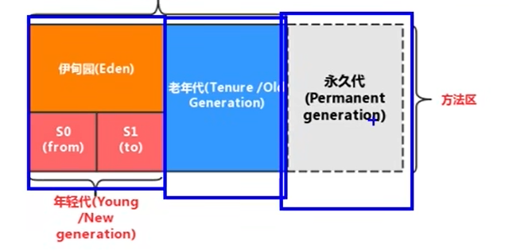
JDK7以及以前： Young Generation Space,Tenure Generation Space,Permanent Space
JDK8及以后：Young Generation Space,Tenure Generation Space,Meta Space
* `-Xmx`:堆空间可用的最大,`-Xms`：堆初始大小
> -X + ms(memory start)
* new的对象在堆中的细节
    * 对象头（header）
        1. 运行时元数据：哈希值、年龄计数器（YGC将Eden中的对象转移到S0，年龄计数器变为1）
        2. 类型指针：指向class对象
    * 实例数据（Instance Data）
* GC
创建的对象会先被分配在Eden区，如果Eden满了会触发YoungGC，YGC会在Eden区进行垃圾回收，没用的对象被回收，如果还有用就会将其放进S0/S1区；除此之位，YGC还会对S0/S1进行垃圾回收，YGC的结果是Eden区和S0/S1堆空间为空；
如果进行一个YGC后（S0/S1放不下或者次数超过了15）在新生代仍然放不下该对象，该对象就会进入老年区
当老年区被放满时，就会触发full/major GC，如果major GC不能回收，就会OOM
> full GC:会对新生代和老年代进行全面扫描，来尽可能的回收内存

* GC实现的细节
GC Roots，可达性分析算法：

* 内存溢出&内存泄漏
    * 内存溢出（OOM）
        1. 堆空间设置的太小
        2. 代码有问题，堆中生成的对象不能被回收
    * 内存泄漏（Memory Leak）
    <br><br>
> 注：下面代码系统GC是可以自动处理的
如图所示，jvm最终会在老年代触发major GC，回收堆内存
```java
public static void main(String[] args) {
    while(true){
        String str = new String();
    }
}
```
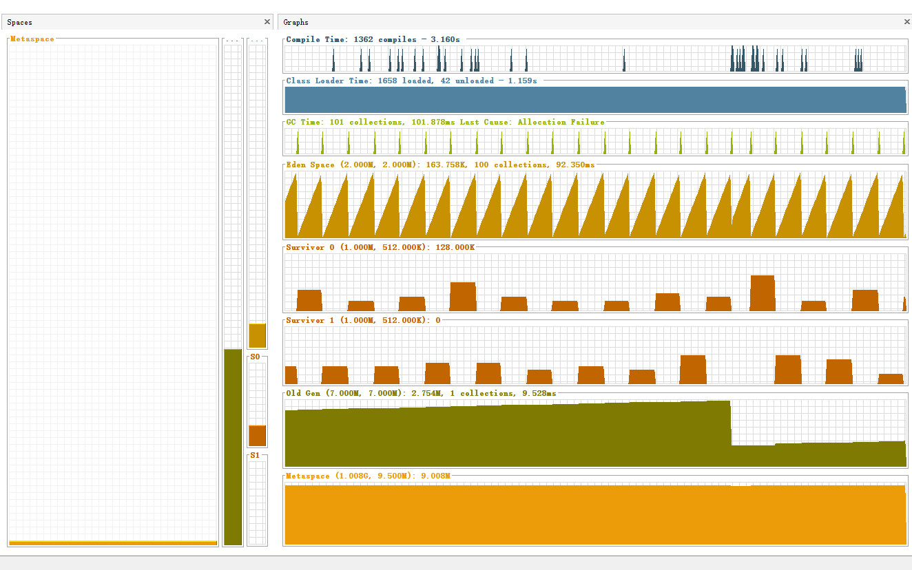

## GC
在代码中new的对象，如果对象不用了，那就需要把其所占的内存释放掉，那在什么时候把内存释放掉，这就是GC的任务
* GCRoot
当jvm进行gc的时候，会从类变量（方法区中），局部变量表中的引用出发，如果某一个对象不可达，那就需要回收内存
* `System.gc()`
手动触发full gc

* 对象的finalization机制
jvm在进行gc的时候，有以下步骤
1、对于某个对象，从gcRoot出发，判断是否可达
2、如果不可达，且该对象进行调用过finalize方法，立即回收
3、如果不可达，且该对象还没有调用finalize方法，调用finalize方法
4、调用finalize方法后，判断该对象是否可从gcRoot到达，如果可达，该对象复活；如果不可达，回收内存
```java
public class FinalizationTest {
    static Object obj;

    @Override
    protected void finalize() throws Throwable {
        super.finalize();
        obj = this;
    }

    public static void main(String[] args) throws InterruptedException {
        obj = new FinalizationTest();
        obj = null;
        System.gc();
        Thread.sleep(10); //等待finalizer线程执行，因为该线程优先级比较低
        System.out.println(obj); //不是null！com.example.jvm.FinalizationTest@14ae5a5
    }
}
```

* 执行引擎

* 为什么Java要引入class文件，不能像C一样直接编译运行吗？因为Java被称为跨平台语言，“一次编译，到处运行”。C就不能一次编译到处运行；那为什么Java**要**一次编译到处运行呢？（一次编译到处运行的好处？：其实英语原文是“write once，run everywhere”，也就是说明C代码在不同的平台需要改源码？现在只能这样理解了）
* Class文件结构
    * magic u4
    * 版本号 u4（u2+u2）
    * 常量池中的个数 u2（为什么实际中的常量池个数=u2-1？）
    * 常量池 
    > 什么是常量池？
    * 访问标识 u2 表示的数是个和 例如0x21表示0x20(public)+0x01(super);同时这个数也用来标识这个class是个类还是接口
    * u2（通过常量池指出当前类的名字）+u2（常量池：父类）+u2（接口个数）+接口索引集合
    * 字段计数器 u2：表示类中的成员个数
    * 字段表
    * 方法计数器
    * 方法表
    * 属性：方法1中的Code（具体操作的二进制）方法2中的Code...
        * LineNumberTable: StartPc：具体指令的行数  <-> LineNumber:Java代码的行数
* 一个方法JVM会开辟一溜内存，这一块被称为栈帧；栈帧被分为几小块，包括：操作数栈+局部变量表+... 局部变量表放的是：this指针？方法传入的形参+方法里面的局部变量
* 一个方法里面的变量被称为局部变量，请思考局部变量与局部变量表之间的关系
* 指令 （用一个字节来表示）
    * 加载与储存
        * 局部变量压栈指令:xload_\<n>
        * 常量入栈指令:xconst,bipush/sipush,ldc
        * 将操作数栈中的元素弹出并装入局部变量表：istore
    * 算术指令
    * 类型转换指令
        * 宽化（自动：int->long）
        * 窄化（强制类型转化，要显示写出来：int->short）
    * 对象的创建与访问指令
        * 创建指令：new（在堆里开辟一块空间并初始化类，将类的地址入操作数栈）、newarray
        * 访问指令：getstatic、putstatic、getfield、putfield
    * 方法调用与返回指令
    * 操作数栈管理指令
        * dup：duplication 将操作数栈顶元素复制一份在入栈
* JVM工具
    * jps
    * jstat
* JVM内存分类：方法区+堆+Java Stack+本地方法栈+程序计数器
* xxx，在内存的方法区就存在一个类的模板
----
* 前端编译器
    * 为什么觉得：eclipse在Run AS的时候要比idea运行的时候要快一点？idea默认使用javac编译器，采用全量式编译（每次运行的时候都要进行全部编译），而eclipse使用的是ECJ（eclipse compiler for java），采用增量式编译器，就是原来编译过的就不编译了
* 为什么说Java是解释+编译：这与JVM有关，JVM中有一个部分用来解释程序运行（一般是程序第一次运行），另一部分用来编译（通常是常用代码）。主要是为了速度
* new一个对象，就会在内存（heap）里分配内存
* ==Java是怎么运行起来的？== （来源：尚硅谷Java基础p317，01：57讲static时，说了一句通过构造方法在heap中创建对象，还是不理解Java的运行过程）【cur：JVMp207】
* `当使用一个类的时候，这个类就会加载到内存里`，加载的时候，加载到哪？什么状态？（来源：尚硅谷Java基础宋p330，9m53s）
* 常量池-string static
# JavaWeb

## JavaScript


* 回忆普通的JavaWeb项目的整体流程(jsp+servlet)【狂神springmvc p3】浏览器请求通过web.xml的引导进入对应的servlet，在servlet中通过调用service和dao层进行功能处理，最终在servlet通过转发或者重定向告诉浏览器该该访问什么页面
* 前端
    * get请求与post请求的区别？ get请求方式会在URL上显示参数 狂神JavaWeb p14，18min22s ；而post的数据会在Form data里面
    * 一个url`xxxx?username=cbc&password=123456`里面的username和password是从哪来的？狂神JavaWeb p14，19min15s 
## EL表达式  
* EL表达式是为了简化jsp输出，用${}代替<%= %>
```java
${key} =
<%= xxx.getAtrribute("key",something)%>
//EL表达式有点像一个map映射，通过${key}来得到setAtrribute("key",something)中的something

/*这样的话EL表达式中的隐式对象也就很好理解了
    为什么EL表达式中的ApplicationScope对象=jsp中的application？
    我觉得底层肯定有这样一行代码：xxx.setAttribute("ApplicationScope",application);
*/
```
* `${key}`,当四个域中都有key的时候，EL表达式会怎么进行取值？
pageContext->request->session->application
* EL表达式也能够进行一些简单的逻辑运算和算术运算
    * ${empty sessionScope.indexuser}：若indexuser有值，输出false
* `.`操作符&`[]`操作符
    * `.`操作符
    `${person.name}`中的person只能是一个Map或者一个bean；name只能是Map中的key或者bean中的一个属性
    当person是一个bean时，${person.name}相当于person.getName()
## Servlet
* 什么是Servlet：Servlet就是一个程序，接收Tomcat传过来的request对象，Servlet进行处理后在扔给Tomcat，Tomcat将结果发回浏览器
* 为什么要用Servlet？ 因为Tomcat需要[link](https://www.zhihu.com/question/21416727/answer/690289895) Tomcat的代码图
* 是怎么通过URL在找到具体的Servlet的？【尚硅谷JavaWebp124】
* Servlet是一个class，里面有各种各样的方法，那有个问题：谁调用的Servlet？[link](https://www.zhihu.com/question/21416727/answer/690289895)
* 什么是ServletContext？ 【狂神p10】
    * `context.getInitParameter`
    * `context.getRequestDispatcher("").forward()`,理解转发 与 重定向之间的区别：重定向走了两趟；servlet+jsp就是转发
    * 通过context读取外部配置文件
* 解决请求乱码问题
    * get请求
    get请求需要去修改Tomcat的配置；或者在前端做一些支持[link](https://www.likecs.com/show-305417381.html)
    * post请求
    ```java
    req.setCharacterEncoding("UTF-8"); //setCharacterEncoding只对请求体设置字符编码，所以如果是get请求，就没用
    String name = req.getParameter("name");
    ```
* 解决响应乱码问题
```java
    resp.setCharacterEncoding("utf-8");//设置response的编码格式
    resp.setHeader("Content-Type","text/html;charset=utf-8");//设置浏览器解析编码的格式

    //===================================或者===============
    resp.setContentType("text/html;charset=utf-8");//同时设置服务器和浏览器的编码方式
```
* HttpServletRequest
    * 获取前端参数：为什么能获取到？怎么获取？
        * 获得一个
        * 获得一组
    * 转发：`req.getRequestDispatcher("").forward()`
* HttpServletResponse
    * resp重定向的原理：后端Servlet来设置response对象，1.设置状态码302；2.给出新的地址；然后服务器将response发给浏览器，浏览器解析后在向新地址发起请求
    * 如何使用response给客户端传字符串数据？
    ```java
    //通过流
    PrintWriter writer = resp.getWriter();
    writer.println("<h1>i am cbc html version</h1>");
    writer.write("<h1>i am cbc html version</h1>");
    ```
* web.xml
    * `<welcome-file-list> </welcome-file-list>`的作用？ 配置初始页面
    * `<url-pattern>/</url-patter>`表示什么？
    /  映射到 http://ip:port/工程名/
    * 配置错误页面
    ```xml
    <error-page>
        <!-- 异常代码，可以404、500 -->
        <error-code>404</error-code>
        <!-- 如果Tomcat内部产生异常，跳转的路径 -->
        <location>/error.jsp</location>
    </error-page>
    ```
* Filter
    * 使用背景
    权限管理：只有登录后才能访问某些资源
    * 过滤器四个方法（+构造方法）的执行顺序？
    构造和init方法在tomcat启动的时候就会执行；每次请求进来就会执行dofilter方法；当tomcat关闭，执行destroy方法
    * FilterConfig
    就是将web.xml中配置的filter信息封装到FilterConfig中，可以通过FilterConfig中的方法得到配置信息
    * FilterChain
    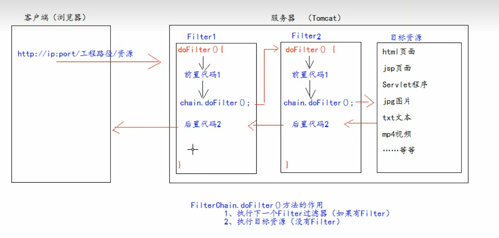
    * 具体使用
    ```java
    1、新建一个类，implements Filter接口（javax.servlet）
    2、在doFilter方法里写上登录判断
    @Override
    public void doFilter(ServletRequest request, ServletResponse response, FilterChain chain) throws IOException, ServletException {
        //转换类型
        HttpServletRequest httpServletRequest = (HttpServletRequest)request;

        //获取session的user
        User user = (User) httpServletRequest.getSession().getAttribute("user");

        //用户没有登录
        if(user == null){
            //管理员登录页面
            httpServletRequest.getRequestDispatcher("/pages/manager/admin_login.jsp").forward(request,response);
        }else{
            //登录已完成
            chain.doFilter(request,response);
        }
    }
    3、在web.xml中配置Filter
    ```
* Cookie
    * cookie是什么：cookie是由服务器创建，并发送给浏览器；让浏览器每次访问在request header带上cookie
    * cookie保存在客户端还是服务端？
* Session
    * session默认的存在时长是？
    通过`session.getMaxInactiveInterval()`可得到：1800s，即30min
    * 代码中是通过`request.getSession()`来得到对应的session，那如果是同一个用户发起不同的请求，用这些request调用getSession方法，得到的session是同一个session吗？
    ```java
    requet.getSession()
    当第一次执行时，服务器会分配一块内存作为session，与此同时会新建一个Cookie，它的key是jsessionid，它的value是sessionid
    该Cookie的存活时间是：当浏览器关闭即消失。
    该Cookie的创建、初始化、返回给浏览器是我们不可控的，全部由web服务器执行

    上面问题的答案是：
    找session并不是通过request来找的，而是通过key为jsession的cookie的value来找的
    ```
    * Q：服务器端创建Session对象的时候，有没有在背后创建Cookie对象？
    是有的，回忆Cookie的使用，只有我们`resp.addCookie()`的时候，浏览器端才会创建一个cookie。而当我们只写个`getSession`的时候，浏览器端也会存在cookie。
    所以可以猜测Tomcat在背后是创建了一个Cookie的
    * `request.getSession(true)`什么意思？ 与`request.getSession(false)`做对比
    ```java
    request.getSession(true)//：若存在会话则返回该会话，否则新建一个会话。
    request.getSession(false)//：若存在会话则返回该会话，否则返回NULL
    ```
    * `request.getSession()`原理
    如果访问到这行代码，如果浏览器传过来的有sessionid，那么就回去找
    如果没有sessionid，就直接新创建
    > 是一个浏览器一个session吗？
    在正常使用的情况下，是的
    但可以自己手动删除sessionid的cookie，这样也能在服务器端创建两个session
    * session超时有什么影响？
    * `req.setattribute()`与`req.getsession.setattribute()`之间的区别？从request的持续时间与session的持续时间理解
    * session超时的结果是什么？ session被销毁，存在session里面的数据都没了
 * Cookie
    * Cookie是什么？就是个键值对
    * 为什么需要Cookie？Cookie被设计出来是为了辅助Session的，用来传递sessionid的，有很多个浏览器，也有很多个session，用sessionid防止搞混
    * Cookie是存放在浏览器中的，那Cookie.setMaxAge是什么意思？服务器怎么直到Cookie啥时候到期？ emm，理解有问题，这个setMaxAge是告诉浏览器的，即到了时间就会把对应的Cookie删除
    * Cookie的使用
    ```java
        //创建
        Cookie cookie = new Cookie("key","value");
        //通知浏览器
        resp.addCookie(cookie);
    ```
* Servlet代码优化
    * 用户模块，既有注册功能，又有登录功能，难道要写两个Servlet？--通过html的隐藏域+if else在UserServlet中判断
    * 怎么把ifelse给省掉 尚硅谷p227
    * 怎么把用户模块和其他模块的反射操作进行代码复用 尚硅谷p228   
## jsp
* 为什么需要jsp？【尚硅谷JavaWeb p172】
* 为什么说jsp的本质是个Servlet？【尚硅谷JavaWeb p174】
* 前端有个form表单，form里的action应该写整个的url，但我怎么知道项目被部署到哪去？
* 脚本
    * 输出？`<%=  somevalue  %>`
    * 在jsp中,`<%  %>`什么意思【尚硅谷JavaWeb p191】
* EL表达式
    * `${ key }`什么意思？ 相当于`<%=  req.getattribute("key")  %>`，在输出上，EL表达式还比jsp脚本优越在哪里？ （null上）


* 三层架构
    * 什么是pojo包？pojo(plain ordinary java project)
    * dao
        * 为什么dao层还要搞个接口？ 搞接口的目的在于，尽管数据库代码还没有写，仍然不影响service层调用。不会报错   
## JSTL
* 什么是JSTL？ JSTL用JSTL标签`<c:set> <c:if>`等代替<% %>;用`<c:if>`举例，如果没有`<c:if>`,我们就要自己写脚本<% %>,在脚本里进行判断;
> 想要使用JSTL，需要在jsp中导入：`<%@ taglib prefix="c" uri="http://java.sun.com/jsp/jstl/core" %>`
* 标签
    * `<c:set>`
    * `<c:if>`的用法？ test属性里面如果为true则显示，否则不显示；通常用EL表达式来写` <c:if  test="${!empty sessionScope.indexuser}">`
    * `<c:foreach>`
    ```html
    <c:forEach items="${movieList}" var="movie">
        ${movie}
    </c:forEach>
    ```
    * `<c:choose>`
    ```html
    <c:choose>
        <c:when test="${page.pageNo == 1}">上一页</c:when>
        <c:otherwise><a href="${path}/article/index?pageNo=${page.pageNo-1}">上一页</a></c:otherwise>
    </c:choose>
    ```
## Tomcat
* web.xml
如果servlet-mapping中不写`/`即
```xml
    <servlet-mapping>
        <servlet-name>Test2</servlet-name>
        <url-pattern>test</url-pattern>
    </servlet-mapping>
```
会报错
* tomcat中根据url匹配servlet的流程
    1、精准匹配：`/test`
    2、前缀通配符匹配:`*.jsp`
    3、扩展名通配符匹配:`a.*`
    4、默认匹配:`/`
    > 如何理解/和/*的区别是/不能匹配jsp，而/ *却可以?
    /*在第一阶段就会被精准匹配，所以 *.jsp符合要求
    而/在最后才会被匹配，在这之前，你的*.jsp已经被tomcat自己的web.xml匹配成功了
* tomcat中的web.xml与自己的web.xml之间的关系
    1、`<welcome-file-list>`：如果自己的写了，自己的会将tomcat中的替换掉（tomcat自己说的）


# 架构
* 为什么需要Vo？
一个页面需要的数据可能来自很多对象
在以前，我们将很多对象都塞进request里面返回给前端，这样有一些弊处：
1、暴露了一些数据：一个对象中并不是所有属性都会用到
2、前端很麻烦：前端需要知道返回来几个对象，以及对象中的各个属性的含义
引入Vo之后：
1、页面需要什么，Vo定义什么。不会暴露多余的数据
2、前端只需要知道Vo中的各个属性的含义就好了，而且只有一个Vo对象返回给前端，更方便
# JWT(Json Web Token)
* 参考
    * [编程不良人B站视频](https://www.bilibili.com/video/BV1i54y1m7cP/?spm_id_from=333.999.0.0)
* cookie时代
当浏览器第一次访问服务器时，服务器会在自己内存中创建一个session，然后把sessionId（Cookie）传给给浏览器。
浏览器每次请求时会把Cookie给带上，服务器一看有自己发的Cookie，就给他提供服务；否则就拒绝提供服务或者让浏览器去登录
缺点：
1、session是在服务器的内存里面的，如果用户过多，光session就会占据服务器绝大多内存
2、分布式时代，session只存在与单个机器内部，如果用户登录过了，但是请求分配给另外一台机器，最终还是显示用户没登陆
3、不安全：在免密登录中，如果我能截获cookie，那我就能随意登录任何一个人的账户
* 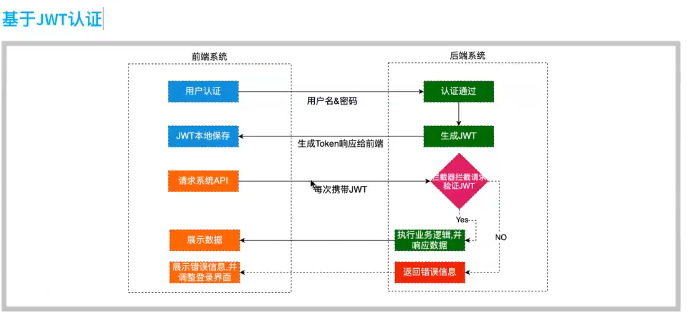
* JWT的优点
1、由服务器生成，但只传给前端，不保存在自己的内存里（解决内存占用问题）
2、当服务器生成JWT时，会把一些信息编码进JWT中，这样每次服务器拿到一个JWT，就可以根据相应的算法把信息就解码出来；这样一来，以前保存在session中的信息都可以编码进JWT中（解决分布式问题）
3、JWT不能解决上述session的安全问题，如果JWT被截获盗用，仍然可以访问账户
* JWT一般放在response请求header中