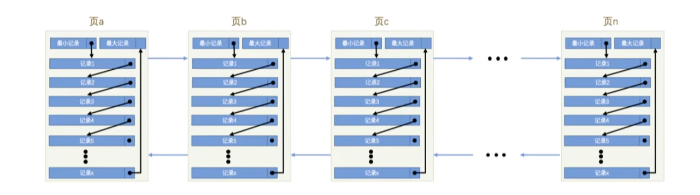
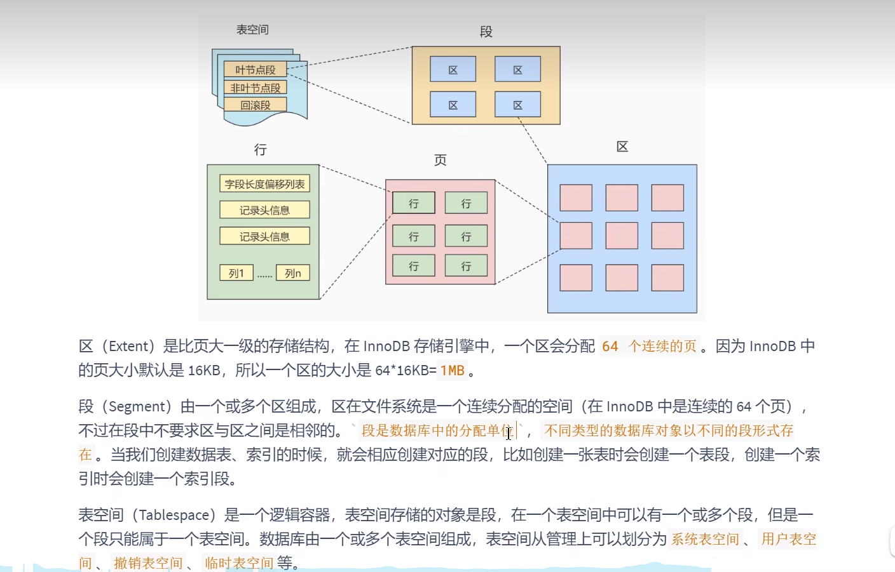

# Mysql基础操作
## 将MySQL中的表复制到word中
* 参考：[link](https://blog.csdn.net/m0_48795024/article/details/124109024)
* mysql登录命令
```sql
mysql -h -u -p
# -h不写，默认localhost
mysql -h123.123.123.123 -ucbc -pabc123
# 会去ip地址为123.123.123.123上面的mysql服务器请求连接
```
* 等值查询
```sql
# 这就是等值查询
select * from user where user_id = 3;
```
* 单行函数and多行函数
```sql
# 单行函数：一条record返回一条结果：to_char()函数
select to_char(sysdate,'yyyy"年"mm"月"dd"日" hh24:mi:ss') from dual;
# 多行函数：多个record返回一条结果
如max(),min(),count()
```
* `\g,\G,;`
在mysql中，语句要以`;`结尾；
`\g`与`;`的功能一样；
`\G`也可以充当`;`,只不过显示结果是vertically
* 查看mysql版本
`mysql --version`
## 字符编码问题
* 查看MySQL字符集：`show variables like 'character_set%';`
* 配置Mysql服务器的编码格式为utf8
```
C:\ProgramData\MySQL\MySQL Server 5.7\my.ini
63:default-character-set=utf8
74:character-set-server=utf8
75:collation-server=utf8_general_ci
```
# MySQL与SQL Server/Oracle其他数据库的区别
* check语法:MySQL只是支持check语法，但在实际添加的时候并不会检查语句是否符合check语法；
其它的一些数据库，比如SQL Server或者Oracle支持的CHECK语法是有实实在在的作用的，每次进行插入或更新记录之前都会检查一下数据是否符合CHECK子句中指定的约束条件是否成立，如果不成立的话就会拒绝插入或更新。
```sql
CREATE TABLE account (
id INT NOT NULL AUTO_INCREMENT COMMENT '自增id',
name VARCHAR(100) COMMENT '客户名称',
balance INT COMMENT '余额',
PRIMARY KEY (id),
CHECK (balance >= 0) 
);
```
# Mysql中存储引擎
* MyIsam与innoDB之间的区别
1、事务：MyISAM不支持事务
2、索引：MyISAM没有聚簇索引，都是二级索引
3、数据目录：MyISAM的索引和数据分开存储:xx.MYD,xx.MYI，而innodb都在xx.idb
# sql语句
```sql
# 数据库相关 
    create database mysql_learn2 character set 'utf8'; # 创建数据库&显示指出字符集编码
    show databases; # 查看有哪些数据库
    show create databse mysql_learn; # 查看数据库的创建语句
    select database(); # 查看当前正在使用的数据库
#--------------表的增删改查
#创建表
    create table test2 as select * from db2.test2 # 完全复制创建新表

# 表相关
    show tables; # 查看数据库中有哪些表
    desc 表名 # 查看表的结构信息
    show full columns from 表名 # 查看表的详细信息（包括权限、comment注解）


# 修改表
    # 添加一个字段(ADD)
    ALTER TABLE 表名 ADD 【COLUMN】 字段名 字段类型 【FIRST|AFTER 字段名】;
    alter table tb_user add addtest double(10,2);
    # MODIFY:modify其实就已经动字段的结构了
    # modify后面紧跟着字段名：确定修改的字段所在的位置
    # 后面输入什么，整个字段就被更新为什么
    # e.g.如果 modify id int(12)就会把id的结果改为int(12)，其他的所有像comment、auto_increment都会消失(primary key 和not null不变)
    ALTER TABLE 表名 MODIFY 字段1 字段1数据类型 AFTER 字段2;
    alter table tb_user modify name varchar(30) after id;
    #重命名字段(CHANGE)
    alter table tb_user change 
    #删除表的某一列
    ALTER TABLE article DROP COLUMN article_childs


# DML（CRUD）
    # 增
        insert into user(colum1,colum2..) values ()
    /*
        如果某一个column_n不写，MySQL会先去找有没有默认值(default)，如果没有默认值就会赋值null
    */
    # update
        # 修改一个字段
        update `user` SET user_email_address='cbc2' where user_id = 2
        //如果没有where，就是批量修改
        # 修改多个字段
        update `user` SET user_email_address='cbc2', user_cookieid='value' where user_id = 2
    # delete
        delete from `user` where user_id = 2

#DCL/TCL（transaction control language）：commit、rollback
```
# DDL/DML/DCL
* 什么是DDL，DML，DCL？
    * DDL（数据、定义、语言）：CREATE table、truncate table、alter table、drop table
    * DML（数据、操作、语言）：增删改查
    * DCL（数据、控制、语言）：commit、rollback
> DDL与DML的区别
DDL执行完，一定不能回滚
DML执行完，可以回滚（前提是在执行DML之前：`set autocommit = false`）


> truncate table 和delete from之间的区别
相同点：都用来清空表数据，且都保留表结构
不同点：
    0、truncate直接清空表数据，delete可以配上where语句实现部分删除
    1、truncate不能rollback，而delete可以回滚
## DDL
* DDL操作是不能回滚（rollback）的，因为一个语句就是一个单独的事务
* `drop`
    * `drop students`:删除student表
    * `drop database dbtest1`:删除数据库
## DCL
### 用户与权限
* 创建用户
```sql
create user 'cbc' identified by 'abc123' # 创建用户以及密码

show grants; # 查看当前登录用户所拥有的权限
```
* 修改用户
* 删除用户
```sql
drop user 'cbc'
等价于
drop user 'cbc'@'%' # 删除用户'cbc'@'%'
```
* 设置用户的密码
```sql

```
* 权限管理
```sql

```
# 数据类型
> character set相关
1、如果字段没有显示指出字符集格式，则默认采用表的字符集
2、如果表没有显示指出，则默认采用数据库的字符集
3、如果数据库没有显示指出，则采用配置文件中的字符集
* `double(10,2)`什么意思？ 小数点前8位，后两位
## 整数类型
* tinyint,smallint,mediumint,int(integer),bigint
越往后，所占字节数越大，自然能存储的范围就越大
> int(M)什么意思：
1、后面的（M）不影响数据库中存的数，即只要一个数在int的范围里面，都可以存
2、如果（M）不搭配zerofill，则没有任何作用
3、如果搭配zerofill，则如果数据库中存的数不足M位，前面的M-p位会用0来补充
4、如果用了zerofill，则在创建表的时候会在该字段上自动加上unsigned，即如果用了zerofill，就只能存正数
ps:自从8.0以后，不推荐int后面加(M),直接写int就完事了。

## 字符串类型
* char
char(10)指的存的字符串的长度最大为10个字符
如果不指明即char，则默认为1个字符
如果声明char(10),在底层，如果不够10个字符，会用空格填补（固定长度）；在查询结果的时候会再把空格去掉
> 一个字符：当前所知道的包括：一个英文字母、一个中文文字
* varchar(M)
varchar(M)中的M必须写，不写就会报错；
（M）指的是M个字符
M的最大值为21845。一个字符占三个字节，所以varchar最多占（21845*3）65535个字节
> varchar(5)与char(5)之间的区别
如果存的值为'ab',那varchar底层所占的字节为2*3=6；而char不管你存的是什么，只要能存下，底层都按5个字符来存
* 各种Text:tinytext,text,mediumtext,longtext
长文本，像longtext最多可以存4GB
没有删除末尾的空格
## 时间类型
* YEAR
* DATE
    * 使用
    ```sql
    # 与字符串类似
    update user set birthday='2000-11-03' where id=2
    ```
# SQL操作
## 聚合函数（aggregate function）
* count
```sql
SELECT COUNT(*) FROM Products where ProductID > 10;
可以理解为
先 SELECT * FROM Products where ProductID > 10;
然后返回行（row）的数量
```
> Warning
在使用count求总和的时候，我们通常使用count(1)或者count(*);
count(某一列)可能会出错，原因是count计算总和的时候，是不包含值为Null的行的

> Q:如果某一列全部为空，那count(1),count(\*),count(某一列)三者谁的效率高？
一般来说效率 count(1) = count(\*) > count(某一列)
因为在count(\*)的时候，mysql可以利用索引进行查询优化，但使用某一列时有时不能用到索引
* Avg和Sum

```sql
SELECT AVG(Price) FROM Products;
可以理解为
先 SELECT Price FROM Products;
在计算所有行结果的平均值并返回
```
## group by
* 执行流程 
```sql
SELECT Country,count(1) //3
FROM Customers where CustomerID > 5 //1
GROUP BY Country; //2
```
1、建立一张虚拟表，第一列是Country，第二列是count(1)
2、将where过滤后的表通过group by进行分组
3、对于每一组将作为虚拟表中的一行，进行数据填充

* group by后面跟多个字段？
先根据第一个字段分组，在分组后的字段中按照第二个字段在分组

* group by 的位置
from,on,where,group by,order by,limit
## having
having用来进行条件过滤，一般和group by连用，将group by最后得到的虚拟表进行条件过滤
## like
* 占位符（wildcard）
    1、`%`:表示0个或多个
    2、`_`:表示一个
    ```sql
    WHERE CustomerName LIKE 'a%'	Finds any values that start with "a"
    WHERE CustomerName LIKE '%a'	Finds any values that end with "a"
    WHERE CustomerName LIKE '%or%'	Finds any values that have "or" in any position
    WHERE CustomerName LIKE '_r%'	Finds any values that have "r" in the second position
    WHERE CustomerName LIKE 'a_%'	Finds any values that start with "a" and are at least 2 characters in length
    WHERE CustomerName LIKE 'a__%'	Finds any values that start with "a" and are at least 3 characters in length
    WHERE ContactName LIKE 'a%o'	Finds any values that start with "a" and ends with "o"
    ```
## in
```sql
# The IN operator is a shorthand for multiple OR conditions.
select * from article where article_id in (1,2,3)
```
## comment关键字 
* [resources-link](https://www.qycn.com/xzx/article/7092.html)
```sql
 create table test1 ( 
     field_name int comment '字段的注释' 
 )comment='表的注释';

 //查看已有表的所有字段的注释
 show full columns from test;
 //查看表注释的方法
 show  create  table  test1; 
```
## 联结表
* `inner join`&`outer join`
    * 出现的背景：
    ```sql
    select * from student,score where student.number=score.number;
    # 有个问题，在student表中的学生，如果在score表中没有他的成绩，查询得到的结果集是不包含该学生的
    # 那如果有个需求，即使该学生没有参加考试，也要在结果集中显示出来，成绩为0就是了，这该怎么做？
    ```
    > 对于内连接的两个表，驱动表中的记录在被驱动表中找不到匹配的记录，该记录不会加入到最后的结果集
    对于外连接的两个表，驱动表中的记录即使在被驱动表中没有匹配的记录，也仍然需要加入到结果集。
* `inner join`
    * sql进行内连接的查询过程
    ```sql

    SELECT * FROM t1, t2 WHERE t1.m1 > 1 AND t1.m1 = t2.m2 AND t2.n2 < 'd';
    0、总原则：驱动表只访问一次，而被驱动表要被访问多次
    1、通过t1.m1 > 1条件过滤t1表中的数据
    2、对于t1表中过滤后的数据，逐条去t2表中找匹配的数据（ex：t2.m2=3 and t2.n2 < 'd'）
    ```
    * 使用：
    ```sql
    # 以下四种写法等价
    SELECT * FROM t1, t2;
    SELECT * FROM t1 JOIN t2;
    SELECT * FROM t1 INNER JOIN t2;
    SELECT * FROM t1 CROSS JOIN t2;
    ```
* `left (outer) join`&`right (outer) join`
    * 外连接细分为左（外）连接和右（外）连接；区别就是驱动表的不同：左连接是左边的表为驱动表，右连接是右边的表为驱动表
    > Wanring:
    使用left join 和 right join时，必须要有on过滤条件，不然语法报错
* `left join`
`A left join B on xx`：将A表中的数据进行过滤后都存在结果集中，对于A中结果集的每一条数据，根据on条件去B表中找匹配的数据，插到A中该条数据的右边，如果有多条那就插入多条，如果一条都没有就插入NULL
* `natural join`
两张表A、B放在一起，找到列名相同的列（不妨假设id），开始匹配
A中的第一条记录id=100，开始对B从上往下找id为100的，找到的话就将两条记录拼接

# 约束
数据完整性：数据完整性是指数据的可靠性&安全性
通过约束来保证数据完整性。例如：
通过主键约束：来保证一个表中不能有两条一模一样的数据
通过外键约束：来保证一个外键字段要能在另一张表中找到（员工所在部门）
```sql
# 查看表约束
select * from information_schema.table_constraints where table_name='user' and table_schema='mysql_learn';
```
* not null
```sql
    # 建表的时候创建约束：直接在字段后面 not null
    # alter修改为not null
    # 去除not null：alter table table_name modify
    # not nul没有表级约束的写法
```
* unique
```sql
# 列级约束的写法
create table test(id int unique,name varchar(20) )
# 表级约束的写法
create table test1(id int,name varchar(20),constraint uk_name unique(id) )
/*
    1、constraint uk_name可以不写，也能添加约束成功
    2、constraint uk_name写的作用是给约束个名字
    3、如果不写，则默认为id（加约束的列的名字）
*/
# 增加unique约束的两种方式


```
> unique约束的字段能不能存在重复的null值？ 可以
* primary key
```sql
# 创建表后，增加主键约束
ALTER TABLE 表名称 ADD PRIMARY KEY(字段列表); #字段列表可以是一个字段，也可以是多个字段，如果是多个字段的话，是复合主键
alter table test1 modify id int(11) primary key;

# 删除主键约束
alter table 表名称 drop primary key; # 不需要指出具体的列
```
* auto_increment:
    * 条件：只能用在`主键列`or`唯一性约束的列`上；且必须为整形
    * 用法：`insert into user(username) values("cbc")`,不需要在指明id了
    > 如果指明了id，且id为0或者null，则和不写一样
    如果指明了id，且id合法，则直接插入
    * 关于auto_increment，在5.7和8.0上的不同？ 5.7增加是在内存层面，重启服务器后可继续，8.0是在磁盘层面，重启服务器后仍然跳跃
* foreign key
```sql
# 建表时创建外键
create table dept( #主表
    did int primary key, #部门编号
     dname varchar(50) #部门名称
);
create table emp(#从表
    eid int primary key,  #员工编号
     ename varchar(5),   #员工姓名
     deptid int, #员工所在的部门
      foreign key (deptid) references dept(did)  #在从表中指定外键约束
      #emp表的deptid和和dept表的did的数据类型一致，意义都是表示部门的编号
);
```
# 视图
* 视图的本质
视图的本质就是存储起来的select语句
* 视图的优点
1、简化查询语句
2、控制数据的访问（通过视图对dba开放部分字段）
# 触发器
* 为什么要使用触发器
* 触发器的使用
# 建表原则
* 一对多
在从表中创建一个字段，作为外键指向主表的主键
* 多对多
必须创建第三个表（连接表）将多对多的关系转化为两个一对多
> 连接表中字段必须有id(自己的id),A_id(第一张表的id),B_id(第二张表的id)
# InnoDB数据存储结构
一个表以页(16K;32个扇区)为单位进行分割;索引中B+树的每一个节点就是一个页



# 存储过程(procedure)
* 自定义procedure
`DELIMITER $$`一定要大写，不然报错 
```sql
declare str;
set str = substring(MD5(RAND()),1,20);//str随机字符串
```
```sql
//stackoverflow例子
DELIMITER $$
CREATE PROCEDURE InsertRand(IN NumRows INT, IN MinVal INT, IN MaxVal INT)
    BEGIN
        DECLARE i INT;
        SET i = 1;
        START TRANSACTION;
        WHILE i <= NumRows DO
            INSERT INTO rand_numbers VALUES (MinVal + CEIL(RAND() * (MaxVal - MinVal)));
            SET i = i + 1;
        END WHILE;
        COMMIT;
    END$$
DELIMITER ;

CALL InsertRand(1111, 2222, 5555);
```
```sql
DELIMITER $$
CREATE PROCEDURE procedureTest(IN mid INT) //如果mid改为id，where子句恒成立
	BEGIN
		SELECT * from test1 where id = mid;
	END$$
DELIMITER ;
CALL procedureTest(2);
```
```sql
DELIMITER //
CREATE PROCEDURE `add_num`(IN n INT)
BEGIN
   DECLARE i INT; 
   DECLARE sum INT;
  
   SET i = 1; //要先在前面declare后才能set；set是赋值操作，declare是声明变量
   SET sum = 0;
   WHILE i <= n DO
       SET sum = sum + i;
       SET i = i +1;
   END WHILE;
   SELECT sum; //输出
END //
DELIMITER ;
```
```sql
DELIMITER $$
CREATE PROCEDURE InsertRand(IN NumRows INT)
BEGIN
DECLARE i INT;
DECLARE key1p VARCHAR(100);
DECLARE key2p INT;
DECLARE key3p VARCHAR(100);
DECLARE key_part1p VARCHAR(100);
DECLARE key_part2p VARCHAR(100);
DECLARE key_part3p VARCHAR(100);
DECLARE common_fieldp VARCHAR(100); //declare一定要在set前面，不然报错
SET i = 1;
-- 	START TRANSACTION;
	WHILE i <= NumRows DO
	SET key1p = substring(MD5(RAND()),1,20);
	SET key2p = i;
	SET key3p = substring(MD5(RAND()),1,20);
	SET key_part1p = substring(MD5(RAND()),1,20);
	SET key_part2p = substring(MD5(RAND()),1,20);
	SET key_part3p = substring(MD5(RAND()),1,20);
	SET common_fieldp = substring(MD5(RAND()),1,20);
	INSERT INTO single_table(key1,key2,key3,key_part1,key_part2,key_part3,common_field) VALUES(key1p,key2p,key3p,key_part1p,key_part2p,key_part3p,common_fieldp);
	SET i = i + 1;
	END WHILE;

END$$

DELIMITER ;
```
* procedure的增删改查
```sql
//查
show create procedure procedureTest;
//删
DROP PROCEDURE CountProc;
```
# 函数
* MySQL内置函数
    * RAND()
    ```sql
    RAND() //返回0-1的一个随机数，每次调用返回的值不一样
    RAND(seed) //返回0-1的一个随机数，每次调用返回的值一样
    ```
    * CEIL()
    ```sql
    CEIL(x) //x如果是小数，向上取整；整数则不变
    ```
* x
```sql
DELIMITER $$
CREATE PROCEDURE InsertRand(IN NumRows INT, IN MinVal INT, IN MaxVal INT)
    BEGIN
        DECLARE i INT;
        SET i = 1;
        START TRANSACTION;
        WHILE i <= NumRows DO
            INSERT INTO rand_numbers VALUES (MinVal + CEIL(RAND() * (MaxVal - MinVal)));
            SET i = i + 1;
        END WHILE;
        COMMIT;
    END$$
DELIMITER ;

CALL InsertRand(1111, 2222, 5555);
```

# 索引
## reference
* [第6章 快速查询的秘籍-B+树索引](https://relph1119.github.io/mysql-learning-notes/#/mysql/06-%E5%BF%AB%E9%80%9F%E6%9F%A5%E8%AF%A2%E7%9A%84%E7%A7%98%E7%B1%8D-B+%E6%A0%91%E7%B4%A2%E5%BC%95)
## 为什么需要索引？
MySQL表中的每条记录会按照主键值的大小串联成一个单链表，这个链表被分成了几段，每一段成为一个数据页，在每个数据页中，mysql通过页目录这种结构实现了对有序单链表的二分查找。
如果以主键进行查找，尽管在单个数据页中可以用二分来缩短查找时间，但仍然要遍历每个数据页；
## 索引的种类
1、主键索引(聚簇索引)
如果设置主键，mysql会自动创建主键索引，不需要使用index关键字
2、唯一性索引
当使用`unique key (c3)`建立唯一性约束时，会自动为`c3`创建普通索引
3、普通索引（二级索引）
```sql
使用index关键字创建的索引
CREATE TABLE index_demo(
    c1 INT,
    c2 INT,
    c3 CHAR(1),
    PRIMARY KEY(c1),
    INDEX idx_c2 c2
);
```
4、联合索引
```sql
CREATE TABLE index_demo(
    c1 INT,
    c2 INT,
    c3 CHAR(1),
    PRIMARY KEY(c1),
    INDEX idx_c2_c3 (c2, c3)
);
```
* 为什么MySQL中的索引实现为B+tree？B+树比B树好在哪里？
B+树中的叶子节点存在一个指针，指向相邻的叶子节点，又因为叶子节点即数据，这样在进行全表扫描的时候比较有优势
如果不以主键进行查找，那就需要去遍历每条记录！
* 聚簇索引vs二级索引
数据库中的表默认以主键建立聚簇索引，叶子节点中的页存的就是数据；
二级索引是我们以某个列手动创建的，叶子节点的页存的是主键id，通过二级索引找某个数据，找到的其实是它的主键id，需要拿着主键id在到聚簇索引的B+树中找（回表）
* 多个列共同组成的二级索引，是怎么排序的？
```txt
和sort差不多：
先按照name列的值进行排序。
如果name列的值相同，则按照birthday列的值进行排序。
如果birthday列的值也相同，则按照phone_number的值进行排序
```
* 什么情况下索引会失效？
1、由一列构成的索引
```sql
create table xxxx key(name)
如果在select的时候，where条件不使用name自然用不到索引
```
2、由多列构成的索引
```sql
create table xxx key(name,age,birthday)
在select的时候，where条件必须要有name
where name = 'cbc' √
where name = 'cbc' and age = 18 √
where name = 'cbc' and age = 18 and birthday = '2000' √
where age = 18 ×
```
* 为已经存在的表的某个字段，添加索引
```sql
alter TABLE indextest ADD INDEX myindex(id2);
```
## 如何验证sql查询使用了索引？
```sql
explain select * from single_table order by key2 limit 10;
# 如果Extra中的是Using fileSort，则没有使用索引
# 如果Extra中的是Using index，则使用了索引
```
> Q:为什么我对key2列建立了普通索引，可explain select之后使用的仍然是fileSort？
MySQL中的优化器会判断：是直接对记录进行filesort，还是使用索引+回表的代间小
-《从根儿理解Mysql-ch7-回表的代价》
## 升序索引&降序索引
```sql
CREATE TABLE index_demo(
    c1 INT,
    c2 INT,
    c3 CHAR(1),
    PRIMARY KEY(c1),
    INDEX idx_c2_c3 (c2 ASC, c3 DESC)
);
```
> ps:降序索引虽然5.7语法支持，但B+树的叶子节点还是按照升序排列的
8.0及其之后才支持真正的降序索引

在创建联合索引时，先按照c2字段升序排列，如果c2字段相同，在按照c3字段**降序**排列

## 为什么会有升序索引&降序索引？
### reference
* [不可以使用索引进行排序的几种情况](https://relph1119.github.io/mysql-learning-notes/#/mysql/07-%E5%A5%BD%E4%B8%9C%E8%A5%BF%E4%B9%9F%E5%BE%97%E5%85%88%E5%AD%A6%E4%BC%9A%E6%80%8E%E4%B9%88%E7%94%A8-B+%E6%A0%91%E7%B4%A2%E5%BC%95%E7%9A%84%E4%BD%BF%E7%94%A8)
为了定制化：
比如我大多数情况下需要一些数据，这些数据需要按照c2升序，c3降序
如果不支持降序索引`INDEX idx_c2_c3 (c2 ASC, c3 ASC)`,那么其实这个索引是用不到的。因为查询语句中需要c2升序，c3降序,而索引是c2升序，c3升序，不一致，就用不了索引；MySQL会默认使用filesort
## Innodb与MyISAM索引方案的区别
Innodb会默认对主键创建聚簇索引，B+树的叶子节点即是数据（索引即数据）
MYISAM的数据和索引是分开存储的；MYISAM索引的叶子节点并不是数据，而是主键+行数；通过行数，在到数据文件中得到数据记录；即在MYISAM中，即使主键索引也是二级索引
# 事务
* 为什么要用事务？
```sql
UPDATE account SET balance = balance - 10 WHERE id = 1;
UPDATE account SET balance = balance + 10 WHERE id = 2;
```
1、如果多条语句在执行的过程中，只执行一半（硬盘上一半修改了一半没改）断电了怎么办?
2、就算一条语句，我们知道在执行的过程有缓存bufferpool这个概念，一页数据从硬盘上读出来放到缓存中，在缓存中进行修改，等到合适的时机在写回硬盘。如果更新操作执行后、写回硬盘前电脑断电了怎么办？
* 什么是事务？
事务是|确保我们写的SQL语句具备ACID性质的|一系列措施（数据库操作）
A：原子性：即这些SQL语句要么成功，要么失败，没有第三种状态（假如一些列SQL语句，才执行一半就断电了，那就失败，不可能存在数据库改了一半这种情况）
C：一致性：保证数据一致性：A有1000元，B有1000元，如果不使用事务并且在转账业务中发生异常，就可能会出现A有900元，B有1000元，导致数据不一致
I：隔离性：与多线程操作共享数据类似，在数据库服务器端如果有多个事务同时操作同一张表，各个事务之间要保证相互隔离，互不影响
D：持久性：事务一旦提交，就要确保数据能够刷到磁盘上

* 事务的支持
    * undo日志：保证A（原子性）
    * redo日志：保证D（持久性）

## 数据库中事务的并发问题
把sql语句或者事务当成一个线程。当线程并发的时候就有可能存在以下问题：
1、脏写：事务A修改好数据并且已经提交，事务B回滚，将已经被A修改的数据改为了原来的值
2、脏读：读的数据是废数据；事务B往表中写数据value，后来又不想要这个数据了，进行了rollback。但是这个value被事务A读到了。
3、不可重复读：我已经读过一次了，什么操作都没有做，下次再读的时候与上次读的结果不一样了（条数不变、数据变了）不太严重
4、幻读：特指第二次读到了第一次没有读到的数据（条数多了）
> 如何理解不可重复读和幻读是一个**问题**？
从日常使用的情况下，不可重复读和幻读没有问题
但是从事务的acid原则上来说，这确实是一个问题：事务要满足i隔离性，那么在一个事务的执行期间，是不能有其他事务进行执行的。所以我写一个事务，两条同样的select语句查出来的结果不一样，确实不对劲。
出现这种情况的原因是数据库做了妥协，并非严格满足i隔离性的要求，得到的是性能
## 事务的隔离级别
* 背景
数据库允许多个客户端同时连接，如果多个客户端同时发起事务请求，那处于服务器端的mysql该**如何处理这些并发事务**？（并发事务修改同一个数据）
并发性与数据一致性 发生了冲突
* 类别
    * ReadUncommit
    并发情况下什么都没保证，存在脏读，不可重复读和幻读
    脏读：事务B能读取到事务A还没有commit的修改
    * ReadCommit
    保证不存在脏读
    * repeatableRead（默认）
    保证不存在脏读，不可重复读
    * serializable
> ps:脏写的情况特别严重，所以Innodb无论在什么事务隔离级别下，都默认保证不可能发生脏写

为什么repeatableRead就可以保证不存在脏读、不可重复读；为什么ReadCommit只能保证不存在脏读？换句话说，这些事务隔离级别是怎么做到的？他们的原理是什么？
请看下节MVCC

## MVCC
当两个事务同时读的时候，无所谓；
当两个事务一个读一个写，操作同一个数据的时候，如果什么都不做，那么读事务就有可能会脏读、不可重复读、幻读
脏读非常严重，必须杜绝
如何解决脏读、幻读、不可重复读呢？
## cmd事务操作
```sql

select @@tx_isolation # 查看事务的隔离级别
```
# 锁
## 背景
* 无论是什么样的事务隔离级别，都不会发生脏写；这是因为innodb使用了锁来保证这种机制
* 在serializable下，innodb使用加锁的方式来访问记录

# 数据库设计
* 不要用与业务相关的字段作为主键
* 三大范式（针对于单个表）
    * 1NF：原子性；
    * 2NF：当我把主键确定下来的时候，其他属性是否可以确定下来（其他属性要完全依赖主键，不能部分依赖）
    > 2NF比较阵对联合主键：如果两个属性共同构成主键，只有两个主键都确定下来的时候，剩余的属性才能确定下来；不能我先确定1个主键，就有几个主键确定下来
    * 3NF：
    > 商品id,类别id,类别名称 
    类别名称依赖于->类别id,类别id依赖于->商品id //不满足3NF
    解决方法：去除类别名称，把类别id与类别名称单独建一张表
# Select进阶
* order by：对数据排序
    * desc
    order by money默认对money升序排列，如果向反过来，就可以使用desc
    `order by money desc`
* group by：对数据分组
* limit
```sql
select * from user limit 2;//只看前两个
select * from user limit 2,4//从结果下标为2的地方开始，往下4个，即（2,3,4,5)；显示这些数据
//mysql中第一个数据的下标为0；
```
# 数据库的备份与恢复
## MySQLdump逻辑备份
* 备份单个数据库
```sql
mysqldump -uroot -p mysql_learn2 > ./mysql_learn2.bak
```
> MySQLdump在使用powershell进行重定向的时候，导出的文件默认为utf16！，所以以utf-8编码的数据库在打开的时候会中文乱码
* 复制数据库
```sql
mysql -uroot -p mysql_learn</var/lib/mysql/backup/mysql_learn.sql
```
### 恢复数据
* 单库备份恢复单库
```sh
mysql -uroot -p mysql_learn</var/lib/mysql/backup/mysql_learn.sql
```
* 从全部数据库备份中`all_database.sql`中恢复某一个数据库
* 从单库恢复单表
## 物理备份
