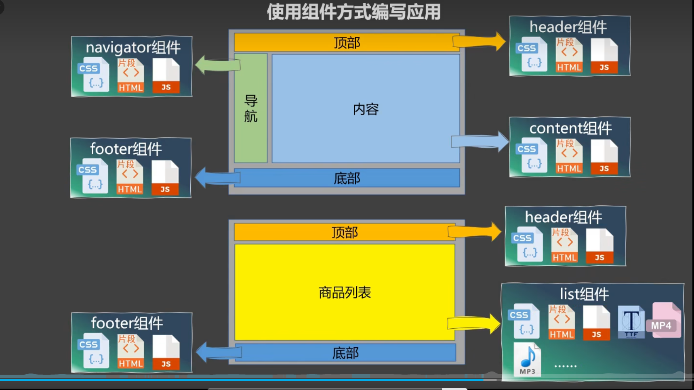

* npm
npm 类似于Java中的maven
* package.json
package.json中的dependencies与devDependencies的区别
一个是生产环境，一个是开发环境
```bash
npm install -D # 安装开发环境的依赖
npm install # 安装生产环境的依赖
```
# Vue基础
* 在main.js中new Vue()
```js
new Vue({
  el: '#app',
  i18n,
  store,
  router,
  components: { App },
  template: '<App/>',
  render: h => h(App)
})
```
这个el是什么意思？
表示Vue这个黑盒子挂载到了html中的某个元素上，这个元素的id为app
在这个元素里面就可以使用Vue这个黑盒子


<hr>
这个template什么意思？
表示现在index.html中找到id为app的元素，然后将App组件放到这个元素中

```html
<div id="app">
  <App/>
</div>
```
<hr>
这个render是什么意思？

1、通过`import Vue from 'vue'`引入的是一个阉割版的vue.js文件
2、使用阉割版的vue.js文件，需要使用render函数来渲染组件
3、`render: h => h(App)`表示使用render函数来渲染App变量
> 使用render的意义是：在最终通过webpack打包的产物中，不包括模板解析器

* Q：如果我在main.js中`import vue from 'vue'`，请问引入的是哪个js文件？


## props属性

外部就可以这样使用
```vue
<BackTop parentClassName="xxx" scrollClassName="xxx"/>
```
即组件里面的值是通过外部传进来的


## vue.config.js
该文件用来配置vue脚手架的


# Vue指令
* v-on
```vue
<button v-on:click="handleClick">Click me</button> 
# 简写
<button @click="handleClick">Click me</button> 
```
v-on:click可以缩写为@click
@click中的click可以是动态的
```vue
<button @[envent]="handleClick(123)">Click me</button> 
<script>
    const event = 'click'
</script>
```
```
<button @click.stop>Click me</button>
```
@click.stop可以阻止事件冒泡

## v-bind
> v-bind只要一写，双引号里面的内容就被看作js表达式进行运算
v-bind简写为:
```vue

```
上面的代码意思是将imageSrc的值绑定到img标签的src属性上；这样src的值是动态的

* L2
`{{}}`
* L3
`v-bind`
* L4
`v-if`与`v-show`
* L5
`v-for`
* L6
`v-on:click`
* L7
`:class`

# Vue组件
* 为什么要使用组件？
before：

middle：
JS的模块化：解决JS代码引用的先后顺序
after：


* 项目中开发组件


# scoped
什么意思？

* 背景：
在每个component中的style标签中写的样式，最终都会汇总在一起；
这样就会出现命名冲突的问题；
使用scoped样式，可以解决这个问题；

# 组件的自定义事件


# 全局事件总线
* 作用：任意组件之间的数据传递

# Vuex


# Babel
babel是js的编译器，将es6的代码编译成es5的代码
* 为什么要用babel
因为浏览器对es6的支持度不够，所以需要将es6的代码编译成es5的代码