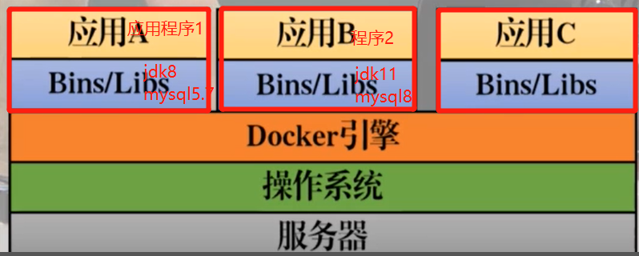

* 为什么需要Docker？
和springboot相似，Docker将应用程序和其所依赖的环境打成一个整体，部署在服务器上


# 安装
* [官方文档：看Docker engine](https://docs.docker.com/engine/install/ubuntu/)
# docker常用命令
## `docker pull`
作用：docker daemon(服务端)会去docker hub下载镜像(image)
```bash
sudo docker pull mysql:5.7
```
* 查看镜像(images):`sudo docker images`
## `docker ps`
* 查看docker正在运行的容器
```bash
docker ps -a #显示所有容器，包括正在运行的以及停止的容器
```
## `docker run`
* `docker run -d --name nginx01 -p 3344:80 nginx`
docker run 启动image
-d ： 后台运行
--name ： 起个名字，如果不写，默认为image名
-p 3344：80: 端口映射，将本地(vmware虚拟机)的3344端口与nginx01(小Linux)的80端口绑定； 只要访问vmware的3344端口，就可以访问到ngnix
nginx：想要启动的image名字
## 容器操作
* 进入容器
```bash
docker exec -it  mysql /bin/bash # 进入mysql容器
```
* 退出容器
```bash
exit # 在容器内部执行exit，直接将该容器终止运行；并返回当前虚拟机

CTRL+p+q # 返回当前虚拟机；但是容器继续执行；相当于后台执行

```
* 启动已停止的容器
```bash
docker start 容器ID/容器name
```
* 停止容器
```bash
docker stop 容器ID/容器name
```
* 重启容器
```bash
docker restart 容器ID/容器name
```
* 删除已停止的容器
```bash
docker rm 容器ID
```