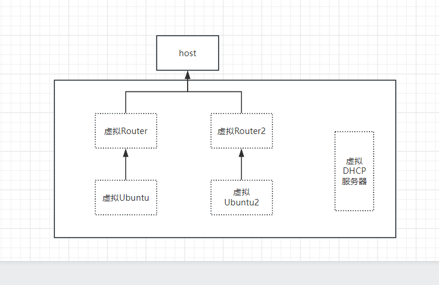
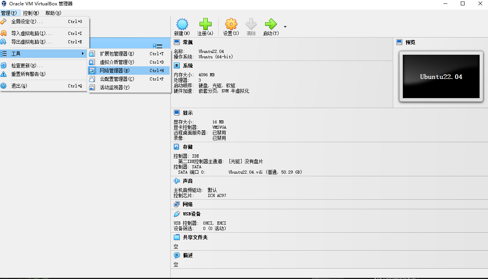
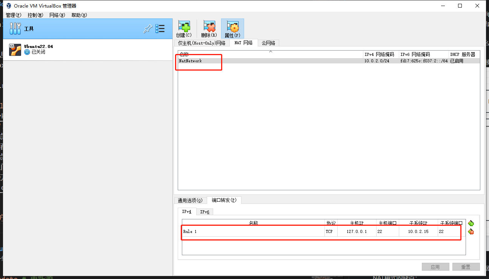
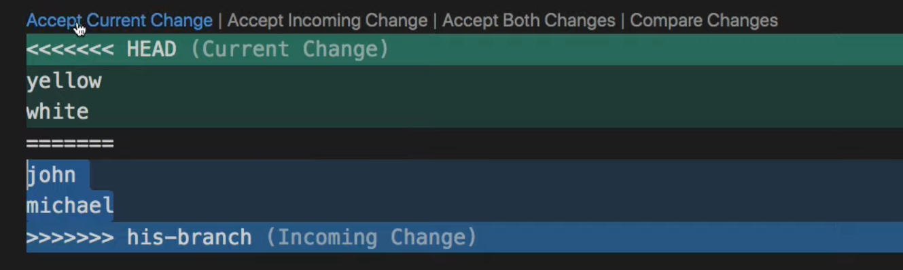
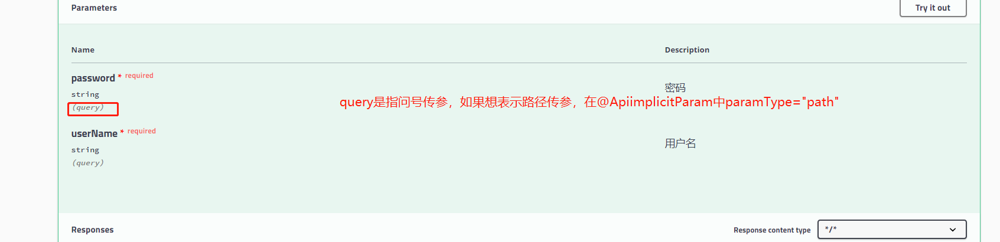

# VMware
## 参考
* [VMware下载和破解](https://www.ssymon.com/archives/vmware-download-key)
* [自适应屏幕](https://www.cnblogs.com/jie-fang/p/10270232.html)
# Linux
## 1.Linux中的目录
* /usr(UNIX software Resource)
## man
* 背景
Linux里面有很多命令，如何了解一个命令该怎么使用？
* 在man里通过`/keyword`进行查找
按n跳到下一个匹配项
按N跳到上一个匹配项
* `-k`
```bash
$ man -k single_keyword | less # 通过-k在man手册里根据关键词查找
```
* 分类
Linux将各种命令分为了9类，分别为：
1、常见命令的说明
2、可调用的系统
3、函数库
4、设备文件
5、文件格式
6、游戏说明
7、杂项·
8、系统管理员可用的命令
9、与内核相关的说明
查看reboot命令在哪个分类下：`man -f reboot`；
然后就可以使用`man 2 reboot`查看系统调用的reboot；
使用`man 8 reboot`查看系统管理中的reboot
## `ll`是什么
`ll`是`ls -alF'`的别名（alias），可在Linux输入`type ll`查看；
也可通过`alias`命令查看有哪些别名
## `cp`:(copy)
```sh
cp a.txt /dev/a.txt # 将当前目录下的a.txt复制到dev目录下的a.txt
cp -r test1 test2 # 想要复制目录，需要加上-r
```
## `mv`(move)
```sh
mv a.txt /mnt/ # 会把当前目录中的a.txt移动到/mnt目录下；当前目录就没有a.txt了
mv a.txt a.doc # 把a.txt文件改名为a.doc
```
## `rm`:(remove)
```sh
rm a.txt # 删除a.txt文件
rm -r dir/ # 使用rm命令删除一个文件夹
rmdir dir/ # rmdir命令只能删除空文件夹
rm -rf dir/ # 使用rm命令删除一个文件夹，并且一路yes
```
## terminal
* <ctrl> + a will move the cursor to the beginning of the current line (helpful for fixing mistakes)
* <ctrl> + e will move the cursor to the end of the current line (helpful for fixing mistakes)
* <ctrl> + r will let you search through your recently used commands
# Virtual Box
## 1.网络
* situation：
我在virtual Box中创建了一台虚拟机，它默认网络是NAT模式。我想在本地通过ssh连接虚拟机，但是连接不上
通过在虚拟机里`ip addr`，我发现虚拟机的ip地址为`10.x.x.x`,而且在虚拟机里ping主机(virtual box虚拟网卡的ip地址)，是可以ping通的；但是在主机里ping虚拟机不行
* task：
需要搞清楚virtualBox中的NAT到底是个什么模式
* analysis：
通过[virtual Box的官方文档](https://www.virtualbox.org/manual/ch06.html#network_nat)，可以得知NAT模式如下图：

NAT模式的优点:
虚拟机不需要配置，可以直接上网(上网数据包通过虚拟路由器转发给了主机)
NAT模式的缺点：
多个虚拟机之间不能通信；主机不能与虚拟机通信
每种网络连接方式的优缺点见：[Table 6.1. Overview of Networking Modes](https://www.virtualbox.org/manual/ch06.html#network_nat)

* action
方法1:见[官方文档](https://www.virtualbox.org/manual/ch06.html#natforward)中的端口转发

配置NAT网卡中的端口转发：
Rule1的意思是：任何访问127.0.0.1(本主机)22端口中的请求，都会转发给虚拟机(10.0.2.15)中的22端口
（10.0.2.15替换虚拟机的ip地址：可在虚拟机terminal中输入ip addr得到）

只要确保虚拟机中的ssh server开启了，我们就可以在本地输入以下命令进行ssh连接
```bash
ssh beichen@127.0.0.1
```
方法二：配置双网卡

# 配置新Linux
* 更新源和升级软件
```bash
sudo apt update # 更新源
sudo apt upgrade # 更新软件
```
* 创建新用户
```bash
adduser beichen # /home中的文件夹，其中一个文件夹代表一个用户
```
* 给beichen`sudo`的权限
```bash
usermod -aG sudo beichen
id beichen # 查看用户是否具有sudo权限
```
* Linux中用户之间的切换
```bash
su # 切换到root用户
su beichen # 切换到beichen用户
```
* 修改某一程序的配置文件后，需要重启该程序
```bash
sudo systemctl reload sshd
```
* 修改某一文件夹的主人
```bash
sudo chown -R beichen:beichen /home/beichen2
# chown:change owner
# -R: 所有文件(Recursively)
# beichen:beichen  user:group
```
# ssh
## 1.是什么
* ssh是一个协议(protocol),和HTTP，FTP类似
* 一般来说，我们都是使用ssh进行远程连接
* 想要使用ssh从local(本地电脑)连接到server(远程电脑)，需要两个配套的软件(这两个软件实现了ssh协议)：local端安装了ssh client，server端安装了ssh server
> 这里的ssh server是一个抽象的说法：如ubuntu中ssh server实现之一是：openssh-server.所以在ubuntu中，只需要`sudo apt-get install openssh-server`就可以安装好这个软件
## 2.登录(login)的几种方法
* `ssh beichen@192.168.52.1`
直接输入192.168.52.1服务器中beichen用户的密码
* 使用public/private key进行登录
最终的结果就是在命令行中输入：`ssh beichen@192.168.52.1`
就会直接登录，不需要输入密码（当然，想实现这种效果，需要进行一些配置）
* 配置公钥&私钥实现ssh免密登录
1. local端：输入`ssh-keygen`
结果：如果所有信息保持默认(default),会在`~/.ssh/`文件夹下新增两个文件：`id_rsa`（私钥）`id_rsa.pub`（公钥）
2. 通过一些方法将`id_rsa.pub`（公钥）文件放到服务器中.ssh的authorized_keys文件下
可以使用scp命令(基于ssh的copy)：`scp ~/.ssh/id_rsa.pub beichen@192.168.52.1:~`
## 3.让一台local通过ssh免密登录多台server
1. 在创建key的时候，要取名
2. 需要将文件名非id_rsa的private key通过ssh-add命令加入Identity List
## 4.参考
* https://www.youtube.com/watch?v=hQWRp-FdTpc&t=24s
* 通过windows远程连接：`ssh ubuntu@192.168.222.3`
* 为什么需要xshell这种软件？
如果同时操作多台服务器的话，在cmd中使用ssh就不太方便了；每次都要登录，退出。
* 为什么需要xftp这种软件？
如果涉及本电脑与服务器之间的文件传输，当然自己可以通过cmd通过ssh连接服务器，在通过scp命令进行文件传输。但是通过xftp，文件的传输只需要简单的拖拽
# ps
    * `ps -A`同`ps -e`：查看所有后台正在运行的进程
    * `ps -p 2034`：查看process 2034的详细信息
* apt
    * `Failed to fetch http://security.ubuntu.com/ubuntu/pool/main/e/eglibc/libc-bin_2.15-0ubuntu10.6_i386.deb 404 Not Found [IP: 91.189.91.14 80] `
    先`sudo apt-get update`，在使用下载命令`sudo apt install gcc`
* tar
    * `tar -xzvf xxx.tar.gz`中的`-xzvf`选项都是什么意思？
    ```text
    -x：表示解压缩，也称为提取（extract），用于解压缩 tar 文件或从 tar 文件中提取文件。
    -z：表示使用 gzip 压缩算法。tar 命令通常用于处理 tar.gz 或 .tgz 文件，使用 -z 选项可以自动处理 gzip 压缩的文件。
    -v：表示 verbose，即详细模式。使用此选项会输出详细的操作信息，显示正在提取的文件列表和解压缩进度等。
    -f：表示文件，用于指定要操作的 tar 文件的路径。需要注意的是，-f 选项后面必须紧跟要操作的 tar 文件的名称。
    
    所以-xzvf的意思是
     xxx.tar.gz文件(-f)进行解压缩(-x)
     使用 gzip 压缩算法(-z)
     同时在操作过程中显示详细的操作信息(-v)
    ```
* 查看ip地址：`ip addr show`看inet后面的值
* gcc
    * `gcc --help`
# Idea
* 重写父类方法：CTRL+o
* 自动补全new Thread前面的 ：alt+enter
* 选中当前单词：ctrl+w
* 在当前行上面加一行：ctrl+alt+enter；在当前行下面加一行：shift+enter
* try-catch快捷键：选中代码，ctrl+alt+t
* idea中代码模板的使用
参考：[link](https://zhuanlan.zhihu.com/p/615874498)
# VScode
|快捷键|作用|
|-|-|
|ctrl+L|选中当前行|
|shift+alt+↑|向下/上复制一整行|
|Ctrl+d|选中当前单词|
|Home|一键回到当前行的头部|
|End|一键回到当前行的尾部|
|Ctrl+enter|在当前行下插入一行|
|Ctrl+shift+enter|在当前行上插入一行|
|Ctrl+Alt+↓|选中多行|
* vscode逐个替换
[link](https://blog.csdn.net/fantasyYXQ/article/details/125607352)
* 代码自动对齐
shift+alt+f
# Markdown Preview Enhanced 
* [link](https://blog.csdn.net/while0/article/details/124677531?spm=1001.2101.3001.6650.7&utm_medium=distribute.pc_relevant.none-task-blog-2%7Edefault%7EBlogCommendFromBaidu%7ERate-7-124677531-blog-94321593.pc_relevant_3mothn_strategy_recovery&depth_1-utm_source=distribute.pc_relevant.none-task-blog-2%7Edefault%7EBlogCommendFromBaidu%7ERate-7-124677531-blog-94321593.pc_relevant_3mothn_strategy_recovery&utm_relevant_index=10)
* esc：在vscode预览模式下显示目录
# 6、SVN
## 6.1 将svn服务器中的代码下载到本地
这一步叫做checkout，右键-Subversion checkout就行了
> 注意：如果右键-tortoise SVN-export，这种方式下载的文件是没有.svn文件夹的
## 6.2 SVN与Git之间的区别
1、分支功能：SVN中的分支功能，实际上就是在SVN服务器上将工作文件夹复制一份，然后在从中央服务器上checkout下来；而Git就比较神奇，代码直接在当前目录下进行切换
2、版本库：SVN只有一个版本库，位于svn服务器上，无论是update还是commit，实际上都在和服务器打交道；而Git在本地就有一个自己的版本库，在进行commit时，是不会牵扯到远程服务器的。只有在pull或者push的时候，才和远程服务器打交道
## 6.3 idea中启用svn
* 参考:[link](https://blog.csdn.net/weixin_48131807/article/details/123921488?spm=1001.2101.3001.6650.6&utm_medium=distribute.pc_relevant.none-task-blog-2%7Edefault%7EBlogCommendFromBaidu%7ERate-6-123921488-blog-130825607.235%5Ev38%5Epc_relevant_sort&depth_1-utm_source=distribute.pc_relevant.none-task-blog-2%7Edefault%7EBlogCommendFromBaidu%7ERate-6-123921488-blog-130825607.235%5Ev38%5Epc_relevant_sort&utm_relevant_index=10)
s(situation)：项目文件夹内已经有了.svn，但是idea没有识别，导致不能通过idea来提交or更新代码
t(task):肯定需要通过idea来进行一些配置
a(action): idea-VCS-enable version control Integration
# 7、Git
some questions
> 1、为什么git bash可以git clone，但cmd git clone却会failed？
## 本地
* `git status`
git status会比较工作区、暂存区、版本库
```bash
# 三者都一样
On branch master
nothing to commit, working tree clean
# 如果工作区和暂存区不一样
Changes not staged for commit:
# 如果暂存区和版本库不一样
Changes to be committed:
```
* `git add`
新创建的文件git是不会管理的，通过`git add`操作给这个文件‘打上标记’，git就可以管理了
* `git commit`
    * `git commit -m "输入简短的提交信息"`
* `git log`
```sh
git log --oneline # 将提交记录显示为一行
```
* 分支
    * 查看分支：`git branch`
    * 切换到feature1分支：`git switch feature1`
    * `git branch bugFix`:创建新的分支：bugFix
    * `git checkout bugFix`:切换到bugFix分支
    * `git checkout -b bugFix`:创建新的分支bugFix并切换到bugFix
    * `git merge newfeature`:将newfeature分支合并到当前所在的分支
    * `git branch --delete xx`:删除分支
* `git merge`
```bash
git merge feature1  # 此时我站在master分支上：将feature1分支 merge into master 分支
```
如果没有冲突，则自动合并，如果有冲突，显示如图,需要手动解决

* `git diff`
    * git diff是比较工作区和暂存区之间的区别
    * git diff 怎么看？
    ```shell
    $ git diff
    diff --git a/src/a.txt b/src/a.txt
    index a996bf8..41d731c 100644
    --- a/src/a.txt
    +++ b/src/a.txt
    @@ -1,3 +1,5 @@
    v1
    v2
    -v3
    \ No newline at end of file
    +v7
    +v4
    +v5
    \ No newline at end of file
    #============================================
    v1，v2前面没有-或者+，表示比较文件所共有的部分
    前面-，表示原来的文件独有的（在暂存区的）
    前面+，表示新修改文件独有的（在工作区的）
    所以：
    v1         v1
    v2  ->     v2
    v3         v7
               v4
               v5
    ```
* `git reset`
```sh
git reset # 在git add之后使用git reset，将被修改的暂存区恢复到git add之前的状态
git reset --hard # 撤销工作区中的所有修改，将工作区返回上一次刚刚commit之后的状态
git reset --hard <提交ID> #将工作区返回到某次commit之后的状态
```
* `git rm`
```bash
git rm a.c 
# 使用该条命令的前提是working tree clean
# 使用该条命令的结果是：暂存区中的文件被删除，工作区的文件也被删除，需要commit一下

# 如果只想删除暂存区中的文件，保留本地文件，需要加上--cached选项
git rm --cached a.c

# 常用的命令，直接删除对a.c文件的追踪，但保留本地文件
git rm -f --cached a.c
```
* `.gitignore`
直接在.git同级目录下新建`.gitignore`文件
怎么写：[link](https://www.w3schools.com/git/git_ignore.asp?remote=github)
.gitignore只能在文件untrack时有效，如果某个文件已经被`git add`了甚至`git commit`了，那需要先`git rm`后才会生效
* 当工作区与暂存区不一致是：`Changes not staged for commit:`,只有他俩一样才能commit
通过`git add`将工作区中的文件添加到暂存区
通过`git rm`将暂存区的文件删除
他们的目的都是使工作区和暂存区一致，然后好commit
* 我不小心把一些没有用的文件给add了，导致尽管已经在`.gitignore`文件中声明了，但是不生效
```bash
# 请使用git bash：windows下的terminal文件夹表示方法很奇怪
git rm --cached -r --ignore-unmatch **/**/.mvn
# git rm --cached 只删除暂存区中的文件，保留本地文件。如果不加--cached，就会导致本地文件也被删除掉
# -r git rm像rm命令一样，是不能直接rm folder删除文件夹的；想要删除文件夹，需要加上-r
# --ignore-unmatch：如果某个匹配文件夹中为空，git就会直接报错，结束命令，导致后面的文件夹都没法删除。--ignore-unmatch让git如果文件夹为空，也要继续执行，不要报错中断
# *.c匹配所有.c文件，**匹配所有文件夹
```
## 远程
* `git remote`
    * `git remote add git-demo https://xxx`：将链接取别名为git-demo
    为什么要这样做？
    请看git push操作，原始做法是`git push https://xxx master`,这样每次都要输入远程库的url，非常麻烦；通过取别名的方法，就可以用别名来代替url：`git push git-demo master`
    * `git remote -v`:查看有哪些别名
* `git push`
    * 使用背景：
    1、在GitHub上创建一个空仓库（repository）后，需要将本地代码上传到远程端
    * 详细使用
        * `git push url/别名 分支`
* `git pull`
    * 使用背景：由于种种原因，本地库和GitHub上的远程库已经不一样了
    * 详细使用
        * `git pull url/别名 分支`
    * 我写自己的代码功能写完了，需要将远程库中的代码先合并到本地，最后在将所有的代码一起push，但我不想将远程库的代码下载后，我修改的部分消失了。我该怎么做？
    先commit，在git pull
## 其他
* 查看git安装在哪了：`where git`
* `xxx.ignore`:通常为`git.ignore`
    * 使用背景：在idea的项目中，有一些与项目无关的代码：比如idea的配置文件:.iml、maven生成的target目录。这些文件是没有必要push上去的
    * 详细使用：
## Git的配置
* 用户信息
```shell
$ git config --global user.name "BeicC"
$ git config --global user.email 527609724@qq.com
```
* 查看配置信息：`$git config --list`
* 查看配置文件所在的位置：`$ git config --list --show-origin`
## git操作
* 分支
    * `git branch -a`：查看所有分支
    * ``
# GDB
## 参考
* [cs61C gbd card](https://inst.eecs.berkeley.edu/~cs61c/sp21/resources-pdfs/gdb5-refcard.pdf)
* [如何显示所有局部变量、全局及静态变量、方法中的参数？](https://stackoverflow.com/questions/6261392/printing-all-global-variables-local-variables)
# VIM
## reference
* [nju PA](https://nju-projectn.github.io/ics-pa-gitbook/ics2020/0.4.html)
## vimtutor
### lesson 1
* x删除
* i在cursor上直接添加
* A直接在行尾添加
### lesson 2
* dw删除单词
* d$删除当前cursor到行尾所有
* d(motion):
dw(delete word)
de(delete end of word)
d$(delete end of line)
* 数字+立即生效动作：将这个动作重复多次
2w：移动2次word
2e:执行2次，end of word
0：move to the start of the line
* 编辑动作+数字+移动动作
d2w:执行2次，dw
* dd
删除一行
2dd：删除两行
为什么不是dd2？因为当输入dd的时候，这个命令会立即生效，所以想要重复，需要把数组放在前面
* u&U
u:undo
U:undo the whole line
### lesson 3
* p
将刚才删除的内容粘贴到cursor的下一行
* r'x'
将光标中的内容替换为'x'
* ce(change end of word)
将cursor上的字符一直到单词尾部删除，并进入插入模式
cc：将一整行删除，并进入插入模式
### lesson 4
* 移动
CTRL+g 展示当前行数以及文件信息
G 移动到文件最底行
gg 移动到文件第一行
356+G 跳转到第365行（356,GO！）
* 查找
/abc 查找abc(从前往后找)
n 查找下一个；N 查找上一个
?abc 查找abc(从后往前找)
CTRL+o
CTRL+i
* %
将光标放到左括号上，type%，光标会自动移动到与他匹配的右括号上
* 替换
`:s/going/rolling`：当前行的第一个
`:s/going/rolling/g`:当前行的全部
`570,573s/going/rolling/g`:在570行到573行执行替换
`%s/going/rolling/g`:全部文件，自动替换
`%s/going/rolling/gc`:全部文件,但在替换的时候会prompt提醒，是否替换
### lesson 5
* 在vim中执行外部命令
:! ls 相当于直接ls
* 操作vim当前打开的文件
:w TEST 将当前vim打开的文件另存为TEST
* 复制部分行到TEST文件
v 进入visual模式
选中想要的行(会高亮)
然会以此按`:`,`w`.最终屏幕上显示的是`:<,> w`
* 将外面的文件直接插入进来
:r TEST
:r !ls #将ls命令的output直接插入进来
### lesson 6
* 设置
:set nu	Shows line numbers within your file
:set ic (ignore case)在查找的时候忽略大小写
:set incsearch 支持部分匹配
:set hlsearch 将匹配的部分高亮显示
:set noincsearch 将部分匹配关闭(在前面加上no)

# Postman
* Postman中的param与body中的form-data的区别？
get请求，可以在param中添加参数，会自动在url的后面加上?name=cbc&age=10
post请求，在form-data中添加数据，就相当于通过表单进行post提交
* 通过postman查看http请求报文
view-> postman console
# Maven
* [官网](https://mvnrepository.com/)
* 父子继承关系
要想让两个`pom.xml`成为父子：
父pom中要添加`<module>`标签
子pom中要添加`<parent>`标签
## [Dependency Management](https://maven.apache.org/guides/introduction/introduction-to-dependency-mechanism.html#dependency-management)
```xml
<dependencyManagement>
        <dependencies>
            <dependency>
                <groupId>org.springframework.cloud</groupId>
                <artifactId>spring-cloud-dependencies</artifactId>
                <version>${spring.cloud.version}</version>
                <type>pom</type>
                <scope>import</scope>
            </dependency>
            <dependency>
                <groupId>com.alibaba.cloud</groupId>
                <artifactId>spring-cloud-alibaba-dependencies</artifactId>
                <version>${spring.cloud.alibaba.version}</version>
                <type>pom</type>
                <scope>import</scope>
            </dependency>
        </dependencies>
    </dependencyManagement>
```
1、dependencyManagement通常写在parent pom.xml中，用来做版本管理
2、声明在dependencyManagement中的依赖是不会加入该项目的
3、声明dependencyManagement后，在声明dependencies，不需要加版本号了（无论是父项目还是子项目）
```xml
<dependencyManagement>
    <dependencies>
        <dependency>
        <groupId>junit</groupId>
        <artifactId>junit</artifactId>
        <version>4.10</version>
        <scope>test</scope>
        </dependency>
    </dependencies>
</dependencyManagement>
<dependencies>
    <dependency>
        <groupId>junit</groupId>
        <artifactId>junit</artifactId>
    </dependency>
</dependencies>
```
* 在DependencyManagement中，`<type>pom</type>`,`<scope>import</scope>`是什么鬼？
springboot项目中，我已经有了parent标签，但我自己在根`pom.xml`中维护了一个`DependencyManagement`；我想使用根pom中的版本管理，怎么办？

## 命令行命令
1、所有命令都是在`pom.xml`所在的目录下运行。
2、compile、test、package、install，某个命令执行前，都会把前面的命令都执行了
* clean:删除target目录
* compile：将项目编译到`/target/classes`目录下
* package：将`/target/classes`下面的文件打成jar包
* install：将项目打成jar包并且放到本地的repository里面
## pom.xml
```xml
<?xml version="1.0" encoding="UTF-8"?>
<project xmlns="http://maven.apache.org/POM/4.0.0"
         xmlns:xsi="http://www.w3.org/2001/XMLSchema-instance"
         xsi:schemaLocation="http://maven.apache.org/POM/4.0.0 http://maven.apache.org/xsd/maven-4.0.0.xsd">

    <modelVersion>4.0.0</modelVersion>

    <groupId>org.example</groupId>
    <artifactId>Real_Spring</artifactId>
    <version>1.0-SNAPSHOT</version>

    <properties>
        <maven.compiler.source>8</maven.compiler.source>
        <maven.compiler.target>8</maven.compiler.target>
    </properties>
    <dependencies>
        <dependency>
            <groupId>junit</groupId>
            <artifactId>junit</artifactId>
            <version>4.13.2</version>
            <!-- 该依赖只能src/test下的文件使用 -->
            <!-- 如果不写，默认为compile，main和test下的文件都能使用 -->
            <scope>test</scope>
        </dependency>
    </dependencies>
</project>
```
## 插件
* maven-shade-plugin
直接`mvn package`打出来的jar包是没有manifest文件的，即不能运行。可通过该插件解决此问题
* maven-Archetype-plugin
自动创建maven约定的目录结构

* 为什么Maven要配置环境变量？我又不在命令行里面直接访问Maven..还要配置两个M2_HOME,Maven_HOME:说是可以让idea自动使别
* 在idea中，创建Maven项目时勾选模板与不勾选的区别？：勾选模板后的pom.xml文件里面的东西会更多，会预先导入一些包（Junit），而且文件目录有点不一样：勾选模板后会有个webapp目录，而不勾选就没有。
* Maven的高级之处：不在于它能自动导入Jar包，而在于它能自动导入Jar包所依赖的其他Jar包
* Maven中配置文件导不出的问题 【狂神p11 21min46s】
* Maven绑定Jar包的源代码:`mvn dependency:sources`
    * 为什么`mvn dependency:sources`没有把源码下载下来？
    `mvn dependency:sources`会强制把**当前目录**下的pom.xml中使用到的文件下载下来
    请注意项目是否是嵌套结构：如果在project中有module，请在module同级目录下执行该命令
* Maven工程中的java和resources目录下的文件，在打包的时候会被放到哪？
java下的所有东西，编译后放到classes下（不包含java文件夹）
resources下的所有文件，也是放到classes下（可能有意外，发生意外时需要在pom.xml中配置一下）
```java
<build>
        <resources>
            <resource>
                <directory>src/main/java</directory>
                <includes>
                    <include>**/*.properties</include>
                    <include>**/*.xml</include>
                </includes>
            </resource>
            <resource>
                <directory>src/main/resources</directory>
                <includes>
                    <include>**/*.properties</include>
                    <include>**/*.xml</include>
                </includes>
            </resource>
        </resources>

    </build>
```
# Swagger
## 参考
* [baeldung](https://www.baeldung.com/swagger-2-documentation-for-spring-rest-api)(推荐)
## Swagger注解
* `@Api(tags = "晚餐管理1")`
放在controller类上，tags里面的内容显示在下图


* `@ApiOperation("新增")`
放在方法上，里面的内容显示在下图


* `ApiImplicitParams`
```java
    @ApiImplicitParams({
            @ApiImplicitParam(name = "userName", value = "用户名", dataType = "String", required = true),
            @ApiImplicitParam(name = "password", value = "密码", dataType = "String", required = true)
    })
```
放在方法上


* RESTful传参


想要为responseBody添加description
```java
    public ResponseResult<String> insert(@ApiParam(name = "dinner",value = "晚餐实体类") @RequestBody Dinner dinner){

        dinnerService.insert(dinner);
        int a = 1/0;
        return ResponseResult.SUCCESS("success");
    }
```

# batch script
## 参考
* [wikihow](https://www.wikihow.com/Write-a-Batch-File)
* [windows reference](https://learn.microsoft.com/en-us/windows-server/administration/windows-commands/windows-commands#r)
## 命令
* `@ECHO OFF`
一个文件加上`@ECHO OFF`,另一个文件不加，运行看结果
# fiddler
* 用途：用来查看http报文
* 使用:[知乎参考](https://www.zhihu.com/question/55617707/answer/2690009021)