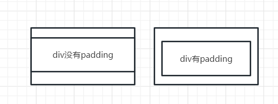
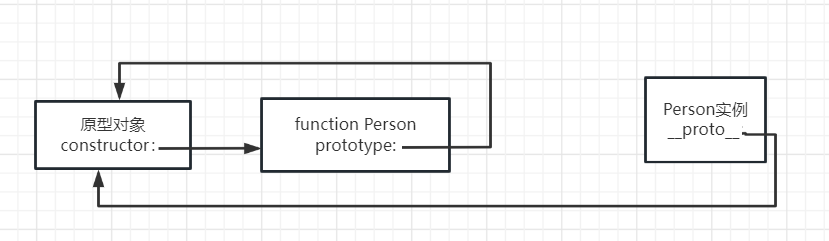
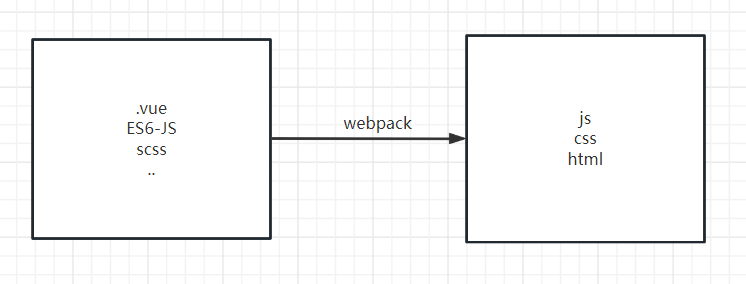
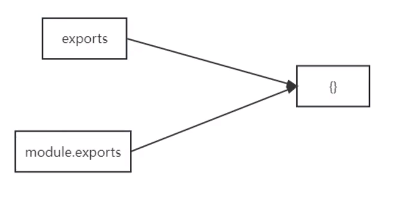

* MIME
就是http协议中content-type那一栏的值，浏览器根据对应的类型进行响应的解析
content-type:text/html 对应.html，浏览器根据响应的规则解析html页面
content-type:image/jpeg 对应.jpeg
Q：如何知道某一后缀所对应的MIME类型？例如.gif对应的content-type是什么？
通过`servletContext.getMimeTypes("/file/a.gif");`
# HTML
## 资料
* [尚硅谷视频](https://www.bilibili.com/video/BV1p84y1P7Z5?p=47&vd_source=365b9168c7e64ccd970c2cd9a5c935b8)
## 文件的上传
* form表单的写法
```html
<!-- 
    1、enctype="multipart/form-data"的作用？ 
    如果不写enctype="multipart/form-data"属性，那么form表单提交的文件就是以key-value（文件的名称），浏览器不会传输文件的内容
    2、如果是get+enctype="multipart/form-data":
    因为get没有请求体，所以仍然得不到文件的内容
    3、post+enctype="multipart/form-data"
    使用该方法时，post表单（load）中的所有内容全部以流的形式传输，所以在服务器端通过req.getParameter方法是得不到数据的。
-->
<form action="http://localhost:8080/JavaWebDemo/upload" method="post" enctype="multipart/form-data">
    name:<input name="username"> <br>
    <input name="photo" type="file"> <br> <!--这时文件和其他input一样，name=value存在于请求体中，只不过value是一串二进制-->
    <input type="submit" value="提交">
</form>    
```
* 为什么文件的上传form表单必须使用post请求？
从以下两个方面理解
1、get请求通常是从服务器中拿数据，而post请求通常是往服务器里存数据
2、因为get请求没有请求体，所以所有的参数都放在url中，如果
## 文件的下载
```java
   protected void doGet(HttpServletRequest req, HttpServletResponse resp) throws ServletException, IOException {
        //设置浏览器的Content-Type，不知道有什么用
        String mimeType = getServletContext().getMimeType("/image/2.png");
        resp.setContentType(mimeType);
        //================告诉浏览器自动下载==========================
        resp.setHeader("Content-Disposition","attachment;fileName=2.png");

        //注意：设置响应头一定要在传输文件之前！！！
        
        //================通过流将文件传过去=====================
        InputStream resourceAsStream = getServletContext().getResourceAsStream("/image/2.png");
        ServletOutputStream outputStream = resp.getOutputStream();
        byte[] buffer = new byte[2024];
        int len;
        while((len = resourceAsStream.read(buffer)) != -1){
            outputStream.write(buffer,0,len);
        }
        //=======================================================

    }
```
* 路径问题（href）：
    1. 如果路径为http/https/D:,浏览器会把整个url换掉
    2. 如果路径为/开头，浏览器会把ip:port后面的部分换成href中写的
    `http://localhost:8080/JavaWebDemo/`变为`http://localhost:8080/test`
    3. 如果其他情况，浏览器在url后面直接添加href的内容
    `http://localhost:8080/JavaWebDemo/`变为`http://localhost:8080/JavaWebDemo/www.baidu.com`
> 页面部署起来后，就是一个树，和Linux中的文件分布一样；我们通过http://ip:port这样的方法就会访问到一个具体的树。实际上的有用的文件是这颗树的叶子节点，所以我们本来应该通过`/dic1/dic2/a.txt`这种形式来访问一个具体的文件，这种方式被称为绝对路径；当我们访问一个文件夹的时候，例如`/dic1/dic2`web服务器就会在这个文件夹下默认去找index.html或default.html(这依赖于具体的web服务器的实现)
* `<br>`是干什么的？ 换行
* a
    * 使用
    link to a JavaScript:`<a href="javascript:alert('Hello World!');">Execute JavaScript</a>`
    * `<a>`，如何设置在当前页面跳转 or 打开新窗口进行跳转？`<a>`标签中的target属性
* iframe
```html
    <iframe src="http://localhost:8080/Spring/" name="iframe"></iframe>
    <!-- 点击index时，跳转的页面会显示在iframe中 -->
    <a href="${path}/" target="iframe">index</a>
    <a href="${path}/login/index" target="iframe">login</a>
```
* table&tr&td
```html
<table>
    <tr>
    <td>1</td><td>2</td><td>3</td>
    </tr>
    <tr>
    <td>4</td><td>5</td><td>6</td>
    </tr>
</table>
```
## form
    * 属性(attribute)
    action：提交的路径
    target：在那个页面接收submit之后传回来的数据(_self默认、 _blank)
    method:get/post
    autocomplete:如果是on，就会根据以前输入的内容进行提示
    * 与js结合使用
    ```html
    <form name="myForm" action="/action_page.php" onsubmit="return validateForm()" method="post">
    <!-- 当表单提交的时候会执行validataForm函数，只有返回值为true，才会继续提交表单 -->
        Name: <input type="text" name="fname">
        <input type="submit" value="Submit">
    </form>
    ```
## input
type
text：默认的就是text
password：不显示输入的内容
submit：提交form
reset：将input中的内容重置为value中写的
radio：单选框
checkbox：多选框
```html
<input name="hobby" type="checkbox" value="爱好1">爱好1
<input name="hobby" type="checkbox" value="爱好2">爱好2
<input name="hobby" type="checkbox" value="爱好3">爱好3 
<!-- 提交表单时，携带的值是name=value -->
```
color：
date: date可以通过min和max属性配合使用
`<input type="date" id="datemax" name="datemax" max="1979-12-31">`如果不符合就像属性为email一样，浏览器内部判断然后提示
email：
image：通过点击图片实现submit效果
file：上传文件
hidden：如果form表单要提交一些数据，但这些数据不能展示
`<input type="hidden" id="custId" name="custId" value="3487">`
* 重置按钮
```html
<input type="reset" value="点我重置">
```
## button
* 重置按钮
```html
<!-- 将表单中的所有值重置为最初状态（value值） -->
<button type="reset"></button>
```
## 文本域：textarea
```html
<textarea name="xx" cols="23" rows="10">
```
* label
    * `<label for="html">HTML</label>`与直接写HTML之间的区别？
    > this increases the hit area
    * 注意点：label实现点击文本就可以选中单选框是有前提的：即label中的for属性要和要绑定的单选框中的id属性值 一样
* 在href或者action中写js代码
```html
<a href="javascript:void(0)">test</a>
<a href="javascript:alert(0)">test</a>
```
## 下拉框：select
```html
    <select name="place">
        <option selected>安徽省</option>
        <option value="shandong">山东省</option>
        <option>河北省</option>
    </select>

<!--  提交表单时，如果option中没有value属性，那name=安徽省
                如果option中有value属性，那name=value
-->
```
# CSS
> css文件不要放在WEB-INF下，因为浏览器访问不到WEB-INF下面的内容
## 选择器
```css
/* 通配选择器 */
*{
  /* 这里面写得样式将会应用于所有元素 */
}
/* 元素选择器 */
h2 {
  
}
/* 类选择器 */
.root{

}
/* id选择器 */
#root{

}
```
* css中padding的理解

* 属性
    * `background-color`：背景颜色

> chrome浏览器开发者工具快捷键：
Ctrl + Shift + J/I
Shift + Enter：console会换行且不会执行
## 盒子模型
* margin
    * 1
    margin-left:auto //离左边能有多远离多远
    但是margin-top 和margin-bottom设置为auto不能垂直居中
    对于**块级元素**，margin左右设置为auto能够水平居中
    * margin值可以为负值
## 文字
* font-size
* color
* font-weight
# JavaScript
## 正则表达式

## this
this一般在函数里面使用
如果某个函数属于一个对象，那函数里面的this就指向这个对象
如果不属于，那函数里面的this就指向window
> 如果开启严格模式:`"use strict";`,指向window的this就变成了undefined
## 定时器
* 防抖
* 节流
## 闭包
* 闭包的形式
一个function里面返回一个function
```js
var createCounter = function(n) {
    return function() {
        return n++;
    };
};

const counter = createCounter(10)
counter() // 10
counter() // 11
counter() // 12
```
* 为什么要这么写？
可以使得变量n只能被返回的函数访问：保护变量
* 学习资料：[link](https://wangdoc.com/javascript/types/object)
* ESMAScript和Javascript之间的关联？
ESMAScript是一种标准，而Javascript是ESMAScript的具体实现（类似于JVM与HotSpot之间的关系）
* js中的基本数据类型
undefined、null、number，string，boolean
* js中的相等运算符？
```js
因为js中在声明变量的时候不确定数据类型
所以在生产中通常使用`===`来判断是否相等，就和let一样，更符合其他高级语言的设定
`===`的语义：
1、判断数据类型是否相同，不相同直接false
2、如果相同，在判断值是否相同

关于`==`运算符
比较规则很复杂：
1、如果有一边为undefined或者null，那只有另一边为undefined或者null才返回true，否则返回false
如何理解？undefined或者null就是没有开辟内存的状态
2、其他类型在比较的时候都往数字上转
    字符串：'123' -> 123, '' -> 0, '0x15' -> '21'
    bool类型：true -> 1, false -> 0
```
## BOM对象
* BOM对象是什么
BOM：Browser Object Model，是对浏览器中的抽象，通过bom对象，我们可以调用一系列API，用来操作浏览器的行为。
例如：
```js
alert() //让浏览器弹窗
window.prompt('请输入姓名') //让浏览器弹窗并输入
```
### window
* `window.onload = fn`
```html
<!DOCTYPE html>
<html lang="en">
<head>
    <meta charset="UTF-8">
    <meta http-equiv="X-UA-Compatible" content="IE=edge">
    <meta name="viewport" content="width=device-width, initial-scale=1.0">
    <title>Document</title>
    <script>
        const btn = document.getElementById("btn1"); 
        
        console.log(btn); //null
    </script>
</head>
<body>
    <button id="btn1">test</button>
</body>
</html>
<!-- 文件是一行一行的加载，当执行到js代码时，dom元素还没有加载，所以就有异常
通过window.onload事件的语义是，等到文档加载完成之后，在执行function里面的代码 -->
```
* window中的定时器方法

## DOM对象
* 什么是DOM对象
比如我们在html中写了一个div，div在浏览器中是以一个dom对象存在的，通过这个dom对象，我们可以调用一些列api对这个div进行修改等操作
### 属性
* `innerHTML`
```js
const d = document.getElementById("mydiv");
d.innerHTML = "Hello World";
```
* `innerText`
```js
// 作用与innerHTML类似
const d = document.getElementById("mydiv");
d.innerHTML = "<h1>Hello World</h1>"; //<h1>不会被解析
```
### 方法

----
* js实现表单验证然后在显示出来
```html
<!DOCTYPE html>
<html>
<body>

<h2>JavaScript Validation</h2>

<p>Please input a number between 1 and 10:</p>

<input id="numb">

<button type="button" onclick="myFunction()">Submit</button>

<p id="demo"></p>

<script>
function myFunction() {
  // Get the value of the input field with id="numb"
  let x = document.getElementById("numb").value;
  // If x is Not a Number or less than one or greater than 10
  let text;
  if (isNaN(x) || x < 1 || x > 10) {
    text = "Input not valid";
  } else {
    text = "Input OK";
  }
  document.getElementById("demo").innerHTML = text;
}
</script>

</body>
</html> 
```
* DOM对象的常见属性
    * value：从input中取值
    * innerHTML：改变p标签中间的文字
* js表达式与js语句
    * js表达式
    拿个变量在左边，能接收到值
    1、a
    2、a+b
    3、method(1)
    4、x === y ? 'a' : 'b'
    * js语句
    控制程序的走向，不产生值
    1、for，while
    2、if
* var、let、const之间的区别
```js
//ES6引入两个关键字：let、const
// var可以重复赋值,let不行
var x = 10;
var x = 2;
const PI=3.1415926//PI不能在被修改了
```
## 对象
### 原型
* `prototype`属性
每个函数在声明时，这个函数里面会有一个`prototype`属性，指向一个原型对象

> 原型对象的作用：
可以将一些公用的属性&方法存到原型对象里面
这样的好处：
1、new出来的对象都具有这些属性&方法
2、这些对象所具备的属性&方法都指向同一块内存（省内存）
* Math
  * Math.random(): 返回值为[0,1)
  * Math.floor(x): 将x向下取整
## ES6 
* 箭头函数
箭头函数中的this始终指向函数声明时所在作用域中的this
* 对象/函数的简化写法
```js
    const name = 'cbc';
    let fn = function(){
        console.log('Hello World!');
    }
    let person = {
        name, //等价于name:name
        fn //fn:fn
    }
```
* 对象中的方法简写
```js
  let person = {
      sayHi(){
          console.log("Hi");
      }
      /*等价于
      sayHi:function(){
          console.log('Hi');
      }
      */
  }
```
* `<script type="module"></script>`
如果想要在html中使用import语句，就要加上type属性
* 模块化
  * export
  ```js
  //a.js
  export let name = 'cbc';

  export function SayHi(){
      console.log('Hi~');
  }
  //上面的写法等价于下面这种写法
  let name = 'cbc';

  function SayHi(){
      console.log('Hi~');
  }

  //推荐使用这种写法，因为可以很方便的在js文件的底部看到暴露了哪些变量or函数
  export {name,SayHi}
  //对应的import语句
  import {name,SayHi} from a.js //变量名都必须一样，否则报错
  ```
  * export default
  ```js
  //export 和 export default的区别
  //在使用export，对应的import
  import {a,b} from './HelloWorld.js' //报错：要写成name,SayHi
  //在使用export default时
  import $ from 'Jquery' //变量名可以随意
  //之所以变量名可以随意，那是因为使用export default只能有一个输出
  ```
* 参考[link](https://es6.ruanyifeng.com/#docs/module)
* let与var之间的区别
let是ES6提出来取代var的
原因是var关键字声明的变量有以下不合理的方面：
```js
//1、通过var声明的变量，可以先使用，后声明
console.log(a);//不报错，输出：undefined，不报错的原因是因为js中的变量提升
var a = 10;
              /*
              上面的代码相当于
              var a;
              console.log(a);
              a = 10;
              */
//2、通过var声明的变量，可以重复声明
  var a = 10;
  var a = 20;
  console.log(a); //20

//通过以上可以发现，let的引入使得js中的很多行为更像java，c等语言一样‘严谨’
//所以一般只要老版的js代码中使用var，新版的都使用let了
```
* Rest运算符
```js
    //Rest运算符作用在函数声明中的参数上
    function Person(...args){ //会把传过来的参数塞进args，成为一个数组；这样我们就可以调用Arrays上的API来处理数据
        console.log(args);
    }

    Person(1,2,3)
```
* 扩展运算符
```js
    function fn(a,b,c){
        console.log(a,b,c);
    }

    let list = [1,2,3];
    fn(...list);//扩展运算符作用在数组上
    //等价于
    //fn(list[0],list[1],list[2]);
```

* let和const关键字
  * 引入背景
  es6引入块级作用域，let和const关键字是为块级作用域服务的
## 字符串
1. JavaScript中字符串使用单引号或者双引号都可以，但一般使用单引号。因为HTML中很多属性值使用双引号
2. 单引号里可以嵌套双引号：`'hello "world"'`
双引号里可以嵌套单引号：`"hello 'world'"`
可是如果单引号里想要使用单引号，就要转义：`'hello \'world\''`
3. 如果长字符串必须分成多行，可以在每一行的尾部使用反斜杠
```js
var longString = 'Long \
long \
long \
string';

longString
// "Long long long string"

//字符串也可用+相连接
var longString = 'Long '
  + 'long '
  + 'long '
  + 'string';
```
4. length属性返回字符串长度，且不能修改
```js
var s = 'hello';
s.length // 5

s.length = 3;
s.length // 5

s.length = 7;
s.length // 5
```
## 对象
* 使用delete删除对象中的属性
```js
let person = {
    name:"cbc",
    age:18
}
console.log(person)//{name: 'cbc', age: 18}
delete person.age
console.log(person);//{name: 'cbc'}
```
> 如果person使用const声明，仍然可以使用delete；因为对于对象来说，地址没有变，没有违背const关键字的定义
* 在对象中定义函数
```js
    const person = {
        name:"cbc",
        age:function(){ //写法一
            alert(1);
        },
        age1(){
            alert(2);// 写法二
        }
    }
    //通过以下方式调用
    person.age()
    preson.age1()
```
*  写法
```js
//功能相同，都是创建一个对象；但是obj1与obj2指向不同的地址。
var obj1 = new Object();
var obj2 = {};


var obj = {
  foo: 'Hello',
  bar: 'World'
};
等价于
var obj = new Object({
    foo : 'Hello',
    bar : 'World'
});

```
2. key默认为字符串，所以写不写引号都可以
```js
//与上面的写法相同
var obj = {
  'foo': 'Hello',
  'bar': 'World'
};
```
3. 如果key是数字，默认转化为字符串
```js
var obj = {
  1: 'a',
  3.2: 'b',
  1e2: true,
  1e-2: true,
  .234: true,
  0xFF: true
};
obj['100'] // true
```
4. key又被称为property（属性），如果对应的value值是一个函数，我们成这个key为方法
```js
var obj = {
  p: function (x) {
    return 2 * x;
  }
};

obj.p(1) // 2
```
5. 属性可以动态创建，不必在对象声明时就指定。
```js
var obj = {};
obj.foo = 123;
obj.foo // 123
```
* 对象转json
```js
JSON.stringify(user)
```
## 函数
### 函数的本质
函数的本质也是一个实例对象
它的构造函数是内置的Function()
### apply、call、bind
* 函数的声明
```js
//1、直接声明
function print(s) {
  console.log(s);
}
//2、
var print = function(s) {
  console.log(s);
};
print('cbc');
也可
var print = function x(){
  console.log(typeof x);
};
//3、
var add = new Function(
  'x',
  'y',
  'return x + y'
);
```
* 立即执行函数
  * 为什么需要立即执行函数？
  这个函数我只想用一次，不想给他赋值变量
  * 怎么写?
  ```js
  (function(){
      alert("Hello World");
  })();
  ```
* 变量提升
通过var定义的变量会将声明语句提到函数的第一行
```js
// 通过var定义的变量会存在变量提升
(function(){
    console.log(v);
    var v = 'helloWorld';
})();
相当于
(function(){
    var v;
    console.log(v);
    v = 'helloWorld';
})();
```
* 函数提升
```js
foo(); //Hello World
function foo(){
  console.log("Hello World");
}
相当于
function foo(){
  console.log("Hello World");
}
foo();
//函数声明是会被提到最前面的，但是函数表达式不存在函数提升
// ======================================================
foo(); //报错
var foo = function(){
  console.log("Hello World");
};
//=========================================================
// 如果同名函数，都进行函数提升，后面的会把前面的函数覆盖掉
foo(); //2
function foo(){
  console.log(1);
}
function foo(){
  console.log(2);
}
```
* 构造函数与普通函数有什么区别？
从技术上来讲，构造函数和普通函数没有区别。
但业内对构造函数有两个约定/规范：1、函数名要大写2、通过new来使用构造函数
```html
    <script>
        function Person(age,name){
            this.age = age;
            this.name = name;
        }

        var p1 = new Person(10,"cbc");
        console.log(p1);

    </script>
```
* 构造函数的底层
```js
var p1 = new Person(10,"cbc");
相当于
p1 = {}; //然后执行构造函数，构造函数中的this指向p1
//构造
p1.age = 10;
p1.name = 'cbc';
```
* 什么是函数表达式
将一个匿名函数赋值给一个变量
```js
  let fn = function(){
      console.log("Hello World!");
  }

  fn();
```
* 箭头函数（ES6引入）
箭头函数是对匿名函数在写法上的简化，有点类似Java中的lambda表达式
例如：axios.get().then()
其中then需要一个函数作为参数
```js
axios.get().then(function(){
    //xxx
})
变为
axios.get().then(()=>{

})
```
箭头函数中的this问题：
```js
//当箭头函数作为函数参数：
    //因为箭头函数里面没有this，所以this与函数调用者所在环境中的this一致
    Delete(id){
       this.$http.delete("http://localhost:9002/meeting/"+id).then((res)=>{
          if (res.data.success == true){
            alert("删除成功")
            this.findall();
          }
      }
    };  
```
## 事件
* 怎么查看都有哪些事件（event）？
HTML DOM Event
* 如何为DOM组件绑定事件？
```js
//方式一：
  const btn = document.getElementById("btn1"); 
  btn.onclick = function(){
      alert("1");
  }
//方式二：
  const btn = document.getElementById("btn1"); 
  btn.addEventListener("click",function(){alert(2);},false)

//方式一和方式二的区别？
方式二可以为click事件绑定多个响应函数，如果使用方式一的写法会被覆盖
```
* 什么是事件的冒泡？
span在div上，div在body上
如果span、div、body都有click事件，那点一下span会同时触发三个事件
# JQuery
* ajax
    * ajax是什么？ 不刷新页面进行网络请求
    * JQuery中的ajax
        * `var param={};param.loginname="BeicC";`ajax的中的data为什么这样写？
        ```js
            $.ajax({
            type: "POST",
            url: "${path}/yanzhengma/isyanzhengma.do",
            data: param,
            dataType:"json", //什么意思？将后端传过来的json字符串自动转化为js对象，就是下面的data
            async: false,
            success: function(data){ //这里的data和上面的那个data有关系吗？ 没有任何关系，这里的data只是个形参，可以任意写变量名
                if(data=="0"){
                    $("#yanzhengmaspan").html("验证码错误");
                        $("#yanzhengmaspan").show();
                        flag=false;
                }else{
                    $("#yanzhengmaspan").html('<p class="duihao"></p>');
                        $("#yanzhengmaspan").show();
                        flag=true;
                }
            }
        });
        ```
* Jquery中的ajax
```js
function login(){
            var emailAddress = $("#emailAddress").val();
            var password = $("#password").val();

            var param = {};
            param.emailAddress = emailAddress;
            param.password = password;
            param.isRemember = "false";
            $.ajax({
                type:"POST",
                url:"${path}/login/doLogin",
                data:param, //param必须是key-value的形式：xxx?key:value
                dataType:"json",
                success:function (data){
                    console.log(data);
                    var msg = data.msg;
                    var flag = data.flag;
                    if (flag == 1) window.location.href="${path}/${sessionScope.toWhereAfterLogin}";
                    else alert("check again")
                }
            });
        }
```
* ajax中的async属性
```js
$.ajax({
    type:"post",
    url:"${path}/article/validate",
    data:param,
    async: false, //不写默认为true。如果为true，就相当与该ajax另起一个线程去运行，最终的结果就是先把js function中的代码执行完后在执行ajax
    //如果为false，就正常从上往下执行：先执行ajax，在执行剩余的代码
    success:function(data){
        var res = data.msg;
        if (res == "success") flag = true;
        else alert(res);
    }
})
```
# require.js
* 为什么需要require.js
```html
我们自己写的js文件，一旦要引入的js文件很多，就会变成
　  <script src="1.js"></script>
　　<script src="2.js"></script>
　　<script src="3.js"></script>
　　<script src="4.js"></script>
　　<script src="5.js"></script>
　　<script src="6.js"></script>
这样写有两个问题：
1、一旦遇到js文件，浏览器就会停止页面渲染，去加载js文件；这样会导致页面半天出不来
2、如果6.js依赖于5.js，那6.js一定要放在5.js的后面。如果文件一旦非常多，那该怎么理清js文件之间的依赖关系呢？
<!-- ============================================= -->
require.js为我们提供
1、js文件的异步加载，防止页面失去响应
2、管理文件之间的依赖关系
```
# webpack
* 为什么需要webpack打包工具？

通过这个工具，将我们写的代码转化成浏览器可以识别的文件

# Node.js
* Windows下nodejs&npm的版本更换
1、搜索“添加或删除程序”，找到nodejs，卸载
2、去nodejs的官网下载对应版本的.msi安装程序
* 什么是node.js?
1、JavaScript是一种脚本语言，需要解释器才能运行；浏览器中有这样的解释器，所以JavaScript才能在浏览器中运行。node是一种环境，使得JavaScript代码可以直接在本机上运行。
node的出现，将JavaScript语言应用于服务端编程
2、如他的名字所言，node.js同时也整合了一些js库，因为是内嵌的，所以不需要在自己的js文件中import
## 模块化
* require()
  * 是什么
  require函数是node环境中提供的API，用来进行模块管理。类似于浏览器中的DOM和BOM
  * require('xxx')定位文件的过程
  ```js
  //1、首先判断xxx是不是核心模块，例如：
  require('http')
  require('fs')
  //2、判断xxx是不是以./ ../ / 开始的
  require('./add')
  结果就是得到一个path：E:\\code\\node_learn\\模块化\\add
  //3、如果都不是，就会从node_modules里面去找：具体的是不断往上，寻找node_modules文件夹
  require('express')
  结果：得到一个path数组：
  [
  'E:\\code\\node_learn\\模块化\\node_modules\express',
  'E:\\code\\node_learn\\node_modules\express',
  'E:\\code\\node_modules\express',
  'E:\\node_modules\express'
  ]
  //4、如果文件没有扩展名，就.js .json .node ...依次尝试
  E:\\code\\node_learn\\模块化\\add.js//bingo
  E:\\code\\node_learn\\模块化\\add.json
  E:\\code\\node_learn\\模块化\\add.node
  //5、扩展名找不到，但是定位到文件夹（包的情况）
  E:\\code\\node_learn\\模块化\\node_modules\express.js //无
  E:\\code\\node_learn\\模块化\\node_modules\express.json //无
  E:\\code\\node_learn\\模块化\\node_modules\express//bingo
  这个时候就会去找package.json中的main属性。进行文件定位
  如果找不到main属性或者没有package.json,就依次尝试
  index.js
  index.json
  index.node
  再找不到，就抛异常
  ```
* 为什么可以`module.exports = value`可以暴露值，但是`exports = value`不行？
> prerequisite：
require()方法返回的是module.exports对应的值



如果exports = 521，那exports指针就指走了，没有对正确的内存进行修改，所以不行
  
## npm
* 如何使用npm？
在工作文件夹下执行`npm init`
* `-g` 的作用？
```bash
# 1、通过-g安装的npm包为全局包，有点像软件，可以直接在cmd中使用，而不是在js文件中require
# 2、-g安装的包的路径为全局路径，可以通过npm root -g查看路径；而不是在当前目录
```
* `package.json`是什么？
`package.json`是npm的配置文件，为npm服务的
* `npm run xxx`
当运行这段命令时，npm就会去package.json中的scrips中去找xxx指令，并且执行xxx指令
> `npm start`
`npm start`和`npm run start`的效果一样，都是去scripts里面找start所对应的命令
* package.json中的dependency和devdependency的区别？
在package.json同级文件夹下运行npm install xxx，会将对应的包安装在dependency中
运行npm install xxx -save-dev，会将对应的包安装在devdependency
我觉得他们的不同在于最后部署环节，如果最后生产环境用不到但是开发过程中需要用到的依赖，应该安装在devdependency中。最后打包不会把这些依赖带上
* npm instal -S什么意思？
-S表示将依赖添加到dependencies中，在打包中此依赖会被打进去；与之相对的是-D，表示将依赖添加到devdependencies中，表示该依赖只有在开发的时候存在，打包的时候不会被打包进去；值得一提的是，npm install默认将依赖添加到dependencies中（npm install saves any specified packages into dependencies by default），所以加不加-S其实无所谓
# Vue.js
* Vue是什么？ JavaScript的框架
* 插值语法&指令语法
    * 插值语法：`{{name}}`
    插值语法用于标签体`：<h1>{{name}}<h1>`
    * 指令语法：`v-bind:`
    指令语法用于标签属性：`<a v-bind:href="url">test v-bind</a>`
    > plus:v-bind:可以简写为：
    所以
    `<a v-bind:href="url">test v-bind</a>`
    等价于
    `<a :href="url">test v-bind</a>`
* M,V,VM模型
M：后端数据
V：html+css页面
VM：Vue，Vue拿到数据，放到页面中对应的位置
## 属性
### 计算属性
* 使用场景
如果{{}}里面需要写一些复杂的计算表达式，我们可以把这个表达式放到计算属性里，{{}}里面调用计算属性
```html
<body>
    <div id="root">
        您好：{{fullName}} <br>
    </div>
</body>
<script>
    new Vue({
        el:'#root',
        data:{
            firstName:'chang',
            lastName:'beichen'
        },
        computed:{
            fullName:{
                get(){
                    return this.firstName+this.lastName;
                }
                set(){

                }
            }
        }
    });

</script>
<!-- ======================================== -->
<body>
    <div id="root">
        您好：{{fullName}} <br>
        您好：{{fullName2}} <br>    
    </div>
</body>
<script>
    new Vue({
        el:'#root',
        data:{
            firstName:'chang',
            lastName:'beichen'
        },
        computed:{
            fullName:{
                get(){
                    return this.firstName+this.lastName;
                }
            },
            fullName2:function(){ //计算属性的简写形式，只能应用于不使用set的时候
                return this.firstName+this.lastName+'@';
            }
        }
    });

</script>
```
> 计算属性与其他属性（data，methods）的不同？
data中的所有key-value都被放到vm实例中；methods中的所有方法也被放到vm实例中
而计算属性是：fullName作为key被放到vm上，value的值需要调用get方法进行得到结果后，在放到vm上
### props


## 指令
* `{{}}`:插值语法
> guess:
拿到HTML文件，有个东西来对文件进行扫描，如果看到有{{x}},就将x看成一个js表达式，并且向Vue实例vm去要
* `v-text`
```html
<h1>{{name}}</h1>
等价于
<h1 v-text="name"></h1>
```
* `v-bind：`:单项绑定
如果想要在属性上使用插值，那`{{}}`就不好用了
```html
  <div id="root">
      您好：{{name}} <br>
      <!-- 报错 -->
      <a href="{{url}}">website link</a> 
  </div>
  <!-- ================================ -->
      <div id="root">
        您好：{{name}} <br>
        <!-- 正确！ -->
        <a v-bind:href="url">website link</a> 
    </div>
    v-bind的语义是：将双引号之间的url看作js**表达式**
```
* `v-model:`:双向绑定，只能用于value属性
```html
<!-- v-model用于select组件 -->
<select name="parent" v-model="department.parent">
    <option v-for="(parent,index) in parents" :key="index" :value="parent.id">{{parent.name}}</option>
</select> <br>
<!-- 
    首先select会去读取department.parent值值,在与option中value进行匹配
    如果匹配的上,那该option就被选中
    如果都匹配不上,那就显示未选中状态
 -->
```
* `v-for`
```html
<tr v-for="(employee,index) in employees" :key=index>
    <td>{{index+1}}</td>
    <td>{{employee.name}}</td>
    <td>{{employee.password}}</td>
    <td>{{employee.department}}</td>
    <!-- <td><a href="javascript:" @click="update">修改</a> | <a href="">删除</a></td> -->
    <td><router-link :to="'/employee/update?id='+employee.id">修改</router-link> | <a href="javascript:" @click="Delete(employee.id)">删除</a></td>
</tr>
```
* `v-if`
```html
<h1 v-if="person.name=='cbc'">{{person.name}}</h1>
<h1 v-else>名字不对</h1>
```
* `v-model`
双向绑定
[link](https://v2.cn.vuejs.org/v2/guide/forms.html#%E5%9F%BA%E7%A1%80%E7%94%A8%E6%B3%95)
* `v-bind`
属性绑定
```html
<a :href="'#/user/edit?id='+user.id"></a>
将整个双引号里面的内容看成js中的字符串表达式，最后再将结果放回双引号里
```
* 组件传参
```html
<a href="/user/edit"></a> 通过router的配置会跳转到edit组件，那
<a href="/user/edit?id=1"></a> 我该怎么在edit组件中得到这个1？


在声明周期函数里（created）写this.$route.query.id得到？传参
如果是rest请求，需要改为this.$route.param.id
```
* vue中怎么切换路由（想从当前页面跳转到另一个页面）
```js
this.$router.push("/user") //将url改为/user
```
* vue中怎么回显对象值？
先拿到数据，在通过v-model进行双向绑定
* 像`<a>`,`<button>`这种带有默认事件的标签，如果在给他加上一个单击事件。那么当点击的时候，会先触发默认事件，在触发自己写的单击事件。
如果不想走默认事件，就把默认事件写成js空代码：如
```html
<a href="javascript:">
```
## 事件
* `v-on:click=""`
```html
<body>
    <div id="root">
        您好：{{name}}
        <!-- 其中v-on:click=可简写为@click= -->
        <button v-on:click="showInfo()">test</button>
    </div>
</body>
<script>
    new Vue({
        el:'#root',
        data:{
            
        },
        methods:{
            showInfo(){
                alert('info')
            }
        }
    });
</script>
```
* 事件修饰符
```html
<!-- 阻止触发默认事件 -->
@click.prevent="showInfo()" 
相当于js中的event.preventdefault()
<!-- 阻止事件的冒泡 -->
@click.stop="showInfo()"
相当于js中的event.stopPropogation()
<!-- 只有第一次点击有效，以后再点就无效了 -->
@click.once="showInfo()"

```
## 绑定样式
* 绑定class
```html
<!-- 往vm中找mood属性，将结果塞进class里 -->
<div :class="mood" id="root">
  
<script>
    new Vue({
        el:'#root',
        data:{
            name:'cbc',
            mood:'happy'
        }
    });

</script>
```
> ps:
如果mood对应一个数组，那就会将数组里面的所有结果塞进class里
如果mood对应一个对象，那就根据mood对象中的属性值是否为true来决定是否将该样式塞进class里
* 绑定css
```html
<!-- x必须为一个对象 -->
<div :class="mood" id="root" :style="x">

<script>
    new Vue({
        el:'#root',
        data:{
            name:'cbc',
            mood:'happy',
            x:{
                'font-size':'40px'
            }
        }
    });

</script>
```
## 生命周期
* 生命周期函数与我们在methods里自己写的函数有什么区别？
生命周期函数在Vue的创建过程中自动调用；
而我们自己写的函数需要手动调用
* 生命周期
beforeCreate():在这个函数里，不能访问vue中的data和methods
created():可以访问Vue中的data和methods
beforeMount():此时页面所展现的DOM是未经编译的，数据还没有放上去
mounted():此时页面呈现的是编译后的的DOM，所有的数据都被放上去了
beforeUpdate():当Vue中的data数据发生改变，会进入该函数；此时虽然data中的数据已经修改，但是页面上的数据还没有发生变化
update():此时页面重新渲染已经完成
* Vue运行的过程
解析模板-将解析后的DOM放入页面-会调用一系列函数：其中一个是mounted()函数
若vm里面的值发生了改变
解析模板-将解析后的DOM放入页面（后面的一系列函数只调用一次）
* 生命周期的运用(为什么我需要了解Vue的生命周期？)

## 组件
* 非单文件组件的写法
```js
<body>
    <div id="root">
        <A1></A1>
        <B1></B1>
    </div>
</body>
<script>
    Vue.config.productionTip = false;

    //创建School组件
    const school = Vue.extend({
        template:`
        <div>
            <h2>学校名字：{{name}}</h2>
            <h2>学校地址：{{address}}</h2>
        </div>
            `,
        data(){ //data属性必须写成函数式：目的是当组件被复用时，data有多个实例，这样就可以保证某个地方修改data时其他地方不受影响
            return{
                name:'aust',
                address:'Anhui'
            }
        }
    })

    //创建Student组件
    const student = Vue.extend({
        template:`
        <div>
            <h2>学生名字：{{name}}</h2>
            <h2>学生年龄：{{age}}</h2>        
        </div>
            `,
        data(){ //data属性必须写成函数式：目的是当组件被复用时，data有多个实例，这样就可以保证某个地方修改data时其他地方不受影响
            return{
                name:'cbc',
                age:18
            }
        }
    })
    var vm = new Vue({
        el:'#root',
        //注册组件
        components:{
            a1:school, //最终的组件名为SchoolName
            b1:student
        }
    });
</script>
```
* 组件的局部注册和全局注册
```js
Vue.component('student',student); //全局注册

var vm = new Vue({
    el:'#root',
    //局部注册组件
    components:{
        a1:school, //最终的组件名为SchoolName
    }
});
```
## 路由
### 缓存路由组件
前置知识：当路由发生改变时，从组件A切换到组件B，组件A已经被销毁了
需求：组件A中有很多个input，切换到组件B在切回来的时候，我想保留下这些input里面的信息
```html
<keep-alive include="">
    <router-view></router-view>
</keep-alive>
```
* hash模式(url中带个#)&history模式
## Vue-cli
* 安装：`npm install -g @vue/cli`
## 打包&部署
写好很多.vue文件后，需要一个东西将这个项目转化为html,css,js等浏览器可以识别的文件
`npm run build`
dist文件夹里面的内容就是转化的结果（打包）
将dist文件夹里面的内容放入服务器中的static文件夹或者public文件夹，就完成部署了
# axios
怎么使用请看官方文档
* axios的get、post、patch、delete等操作
* axios的配置实例
一个页面中通过axios发多次请求，每次请求中的url重复
修改起来也非常麻烦。
配置实例解决上述问题
* axios中的拦截器
1、拦截器中的形参
2、返回值
    * 请求拦截器的经典应用
    为在每个请求后面附带上token
    * 响应拦截器的经典应用
    处理异常情况，统一解决方案，使得在写axios中省略catch的部分
* axios的一般使用过程
1、创建axios的配置实例
2、设置实例中的拦截器
3、发送各种请求
* 如何使用axios+post请求，进行文件上传？
```js
<input type="file" @change="handleFileUpload">

handleFileUpload(event) {
    this.meeting.file = event.target.files[0];
}

aixos.post("http://localhost:9002/meeting",this.meeting,{
          headers: {
            'Content-Type': 'multipart/form-data'
          }
    })
```
* 如何使用axios+post请求，进行多文件上传？
```js
meeting = {
    name:'cbc',
    file:[
        {文件1},
        {文件2}
    ]
}
aixos.post("http://localhost:9002/meeting",this.meeting,{
          headers: {
            'Content-Type': 'multipart/form-data'
          }
    })
```
上面这种方式是不行的，原因是axios发送请求时，会把请求参数转化成json；如果是像name这样的普通属性，json中的key就是name，value就是cbc；但是如果属性是一个数组/对象，就会有问题了：如果对象是数组，如file，那json中的key是file[]..
如果想要进行多文件上传，可以通过js中的内置对象FormData来完成
```js
function transformRequestData(data) {
  const formData = new FormData();

  for (const key in data) {
    if (data.hasOwnProperty(key)) {
      if (Array.isArray(data[key])) {
        data[key].forEach((value) => {
          formData.append(key, value);
        });
      } else {
        formData.append(key, data[key]);
      }
    }
  }

  return formData;
}
this.$http
        .post(
          "http://192.168.1.83:9002/meeting",
          transformRequestData(this.meeting),
          {
            headers: {
              "Content-Type": "multipart/form-data",
            },
          }
        )
```
# elementUI
## 消息提示
```js
this.$message.error("")
this.$message.success("")
```
## 树形组件