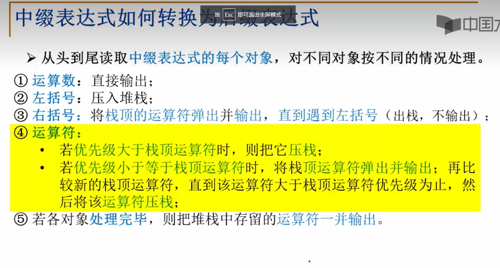
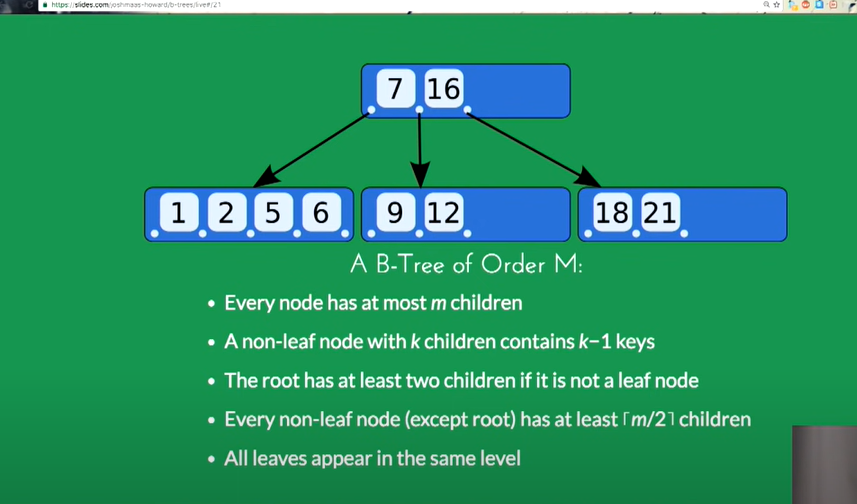
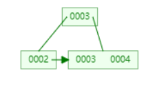

# C++
## 输入
* cin与getline
为什么cin后在使用getline，得到的是一个回车符？
cin输入是先看当前字符是什么，如果是tab、空格、回车，就直接break。否则读入
而getline是先读入，在判断

# 数论
## gcd
gcd：greatest common divisor（两个数的最大公约数）
可用数学证明：$gcd(a,b) = gcd(b,a\%b)$
也可用库函数`__gcd(a,b)`直接得到a和b的最大公约数
[参考](https://oi-wiki.org/math/number-theory/gcd/)
## 快速幂

### 1：运用：

​	求一个数的幂级数，当这个幂非常大的时候，就可以用快速幂。按常规去写复杂度为O(n),用快速幂复杂度为O(log n)

### 2：原理：

​	将指数换成二进制，这样一个幂就能拆解成几个幂的乘积；

### 3：参考博客

https://blog.csdn.net/liangllhahaha/article/details/82119378

### 4：例题：

​	洛谷p1045麦森数；

```c++
long long ksm(long long a, long long b) {//其实快速幂从数值运算转移到位运算
    long long ans = 1, base = a;
    while(b != 0) {
	if(b & 1 != 0) {
	    ans *= base;
	}
	base *= base;
	b >>= 1;
    }
    return ans;
}
```

## 快速乘

1：运用：有人该说，乘法复杂度不是O（1）的吗，对没错，但是如果要求两个数的乘积在对其求模，恰巧这两个数乘积的结果爆longlong，那该怎么写？这就用到了快速乘

2：为什么快速乘不会爆范围，原因如下：乘法容易爆范围，但是由于过程中不断取模，所以加法不会爆范围。

3：如何用加法实现快速乘？原理如下：**快速乘**是利用乘法分配律将a*b分解成多个式子相加（将后面一个乘数转化为二进制的形式计算）求解。例如：12 * 11=12 * 1011(2)=12 * 2^3+12 * 2^1 +12*2^0=96+24+12=132

4：参考博客：https://www.cnblogs.com/960571726y/p/10564138.html

```c++
typedef long long LL;
LL mult_mod(LL a,LL b,LL mod)
{
 LL res=0;  //注意此处初始化为0不是1
 while(b){
  if(b&1)res=(res+a)%mod;
  a=(a+a)%mod;  //注意此处是加不是乘
  b/=2;
 }
 return res;
}
```

## 排列组合

### 1.排列：

排列就像当于排位，肯定有顺序，而组合就相当于男子组合，都是一坨，哪来的什么顺序

公式：
$$
Amn=n(n−1)(n−2)⋯(n−m+1)=n!/(n−m)!
$$

$$
Cmn=Amnm!=n!/m!(n−m)!
$$

排列很好理解，就是从n里面拿出m个，第一次有n种方法，第二次有n-1种方法....

### 2.组合：

而组合是在排列的基础上衍生出来的，排列中是有顺序的，其实就相当于在m个中又进行了一次排序，那有多少种呢?有Amm种，所以在排列上直接把他给除掉进行组合数了

组合一个重要的公式
$$
C_{n}^{m}=C_{n}^{m−1}+C_{n−1}^{m−1}
$$
https://www.cnblogs.com/fusiwei/p/11358009.html

## 中位数

### 1.性质

在一个有序数列中，所有数与中位数的绝对差之和最小

https://blog.csdn.net/SM_545/article/details/78196351

### 2.求中位数

暴力方法暂且不提，无非就是排序+取中间数

如果让你在一个序列中求连续的子序列的中位数，像这一题：https://leetcode-cn.com/problems/sliding-window-median/和https://leetcode-cn.com/problems/find-median-from-data-stream/，该怎么办？

方法：两个堆来分别维护小数和大数。

```c++
class MedianFinder {
public:
    /** initialize your data structure here. */
    priority_queue<int> small;
    priority_queue<int, vector<int>, greater<int>> large;
    int smallSize, largeSize;
    MedianFinder() {
        smallSize = largeSize = 0;
    }
    void makeBalance(){
        if (smallSize > largeSize+1){
            large.push(small.top()); small.pop();
            largeSize++; smallSize--;
        }else if (smallSize < largeSize){
            small.push(large.top()); large.pop();
            smallSize++; largeSize--;
        }
    }
    void addNum(int num) {
        if (!smallSize || num <= small.top()) smallSize++, small.push(num);
        else largeSize++, large.push(num);
        makeBalance();
    }
    
    double findMedian() {
        int n = smallSize+largeSize;
        return n&1 ? small.top() : (1.0*small.top()+large.top())/2;
    }
};

/**
 * Your MedianFinder object will be instantiated and called as such:
 * MedianFinder* obj = new MedianFinder();
 * obj->addNum(num);
 * double param_2 = obj->findMedian();
 */
```


## 逆元

### 1.什么是逆元？

​	逆元其实是倒数的推广，可以从以下两个例子来理解为什么要用逆元（其实就是变除法为乘法，为什么要变？因为+ - * 中的 % 都可以放进括号里，但 / 不行：[图](https://blog.csdn.net/Harington/article/details/96310239)）

​	1.1 当求解公式：(a/b)%m 时，因b可能会过大，会出现爆精度的情况，所以需变除法为乘法：设c是b的逆元，则有b*c≡1(mod m)；则(a/b)%m = (a/b)*1%m = (a/b)*b*c%m = a*c(mod m);即a/b的模等于a*b的逆元的模

​	1.2 如果让你求 2^x^ /  2^20^ ，2^20^ 虽然很大，但还没超int，但如果2^x^ 很大并且已经超过了int，我们按照正常处理防止溢出会 % 1e9+7 ，但如果 % 过后 2^x 比2^20^ 小，那如果直接除得到的结果为0.几？？显然不正确；所以我们可以求一下2^20^ 的逆元，用2^x^ 去乘这个逆元得到最后的结果 

### 2.求逆元的方法：费马小定理

​	费马小定理：x的逆元就是x^p-2^ 其中p为素数，并且x不能被p整除（题目中的数据范围1<=x<=10^9 ，p=1e9+7，p是素数；所以x肯定就无法被p整除啊，所以最后就得出x^(p-2)为x的逆元啦。）

有了费马小定理支撑，我们就只要求x^p-2^ 就是逆元；怎么求？用快速幂！

```c++
const int mod = 1000000009;
long long quickpow(long long a, long long b) {
    if (b < 0) return 0;
    long long ret = 1;
    a %= mod;
    while(b) {
        if (b & 1) ret = (ret * a) % mod;
        b >>= 1;
        a = (a * a) % mod;
    }
    return ret;
}
long long inv(long long a) {
    return quickpow(a, mod - 2);
}
```

参考博客：[传送门](https://blog.csdn.net/baidu_35643793/article/details/75268911?utm_medium=distribute.pc_relevant.none-task-blog-BlogCommendFromMachineLearnPai2-1.channel_param&depth_1-utm_source=distribute.pc_relevant.none-task-blog-BlogCommendFromMachineLearnPai2-1.channel_param)

## 杨辉三角

简介：杨辉三角，是二项式系数在三角形中的一种几何排列。它是中国古代数学的杰出研究成果之一，它把二项式系数图形化（第n行中的数就是(x+y)^n^ 展开后的系数），把组合数内在的一些代数性质直观地从图形中体现出来，是一种离散型的数与形的结合。

一些性质：1.第x行有x个数

2.每一行以1开始，以1结束，其他数等与他肩膀上的两个数之和

3.每一行的数值都是对称的

## 求质数的个数

例题：https://leetcode-cn.com/problems/count-primes/

方法一：朴实无华的解法 时间复杂度：O(N根号N). 空间复杂度：O(1)

```c++
//就直接从2枚举到根号x（以根号x为分界线，如果在分界线左边有因数，那其右边就会对应一个因数，所以至于要枚举到根号x就行了），如果都不能整除，就说明x是质数
class Solution {
public:
    bool isPrime(int x) {
        for (int i = 2; i * i <= x; ++i) {
            if (x % i == 0) {
                return false;
            }
        }
        return true;
    }

    int countPrimes(int n) {
        int ans = 0;
        for (int i = 2; i < n; ++i) {
            ans += isPrime(i);
        }
        return ans;
    }
};
```

方法二：埃氏筛  时间复杂度：O(NlogNlongN). 空间复杂度：O(N)

```c++
//方法一枚举没有考虑数与数之间的关系：**任何一个合数都可以写成若干个质数的乘积**(联系求一个数的约数个数的方法：分解质因数法)，所以我们按顺序去遍历，没有被访问过的就是质数，我们利用这个质数去访问（筛掉）他的倍数，继续访问就行了。		当用一个质数x去筛他的倍数的时候，我们直接从x*x开始筛起：这是因为2*x,3*x....都在访问2，3....的时候已经筛过了
class Solution {
public:
    int countPrimes(int n) {
        vector<int> isPrime(n, 1);
        int ans = 0;
        for (int i = 2; i < n; ++i) {
            if (isPrime[i]) {
                ans += 1;
                if ((long long)i * i < n) {
                    for (int j = i * i; j < n; j += i) {
                        isPrime[j] = 0;
                    }
                }
            }
        }
        return ans;
    }
};
```

方法三：线性筛 时间复杂度：O(N). 空间复杂度:O(N)

```c++
//回顾埃氏筛，其实还存在者一些冗余操作，如3和5都会访问45这个数。线性筛就消除了这些冗余操作，使得每个合数最多只会访问一次，复杂度达到了惊人的线性O(N)
//线性筛与埃氏筛不同的是，又开了一个数组prime，当找到一个质数x的时候，就把这个数放进prime数组中，然后用当前遍历的数与prime数组中的数相乘去筛一些合数，当x % prime[i]的时候终止（为什么：因为我们保证**每个合数都是被他的最小质因数给筛掉的**，如果x = prime[i]*y, 那么x*prime[i+1] = prime[i]*y*prime[i+1], 即这个数肯定会被后面y*prime[i+1]这个数，用prime[i]给筛掉；这样可以保证每个合数被自己的最小质因数给筛掉，并且每个合数只会访问一次）
class Solution {
public:
    int countPrimes(int n) {
        vector<int> primes;
        vector<int> isPrime(n, 1);
        for (int i = 2; i < n; ++i) {
            if (isPrime[i]) {
                primes.push_back(i);
            }
            for (int j = 0; j < primes.size() && i * primes[j] < n; ++j) {
                isPrime[i * primes[j]] = 0;
                if (i % primes[j] == 0) {
                    break;
                }
            }
        }
        return primes.size();
    }
};
```

## 求约数的个数

### 1.枚举：

从2开始枚举到根号x

```c++
int Count(int n)
{
	int count = 0;
	int i;
	for (i = 1; i*i< n; i++)
	{
		if (n%i == 0)
			count+=2;
	}
	if (i*i == n)
		count++;
	return count;
}
```

### 2.分解质因数法：

​	任何一个合数x都可以写成一些最小质数的乘积：360=2* 2 * 2 * 3 * 3 *5=2^3 * 3^2 *5，如果想称为360的约数，只能在2，3，5的指数上改改，一共有4 * 3 * 2 个 = 24 个

```c++
#include <stdio.h>
int main()
{
	int n, m, ans, num;
	while (scanf("%d", &n) != EOF)			//从标准输入中获取此次要计算的数字个数n
	{
		for (int i = 0; i < n; i++)
		{
			scanf("%d", &m);
			ans = 1;
			for (int i = 2; i*i <= m; i++)
			{
				num = 0;		//num表示相同因子的个数
				while (m%i == 0)        //统计该数字m能被当前枚举的质数i整除多少次(事实上如果不是质数这里是不会进入循环的，因为此时已经被比非质数i小的质数分解过了)
				{
					num++;
					m = m / i;
				}
				if (num > 0)         //如果可以被此质数整除，则加一(加上零次方的可能性)
				{
					num++;
					ans = ans * num;
				}
			}
			if (m > 1) ans = ans * 2;    //如果已经把小于根号m的数字都枚举过了但还未将m分解完，则说明还有一个大于根号m的质数约数，因此乘以2(为什么只有一个：不懂，规定)
			printf("%d\n", ans);
		}
	}
	return 0;
}
```

## 和一定的情况下乘积的最大值

description: 设a1+a2+a3+...+an = m，求a1 * a2 * a3 * ...*an的最大值

结论：把m分成尽可能多的3，剩下的用1个2或者2个2来表示

reason：

1. 假设m >= 5，那么从m中抽出一个3， 则3* （m-3） -  m = 2m-9 > 1；所以不断抽出3，最后的乘积才能更大
2. 假设m == 4，那么m 分成两个2， 即2 * 2 = 4， 相等

结论即证。

problem：

1. https://leetcode-cn.com/problems/maximize-number-of-nice-divisors/
2. https://www.acwing.com/problem/content/24/

## 求n个数的最小公倍数

这里有个公式
$$
GCD(a,b)*LCM(a,b)=a*b
$$
explanation：

1. 数学上求两个数最小公倍数的方法：分别把两个数分解质因子，如果有相同的质因子，那么就以最高次幂为准。其余相乘
2. 公式的推导：反向思考：如果LCM != a*b，说明a和b肯定有相同的质因子，在根据1，省掉的肯定是a和b的最大公因数。

求n个数最小公倍数的方法：将公式变换一下。

```c++
    int ans = 1;
    for (int i = 0; i < nums.size(); i++){
        int g = __gcd(nums[i], ans);
        ans = ans * nums[i] / g;//将公式反过来
    }
```


# 栈
## 表达式求值
需求：如何使用计算机计算$2+9/3-5$？
> prerequisite
我们日常数学中的表达式被称为“中缀表达式”
而计算机不擅长处理“中缀表达式”，但是比较擅长处理后缀表达式
所以使用计算机计算中缀表达式的步骤：
1、中缀表达式 => 后缀表达式
2、计算机从左到右读入后缀表达式 => 得到结果

Q1：如何将中缀表达式转化为后缀表达式？
优先级：-，+，/，*


# 树论
## 二叉树的后序遍历(非递归算法)
不要一直看代码，要在自己的头脑中有一副图；代码只是将这幅图表达出来
[参考](https://leetcode.cn/problems/binary-tree-postorder-traversal/solutions/12336/die-dai-jie-fa-shi-jian-fu-za-du-onkong-jian-fu-za/comments/983539)


## 完全二叉树

完全二叉树（满二叉树）有一个比较好玩的性质：假如根节点标号为1，那取树中的任意一个节点其序号为x，看x的二进制，最高位肯定为1表示根节点，从第二高位开始往后，是1表示从上一个根节点往右走，是0表示从上一个根节点往左走；利用这一方法加二分可在O（logN^2）的复杂度判断出一个序号为x的结点是否在这个完全二叉树中

例题：https://leetcode-cn.com/problems/count-complete-tree-nodes/

## 已知二叉树的遍历去还原树

前序+后序是不能确定一个树的

方法很简单，用递归的形式就可以还原

```c++
//后序+中序还原树
struct Node{
	int val;
	Node* left, *right;
};

Node* build(int pleft, int pright, int inleft, int inright){
	if (pleft > pright || inleft > inright) return NULL;
	
	Node* root = new Node;
	root->val = post[pright];
	
	int pos = inleft;
	for (	; pos <= inright; pos++) if (in[pos] == post[pright]) break;
	
	root->left = build(pleft, pleft+pos-inleft-1, inleft, pos-1);//边界要写好
	root->right = build(pleft+pos-inleft, pright-1, pos+1, inright);
	return root;
}
```


## 树的直径

树的直径是指在一棵树中，任意两点之间的最长距离称为树的直径

求树的直径：两遍bfs；以任意一个点为起点，找到离他最远的那个点A，在以A为起点，找到里A最远的点B，AB的长度即为树的直径

此方法依靠一个定理：取树中任意一个点，找到离这个点最远的点，那么这个最远的点一定是直径的一个端点

## 树状数组

树状数组用于单点更新和区间查询

区间查询：（这里的区间查询是直接1-i的前缀和，如果题目要求i-j的前缀和，就用两个前缀和减一下就好了）

有一个主数组A和一个辅助数组C，一个辅助数组C[i] 是多个A的和（注：getsum(i) 就是[1,i]的和，闭区间）

现在要求1-i的前缀和，那么这i个和究竟等于哪几个C[x]加起来呢？-----答：i一直减lowbit，减到0为止

单点更新：

按道理说我们直接把A[i]加上就行了，但这还没完，你把A[i]的值改变了，那所有掌管A[i]的C都要改变，那有哪些C掌管着A[i]呢？-------答：将i一直加上lowbit，直到越界为止

细节分割线-----------------------------------------------------------------------------------------------------------------------

参考博客：https://www.cnblogs.com/findview/p/11281628.html

引子：你以为对一个区间更新或者求一个区间的和 的最低复杂度是O（n）？其实还可以更低，那就是树状数组

对于一个的数组，如果需要求1~m的前缀和我们可以将其从下标1开始对m个数进行求和，对于n次操作，时间复杂度是O(n^2)，对于值的修改，我们可以直接通过下标找到要修改的数，n次操作时间复杂度为O(n)，在数组n开得比较大的时候，求前缀和的效率显得低了

- 那么有人提出了一种优化的方式：
  初始我们用一个数组A的保存每个位置的初始值，然后用一个辅助数组B存放的是下标为i的时候A数组的前i个的和（前缀和），那么当我们需要查询m个数的前缀和的时候只要直接使用下标对B数组进行查询即可，n次查询，时间复杂度为O(n)，而此时，对于单点更新值的维护消耗，由原来的O(n)变成了O(n^2)， 因为每一次与更新单点值都会对后面的已经计算好的B数组前缀和的值造成影响，需要不断更新B数组的值，n次更新维护的消耗自然就变成了O(n^2)，更新的效率变得低下
  那么是否有一种方法可以让查询和更新的时间复杂度都小一些呢，至少可以令人接受，这里将介绍树状数组如何处理前缀和查询和单点更新的问题，对于n次操作，时间复杂度都为O(nlogn)

如图，对于一个长度为n的数组，A数组存放的是数组的初始值，引入一个辅助数组C（我们通过C数组建立树状数组）

C1 = A1
C2 = C1 + A2 = A1 + A2
C3 = A3
C4 = C2 + C3 + A4 = A1 + A2 + A3 + A4
C5 = A5
C6 = C5 + A6 = A5 + A6
C7 = A7
C8 = C4 + C6 + C7 + A8 = A1 + A2 + A3 + A4 + A5 + A6 + A7 + A8

**我们称C[i]的值为下标为i的数所管辖的数的和，C[8]存放的就是被编号8所管辖的那些数的和（有8个），而下标为i的数所管辖的元素的个数则为2^k个（k为i的二进制的末尾0的个数）举两个例子查询下标m8和m5所管辖的数的和**

- 8 = 1000，末尾3个0，故k == 3，所管辖的个数为2^3 == 8，C8是8个数的和
- 5 = 0101，末尾没有0，故k == 0，所管辖的个数为2^0 == 1，C5是一个数的和（它本身A5）

而对于输入的数m，我们要求编号为m的数的前缀和A1~ Am（**这里假设树状数组已经建立，即C1~C8的值已经求出，别着急，在本文的最下方会做出建立树状数组的过程讲解，因为现在是在求前缀和，就假设C数组已经可用了吧**）举两个例子m7和m6（sum(i)表示求编号为i的前缀和）

- m==7 sum(7) = C7 + C6 + C4
  那么我们是怎么得到编号7是由哪几个C[i]求和得到呢（C4, C6, C7怎么得到的），这里有介绍一种巧妙的方法：
  **对于查询的m，将它转换成二进制后，不断对末尾的1的位置进行-1的操作，直到全部为0停止**
  7的二进制为0111（C7得到），那么先对0111的末尾1的位置-1，得到0110 == 6（C6得到），再对0110末尾1位置-1，得到0100 == 4（C4得到），最后对0100末尾1位置-1后得到0000（结束信号），计算停止，至此C7，C6，C4全部得到，求和后就是m == 7时它的前缀和
- m==6 sum(6) = C6 + C4
  m == 6时也是一样，先转成2进制等于0110，经过两次变换后为0100（C4）和0000（结束信号），那么求和后同样也得到了预计的结果

**这里要介绍一个高效的方法，lowbit(int m)，这是一个函数，它的作用是求出m的二进制表示的末尾1的位置，对于要查询m的前缀和，m = m - lowbit(m)代表不断对二进制末尾1进行-1操作，不断执行直到m == 0结束，就能得到前缀和由哪几个Cm构成，十分巧妙，lowbit也是树状数组的核心**

```c++
int lowbit(int m){ //得到得是一个二进制数，这个二进制得特点是只有m得某位1的位置上为1，其余位上都为0
    return m&(-m);
}
```

关于m&(-m)很多童鞋可能感到困惑，那么就不得不提及一下负数在计算机内存中的存储形式，负数在计算机中是以补码的形式存储的，如13的二进制表示为1101，那么-13的二进制而将13二进制按位取反，然后末尾+1，即0010 + 0001 = 0011，那么1101 & 0011== 0001，很显然得到m == 13二进制末尾1的位置是2的0次方位，将13 - 0001 == 12，再对12执行lowbit操作，1100 & 0100 == 0100，也很轻易得到了m == 12时二进制末尾1的位置是2的2次方位，将12 - 0100 == 8，再对8执行lowbit操作，0100 & 1100 == 0100，得到m == 8时二进制位是2的2次方位，8 - 0100 == 0（结束操作），通过循环得到的13，12，8，则sum(13) == C13 + C12 + C8

**求前缀和的代码**

```c++
int ans = 0;
int getSum(int m){
    while(m > 0){
        ans += C[m];
        m -= lowbit(m);
    }
}
```

对于n次前缀和的查询，时间复杂度为O(nlogn)
**接下来讲解单点更新值**
对于输入编号为x的值，要求为它的值附加一个value值，我们把图再一次拿下来

假设x2，value5，那么我们先找到A[2]的位置，通过观察我们得知，如果修改了A[2]的值，那么管辖A[2]的C[2]，C[4]，C[8]的前缀和都要加上value（所有的祖先节点），那么和查询类似，我们如何得到C2的所有祖先节点呢（因为C2和A2的下标相同所以更新时查询从C[x]开始），依旧是上述的巧妙的方法，但是我们把它倒过来
**对于要更新x位置的值，我们把x转换成二进制，不断对二进制最后一个1的位置+1，直到达到数组下标的最大值n结束**

- 对于给出的例子x2，假设数组下标上限n8，x转换成二进制后等于0010（C2），对末尾1的位置进行+1，得到0100（C4），对末尾的1的位置进行+1，得到1000（C8），循环结束，对C2，C4，C8的前缀和都要加上value，当然不能忘记对A[2]的值+value，单点更新值过程结束

**给出代码**

```c++
void update(int x, int value){
    A[x] += value;    //不能忘了对A数组进行维护，尽善尽美嘛
    while(x <= n){
        C[x] += value;
        x += lowbit(x);
    }
}
```

对于n次更新操作，时间复杂度同样为O(nlogn)

这里有一个注意事项，我们对于求前缀和与单点更新时，树状数组C是拿来直接使用的，那么问题来了，树什么时候建立好的，我怎么不知道？

事实上，对于一个输入的数组A，我们一次读取的过程，就可以想成是一个不断更新值的过程（把A1~An从0更新成我们输入的A[i]），所以一边读入A[i]，一边将C[i]涉及到的祖先节点值更新，完成输入后树状数组C也就建立成功了

板子：

```c++
class BIT {
private:
    vector<int> tree; 
    int n;

public:
    BIT(int _n): n(_n), tree(_n + 1) {}//是n+1噢，其实tree[0]就是个摆设

    static constexpr int lowbit(int x) {
        return x & (-x);
    }

    void update(int x, int d) { //假如某个点的下标是x，那更新的时候写update(x+1, val) 
        while (x <= n) {
            tree[x] += d;
            x += lowbit(x);
        }
    }

    int query(int x) const {
        int ans = 0;
        while (x) {
            ans += tree[x];
            x -= lowbit(x);
        }
        return ans;
    }
};
```

## 并查集

具体讲解看《啊哈算法》的p208

板子例题：https://www.luogu.com.cn/problem/P3367

注：并查集并不是每个merge后，所有小兵的老大都是这个老大的，但其实也差不多，你只要访问这个小兵，那他的老大就逐层返回，就变正常了

### 复杂度

​	加入路径压缩和rank数组进行优化：复杂度为a(n)（a为ackerman函数的反函数），小于log(N)

### 板子：

```c++
//写成c++类
class UF{
    public:
        vector<int> f, rank;//f：父亲数组,rank进行优化(把节点少的树加到节点多的树上)
        int n, count;//count:连通分量数
    public:
        UF(int x){//与类同名的构造函数
            n = 1;
            count = x;
            rank = vector<int>(n); f = vector<int>(n);
            for (int i = 0; i < n; i++) f[i] = i;
        }
        int getf(int x){
            if (f[x] == x) return x;
            return f[x] = getf(f[x]);
        }
        bool Merge(int x,int y){
            int fx = getf(x), fy = getf(y);
            if (fx == fy) return false;
            count--;//只需要在Merge上就行修改连通分量数就行了，不需要在写一个函数遍历f数组得到count
            if (rank[fx] < rank[fy]) swap(fx, fy);
            rank[fx] += rank[fy]; f[fy] = fx;
            return true;
        }
};
```

### 相关好题

[leetcode803.打砖块](https://leetcode-cn.com/problems/bricks-falling-when-hit/)（反向并查集）

## B树
* B树出现的背景
二叉搜索树（BST）有很多的好处，比如平均搜索时间为O(logN)
但是有一个痛点，那就是在某些情况下会退化成链表，搜索复杂度为O(N)。
为了解决这个痛点，让搜索时间稳定在O(logN)，就出现了自平衡(self-balance)二叉搜索树。
自平衡二叉搜索树(self-balance BST)有很多的实现(implementation),像红黑树等，其中B树就是实现之一
* N阶B树是什么意思
一个node里最多有n-1个key；一个node最多有N个子节点


## B+树
* B+树和B树之间的区别？
B+树在叶子节点上存在指针，指向相邻的叶子节点


## 完全二叉树
* 用数组模拟完全二叉树de性质
    * node[idx]节点的父节点是node[idx/2] 

## 堆
* 堆的定义：
1、堆是一个完全二叉树
2、以大根堆为例，根节点是所有树节点中的最大值；
3、左右两棵子树的性质同1、2（递归定义）
* insert操作
将新元素直接插入完全二叉树的尾部，然后不断与父节点比较
* delete操作
将树尾部的节点直接放在根上，然后不断比较，往下移

# 哈希
## 背景
* [CS61B](https://docs.google.com/presentation/d/1QevjelsyVO8Ea375VRhIf-o--MIMDYB83OxBbXnbQZU/edit#slide=id.g52624185f6_2_3109)