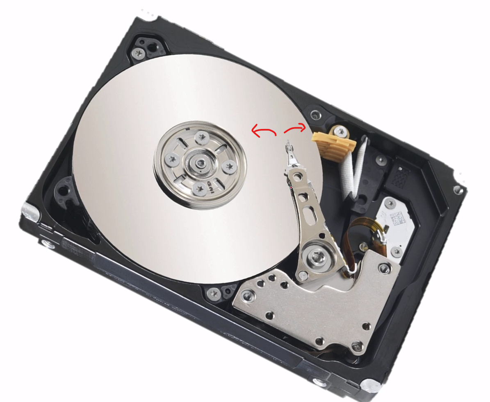
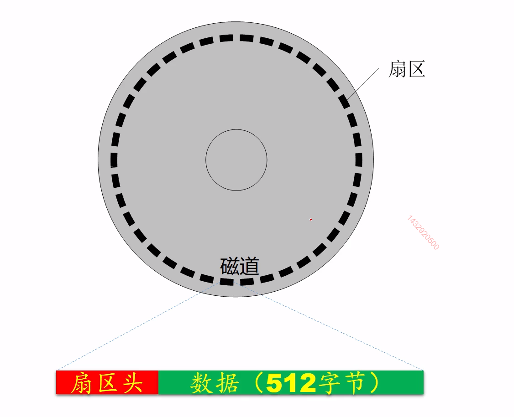
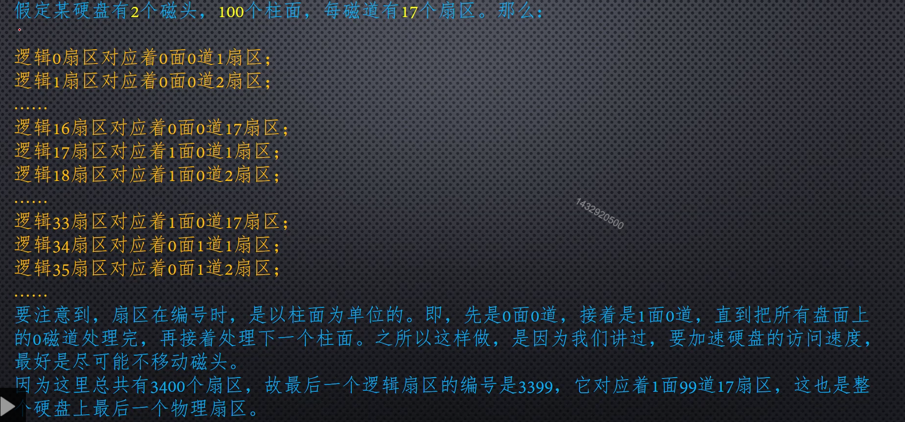

# 数的表示
* 整数&小数十进制转化为二进制的方式
[link](https://www.youtube.com/watch?v=8afbTaA-gOQ)
整数十进制转化为二进制：
Q1、为什么%2得到的是二进制的最后一位？
$x=a_n*2^n+a_{n-1}*2^{n-1}+...+a_0*2^0$
两边同时%2，可发现等式右边只剩下$a_0$
Q2、为什么/2相当于右移？
从$x=a_n*2^n+a_{n-1}*2^{n-1}+...+a_0*2^0$理解
小数十进制转化为二进制：
Q3、为什么每次拿小数部分乘以2，取整数部分？
从$x=a_n*2^{-1}+a_{n-1}*2^{-2}+...+a_0*2^{-n}$
* IEEE754
[一个有用的网站](https://babbage.cs.qc.cuny.edu/IEEE-754.old/Decimal.html)
将263.3转化为IEEE754标准下的单精度浮点数
263.3转为二进制为：`100000111.010011 0011 0011 ....`
二进制进行标准化：$1.00000111010011 0011 * 2^8$
IEEE754标准将32bit分为3部分
bit31：符号位，正为0，负为1
bits30~23：指数位，值为8+127
> $2^8$指数为不应该为8吗？为什么还要加上127？
防止指数为负数的情况，所以一般加上一个bias

bits22~0:小数点后面的所有位
# CPU
* 什么是低端字节序(little endian)or高端字节序(big endian)
0x30这个数字储存在内存中就是：30 00(LE),00 30(BE)
使用低端字节序就是指：拿到的数字先放在寄存器中的低字节
# 内存

# 外设
## 硬盘

* 磁道(track,Header),柱面(cylinder),扇区(secotr)
读写的基本单位为扇区
一圈扇区组成一个磁道

* 硬盘的CHS与LBA
CHS：cylinder，header，sector；比如说主引导扇区就是0，0，1（0面，0道，1扇区）
LBA：Logical Block Address

硬盘写的过程：
1、先写第一张盘面的最外边的一圈
2、再写第二张盘面的最外边一圈...
3、写第一张盘次外边的一圈

* 是什么是主引导扇区？
0头0道1扇区
* 如何知道主引导扇区是否有效？
在主引导扇区512字节中，最后两个字节必须是`0x55`,`0xaa`
要不然CPU不会读取和执行