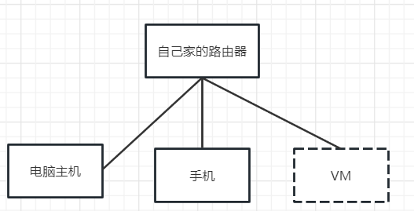
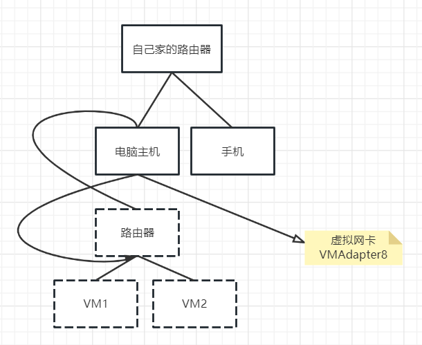
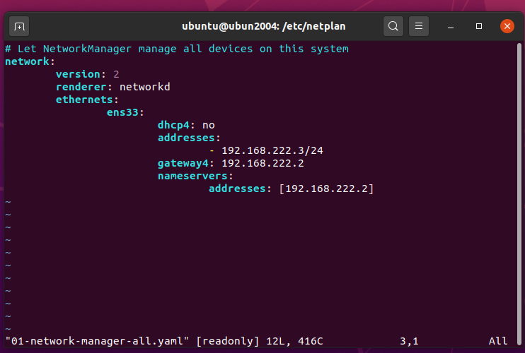

* 怎么在外边访问家里面的电脑？
----
* 网关是什么？
网关地址是一台计算机ip地址，代表该局域网与外界沟通
* 子网掩码有什么用？
假设我的电脑A要和B:10.1.1.2通信，A首先通过子网掩码&10.1.1.2确定B是否在同一局域网内。
如果是，在封装帧的时候，mac地址填B的
如果不是，在封装帧的时候，mac地址填网关（gateway）的。将网络包传给网关（gateway），网关有办法发给B
* 如何通过局域网内的ip地址，查找到对应的物理设备？
`arp -a 192.168.0.104`:会返回mac地址
* 为什么我的局域网网络号是192开头，别人的是172开头？
这和路由器的dhcp服务有关；企业级路由器应该支持更多的ip分配
* 虚拟机三种网络连接方式(尚硅谷linux)
1、桥接（一般不使用）
不考虑细节，最终的结果如图：

所以只需要在虚拟机上，配置网卡的ip地址、子网掩码、网关、dns服务器就行了（其实只需要自己写ip地址就行了，剩余的和主机的一样）
2、NAT（经常使用）

通过这种方法，一般情况下不需要配置虚拟机的网络，因为它通过dpch方式从虚拟路由器中得到网络配置
但是通过自动获取的方式，得到的ip地址是会变的。所以在搭建集群的时候，自己手写静态ip
ip地址（需要和虚拟路由器ip在同一网段），子网掩码，网关（虚拟路由器的ip）；虚拟路由器的ip可以在VMware中查看

* Ubuntu20.04通过yaml配置网络

> 注意：yaml中key：value，value前面有空格！

# TCP
* TCP如何为上层保证可靠的服务？
    * rdt1.0:假设下层服务不出错、不丢失
    tcp层什么都不做，只负责接收数据
    * rdt2.0：假设下层服务不丢失
    接收端为了判断数据是否出错：引入checksum
    * rdt2.1：假设下层服务不丢失
    为了解决ack/nak也可能出错：引入序号
    * rdt2.2：NAK free
    如果package1出错，接收方发送ack0
    * 报文（segment）不出错
        1、
    * 报文（segment）不丢失
# HTTP
* Post、Get、Put、Delete、Patch之间的区别？
[参考](https://stackoverflow.com/questions/31089221/what-is-the-difference-between-put-post-and-patch)
语义上：
Post ：C（create）
Get ： R（read）
Put & Patch : U (update)
Delete : D (delete)
从报文结构上：
Get和Delete请求是没有请求体(body)的,只有start line和header
Post、Put、Patch请求都是可以传入请求体的
